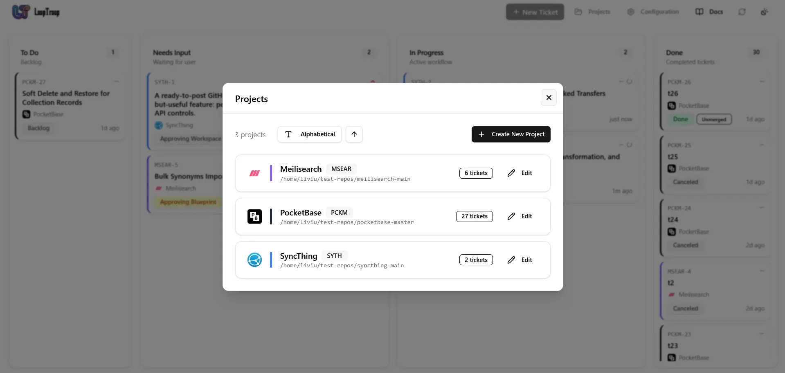
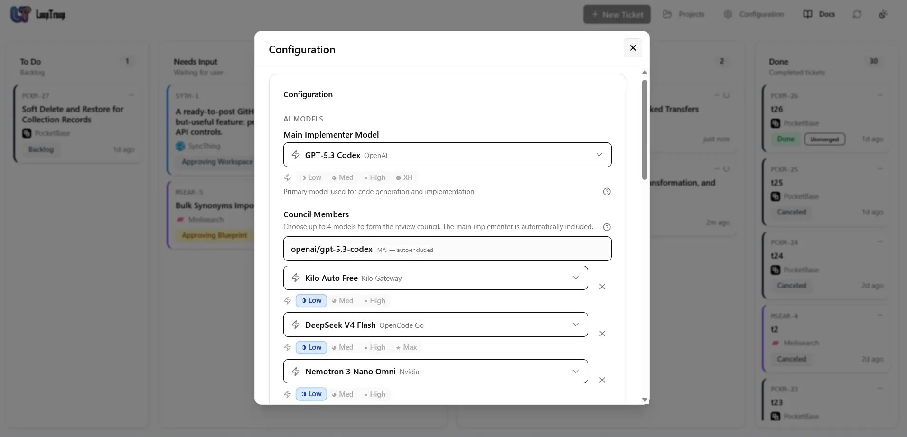
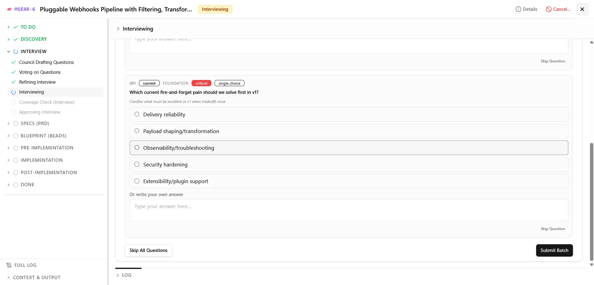
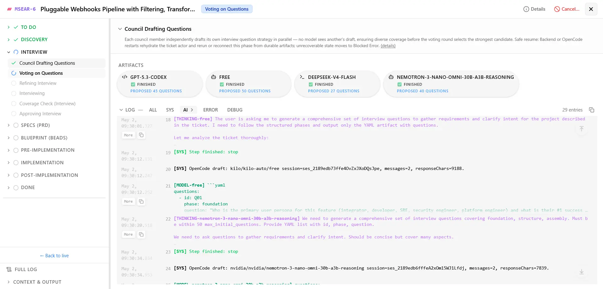
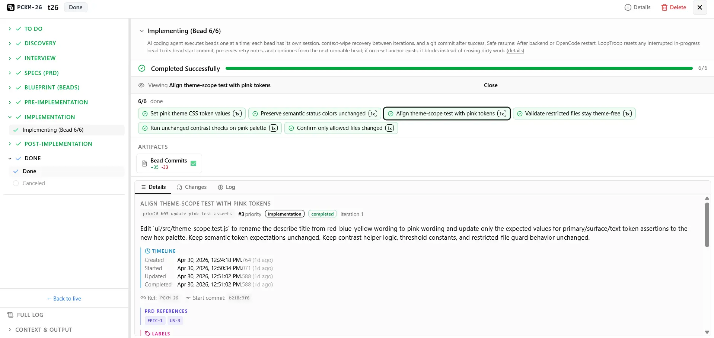
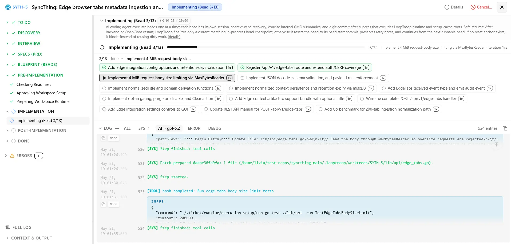
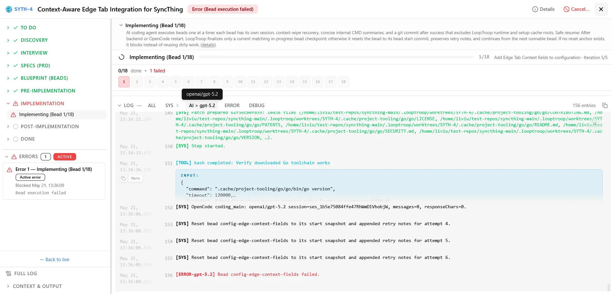
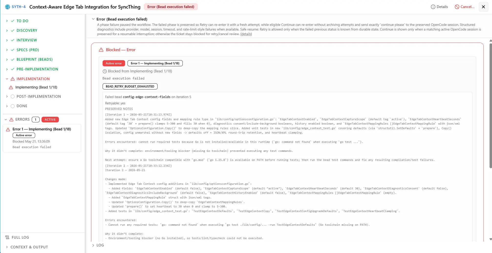
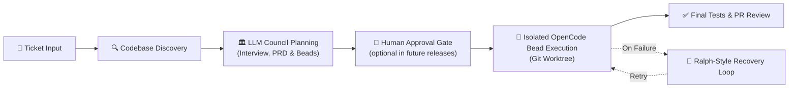

# LoopTroop

> **A smart local engine that automates big coding tasks from start to finish.**
> LLM councils plan it. Ralph loops perfect it. OpenCode worktrees ship it.

LoopTroop helps you turn a coding ticket into a planned, reviewable, agent-executed pull request.

Instead of trusting a single, endless AI chat session - where the conversation history gets bloated, the AI gets confused, and code quality falls off a cliff - LoopTroop breaks the job into clean, separate stages. **Planning** turns an interview into a PRD, which is then split into the smallest manageable milestones, called "beads." **Execution** runs each bead through multiple targeted auto-fix loops. A **final review** ties it all together.

| Architectural Layer | Core | Technical Lifecycle |
| :--- | :--- | :--- |
| **1. Planning** | *LLM Councils Plan It* | Human Input ➔ AI Interview ➔ PRD ➔ Atomic Beads |
| **2. Execution** | *Ralph Loops Perfect It* | Isolated Bead Work ➔ Multi-Loop Automated Testing & Fixing |
| **3. Shipping** | *OpenCode Worktrees Ship It* | Code Isolation ➔ Final Verification Pass ➔ Main Branch Handoff |

**Start here:** [Docs](https://www.looptroop.ovh/docs/) | [Getting Started](https://www.looptroop.ovh/docs/getting-started) | [Ticket Flow](https://www.looptroop.ovh/docs/ticket-flow) | [LLM Council](https://www.looptroop.ovh/docs/llm-council) | [Context Engineering](https://www.looptroop.ovh/docs/context-engineering) | [Beads & Execution](https://www.looptroop.ovh/docs/beads)


*A 26-second animated walkthrough of a complete ticket lifecycle and the configuration menu.*

### 📸 Screenshots

<details>
<summary><strong>Click to expand the screenshot gallery</strong></summary>


*Manage attached repositories, review ticket counts, and add new projects from the dashboard.*


*Choose the main implementer model, council members, and effort levels for local orchestration.*


*Answer focused planning questions before specs and implementation plans are approved.*


*Track council progress, generated artifacts, and live execution logs inside a ticket.*


*Review bead completion, commits, changes, and final implementation details before closing the workflow.*


*Inspect bead-level progress, task status, and live execution logs while an implementation bead runs.*


*Review the focused workspace view shown when an implementation bead is blocked by an error.*


*Compare a different bead's error state, diagnostics, and recovery context before deciding whether to continue or retry.*

</details>

### 🎬 16 Min Deep Dive - Presentation & Full Ticket Demo

<details>
<summary><strong>Click to expand the presentation and demo</strong></summary>

[](https://www.youtube.com/watch?v=LYiYkooc_iY)
*Watch the full 16-minute presentation and ticket demo.*

</details>

---

## What is LoopTroop?

LoopTroop is a **local GUI orchestrator for long-running, high-correctness AI software delivery** - taking you from a raw idea to merged code. Free and fully open-source.

Unlike high-speed coding tools that optimize for immediate chat responses, LoopTroop is built for **complex, multi-file feature work** where alignment and correctness are paramount. It optimizes for a "slow and perfect" paradigm, intentionally sacrificing raw speed to deliver a final result that matches exactly how you envisioned it.

**Great Context Engineering = Zero AI Slop:** LoopTroop employs precise context curation at every stage, feeding the agent only the absolute **minimum** context it needs. See [Context Engineering](#context-engineering) below for details.

---

## How it works



LoopTroop keeps workflow state outside the model, stores durable artifacts, and asks for approval at important boundaries.

## Core ideas

### Context Engineering

Context rot is the enemy of autonomous agents. Traditional agent loops suffer from it-excessive conversational history and irrelevant files overwhelm the model, causing code quality to degrade. Performance can drop severely when reaching just 40% of the maximum context window, resulting in missing files, broken imports, and "AI slop." [[note]](https://antekapetanovic.com/blog/context-engineering/ "Context Engineering: When \"You're Absolutely Right\" Means You're Absolutely Not")

LoopTroop solves this through precise context curation. Instead of sending full conversational transcripts, the engine isolates payloads to the active status. During execution, the agent only sees the specific active bead, its immediate file target, and the test file. During planning phases, it receives only the minimum context relevant to the current step.

This eliminates conversation pollution from previous execution attempts, prevents LLM drift and performance degradation, and keeps model focus high. Keeping the working context fresh is what makes multi-hour, multi-step engineering cycles actually work.

Read more: [Context Engineering](https://www.looptroop.ovh/docs/context-engineering)

### LLM Council

The LLM Council is LoopTroop's planning system. Instead of relying on a single model run, LoopTroop orchestrates multiple independent model instances that **draft** plans, **score** each other using a weighted rubric, and **vote** on proposals. The winner then **refines** its draft by synthesizing the strongest ideas from the losing drafts and **verifies** coverage before any execution begins.

This multi-role process (draft → vote → refine → verify) is utilized for:
- Interview questions
- PRD/Specs generation
- Bead/blueprint generation

Read more: [LLM Council](https://www.looptroop.ovh/docs/llm-council)

### Interview

Before writing a spec, the LLM Council compiles a list of targeted questions to resolve any ambiguities. This interactive session gathers requirements and clarifies intent-because matching your vision is the goal, this phase can take over an hour by design.

You answer these questions directly in the Interview workspace to clarify edge cases, design decisions, and requirements, ensuring the model never operates on false assumptions. Although a final interview is created after the council's draft-vote-refine cycle is complete, the user still receives questions in batches that can adapt based on previous answers.

Read more: [Interview](https://www.looptroop.ovh/docs/interview)

### PRD (Product Requirements Document)

Once the interview phase is complete, the LLM Council translates your initial ticket and your interview answers into a structured Product Requirements Document consisting of Epics and User Stories, complete with highly decomposed implementation steps. This spec serves as the single source of truth for the implementation, detailing the technical approach, edge cases, scope, and expected validation steps before any coding starts. The PRD is stored as a durable artifact for later reference during bead execution.

Read more: [PRD](https://www.looptroop.ovh/docs/prd)

### Beads

LoopTroop implements **only the Beads methodology**-not the full external Beads Project-extracting just the lightweight planning structure needed to bring immediate value to your repository.

Using Steve Yegge's *Beads Project* methodology, epics are split into "beads"-the smallest, independently implementable units of work. Each bead contains:
- Clear purpose and objective
- Measurable acceptance criteria
- Necessary dependencies and prerequisite context
- Specific target files
- Expected validation and testing steps

A bead acts as a small, isolated implementation unit, allowing the execution agent to complete concrete tasks sequentially rather than attempting a massive, single-pass code rewrite.

Read more: [Beads](https://www.looptroop.ovh/docs/beads)

### Execution & Ralph-style recovery

The actual implementation is carried out by an AI coding agent (OpenCode) running in an isolated workspace. If the agent struggles, continuing the same conversation can make things worse. LoopTroop's retry mechanism (the "Ralph Loop") preserves a highly compact error trace from the failure, resets the worktree, discards the contaminated session, and begins a fresh run with clean context-plus a note from previous failures.

```text
fail ──> log failure trace ──> reset worktree ──> retry fresh
```

This cycle repeats until all tests pass or retry limits are reached. **This can take hours (sometimes 10+ hours) by design.** It is built to run unattended (e.g., overnight).

Read more: [Beads & Execution](https://www.looptroop.ovh/docs/beads)

### Worktree isolation

LoopTroop runs execution steps inside isolated Git worktrees rather than modifying your active branch. This keeps your working copy clean and ensures reliable, inspectable diffs. Note that worktrees provide workspace isolation, not sandboxed host security.

Read more: [System Architecture](https://www.looptroop.ovh/docs/system-architecture)

### Human approval gates

LoopTroop keeps you in control of critical state transitions. You actively review and sign off on planning specs, execution blueprints, and final pull request deliverables. *(Note: Human approval gates will become optional in future releases).*

Read more: [Ticket Flow](https://www.looptroop.ovh/docs/ticket-flow)


## Quick start

```bash
git clone https://github.com/looptroop-ai/LoopTroop.git
cd LoopTroop
npm run dev
```

Open `http://localhost:5173`, add a local repository with a GitHub origin, create a ticket, and follow the review gates.

Full setup, ports, startup flags, and troubleshooting: [Getting Started](https://www.looptroop.ovh/docs/getting-started) and [Operations Guide](https://www.looptroop.ovh/docs/operations).

## What you need

LoopTroop expects:

- Node.js and npm
- Git
- OpenCode with at least one configured model provider
- a local repository with a GitHub origin
- **a VM or sandboxed development environment** (strongly recommended)

### Why a VM?

LoopTroop is designed for serious agentic coding work that runs unattended. To make this possible, the orchestrator runs OpenCode in `dangerously-skip-permissions` (YOLO) mode, granting the agent full local execution rights without prompting for confirmation.

While this makes long-running autonomous tasks possible, it introduces real risks. AI agents are not perfect. If a generation goes wrong, the agent can execute commands that delete critical system folders, corrupt active configurations, or break your workspace. Git worktrees isolate your code changes, but they do not sandbox the command execution process itself. The agent runs with your local user privileges.

**Recommended setup: run LoopTroop inside a disposable VM, cloud dev machine, or sandboxed development environment.**

- Git worktrees protect your attached repository checkout
- Logs and artifacts help you inspect what happened
- A VM protects the rest of your computer


## Why not just use a coding agent directly?

Direct coding-agent loops are highly useful, but they degrade rapidly when task complexity or repository scale increases.

| Core Challenge | Direct Agent Behavior | LoopTroop's Structural Fix |
| :--- | :--- | :--- |
| **Flawed Planning** | A single model attempts to draft a multi-step plan in one pass, frequently missing structural edge cases. | **LLM Council Consensus:** Competing models draft, vote on, and synthesize a single, rigorous implementation plan. |
| **Monolithic Overload** | Direct agents try to solve a complex feature in a single massive prompt, leaving incomplete files or "TODO" placeholders. | **Atomic Bead Decompositions:** Automatically breaks down the feature into independent, test-backed "beads" to focus on smallest changes at a time. |
| **Single-Provider Bias** | Relying on one model makes your pipeline highly vulnerable to that specific model's logical blind spots and systemic failures. | **Cross-Model Councils:** Harnesses diverse providers and architectures (e.g., Anthropic, OpenAI, NVIDIA NIM) to critique and align code drafts. |
| **Context Rot** | Long-running chats suffer from token bloat and context degradation, leading to broken imports or forgotten criteria. | **Modern Context Engineering:** The environment strictly isolates context, feeding the agent only the absolute minimum context it needs at each step. |
| **Degenerate Retries** | When a command fails, the agent tries to fix it within the same polluted chat session, compounding previous errors. | **Ralph-Style Retries:** Discards the broken chat session entirely and retries the exact bead with a fresh context window (plus notes from previous failures). |
| **Risky Edits** | Code modifications are made directly in your active checkout, potentially leaving your main branch in an unstable state. | **Isolated Git Worktrees:** Executes all changes in dedicated, isolated worktrees away from your primary working branch. |
| **Opaque Execution** | Internal states, planning notes, and test outputs are lost inside unstructured chat history. | **Structured Durability:** Maintains state locally inside SQLite, JSONL logs, and easily inspectable `.ticket/**` YAML artifacts. |


## What LoopTroop is not

LoopTroop is not a magic autopilot. It does not remove the need to review code, inspect diffs, protect secrets, or run work in a safe environment. It is best understood as an orchestration layer around coding agents: planning, state, approvals, execution boundaries, retries, and delivery.

- **Cost-Sensitive Budgets:** Orchestrating multi-model councils and long retry loops uses a high volume of API tokens, though costs can be mitigated by leveraging subscription plans via providers in OpenCode.
- **Urgent or Quick Fixes:** If you need a trivial change completed in seconds, LoopTroop's overhead will feel slow.
- **Simple Tasks:** For quick edits or trivial apps, standard IDE chat tools or tools like Replit, Bolt, or Lovable are better fits.


## Documentation

The README gives a first-glance overview. The full docs live in `docs/` and at:

https://www.looptroop.ovh/docs/

Useful pages:

| Page | What it explains |
| --- | --- |
| [Getting Started](https://www.looptroop.ovh/docs/getting-started) | Setup, startup, ports, and first project attach |
| [Configuration](https://www.looptroop.ovh/docs/configuration) | All profile settings with defaults, ranges, and trade-offs |
| [Ticket Flow](https://www.looptroop.ovh/docs/ticket-flow) | End-to-end workflow from ticket input to PR result |
| [LLM Council](https://www.looptroop.ovh/docs/llm-council) | Multi-model draft, vote, refine, and coverage planning |
| [Context Engineering](https://www.looptroop.ovh/docs/context-engineering) | Why prompts are built from minimal per-status context and what each status receives |
| [Beads & Execution](https://www.looptroop.ovh/docs/beads) | Bead execution, retries, resets, and context wipe notes |

When the app is running, the same docs are also available from the dashboard.

## Project status

LoopTroop is early alpha software, but it is usable for real work. The full ticket lifecycle is implemented, but some bugs are still likely. The core primitives (planning, execution, retries) are functional.

Roadmap: [Roadmap](https://www.looptroop.ovh/docs/roadmap)

## Contributing

Contributions, ideas, bug reports, and workflow feedback are welcome.
