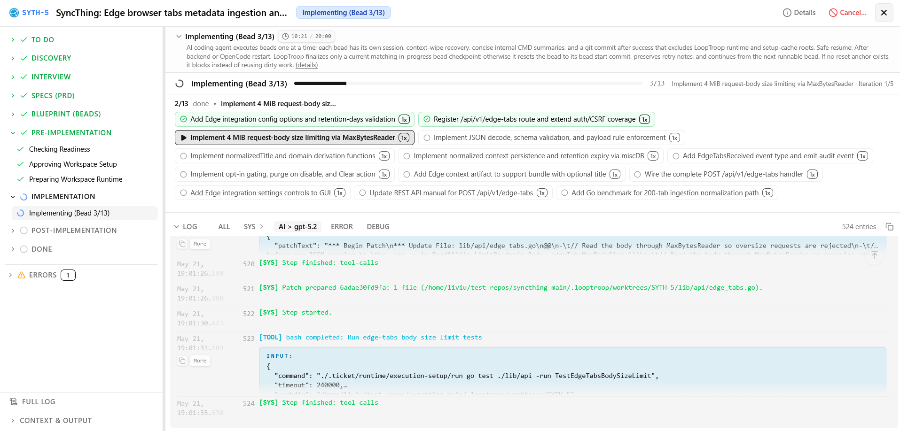

# LoopTroop

> **A smart local engine that automates big coding tasks from start to finish.**
> LLM councils plan it. Ralph loops recover it. OpenCode worktrees ship it.

LoopTroop helps you turn a coding ticket into a planned, reviewable, agent-executed pull request.

Instead of trusting a single, endless AI chat session—where the conversation history gets bloated, the AI gets confused, and code quality falls off a cliff—LoopTroop breaks the job into clean, separate stages: planning (where an interview creates a PRD, which is then split into smallest, manageable milestones called "beads"), execution (where each bead goes through multiple targeted auto-fix loops), and a final review.


| Architectural Layer |  Core | Technical Lifecycle |
| :--- | :--- | :--- |
| **1. Planning** | *LLM Councils Plan It* | Human Input ➔ AI Interview ➔ PRD ➔ Atomic Beads |
| **2. Execution** | *Ralph Loops Recover It* | Isolated Bead Work ➔ Multi-Loop Automated Testing & Fixing |
| **3. Shipping** | *OpenCode Worktrees Ship It* | Code Isolation ➔ Final Verification Pass ➔ Main Branch Handoff |


**Start here:**
[Docs](https://www.looptroop.ovh/) |
[Getting Started](https://www.looptroop.ovh/getting-started) |
[Ticket Flow](https://www.looptroop.ovh/ticket-flow) |
[LLM Council](https://www.looptroop.ovh/llm-council) |
[Execution Loop](https://www.looptroop.ovh/execution-loop) |
[Changelog](https://www.looptroop.ovh/changelog)

---

## What is LoopTroop?

LoopTroop is a **local GUI orchestrator for long-running, high-correctness AI software delivery**—taking you from a raw idea to merged code.

Unlike high-speed coding tools that optimize for immediate chat responses, LoopTroop is built for **complex, multi-file feature work** where alignment and correctness are paramount. It optimizes for a "slow and perfect" paradigm, intentionally sacrificing raw speed to deliver a final result that matches exactly how you envisioned it—even if a complex ticket takes hours to execute.

**Great Context Engineering = Zero AI Slop:** Traditional agent loops suffer from "context rot"—where excessive conversational history and irrelevant files overwhelm the model, causing code quality to degrade. LoopTroop employs **Modern Context Engineering**, feeding the agent only the absolute **minimum** context it needs at each step (including planning and execution).

---

### Core Pipeline (The AI Primitives)

LoopTroop breaks the development cycle into highly structured, verifiable phases:

1.  **Interview Phase (AI-Generated & Tailored)**
    An interactive session gathers requirements and clarifies intent. Because matching your vision is the goal, this phase can take over an hour by design.
2.  **PRD Generation**
    Based on your interview, LoopTroop drafts a detailed Product Requirements Document (PRD) consisting of Epics and User Stories, complete with highly decomposed implementation steps.
3.  **Beads-Style Breakdown**
    Using Steve Yegge's *Beads Project* methodology, epics are split into "beads"—the smallest, independently implementable units of work, each containing its own acceptance criteria and targeted test suite.
4.  **Council of LLMs (Drafting & Voting)**
    The interview output, PRD, and Beads plan are generated via a multi-model "Council." Several models draft solutions independently, score each other using a weighted rubric, and synthesize the strongest ideas into a unified plan.
5.  **Execution via OpenCode & The "Ralph Loop"**
    The actual implementation is carried out by an AI coding agent (OpenCode) running in an isolated workspace. If the agent struggles, a retry loop ("Ralph Loop") repeatedly attempts the bead with refreshed, unpolluted context (plus a note from previous failures) until all tests pass or limit caps are met. **This can take hours (sometimes 10+ hours) by design.** It is built to run unattended (e.g., overnight).

---

### Context Engineering: Why This Exists
Context rot is the enemy of autonomous agents. When an AI is fed too much data, its performance degrades severely—often when reaching just 40% of its maximum context window. This results in missing files, broken imports, and "AI slop." 

LoopTroop solves this through precise context curation: at any given step, the agent only sees the specific active bead, its immediate file target, and the test file. Keeping the working context fresh is what makes multi-hour, multi-step engineering cycles actually work. Even for planning phases, LoopTroop feeds the model only the absolute minimum context relevant to the current step, ensuring that the AI's "attention" is focused and effective.

---


## Safety first: run it in a VM

LoopTroop is designed for serious agentic coding work. Because it is designed to run unattended (sometimes for 10+ hours overnight), sitting at your computer to click "approve" on every terminal command is not practical. 

To solve this, the orchestrator runs OpenCode in a **dangerously-skip-permissions** (YOLO) mode. This grants the agent full local execution rights without prompting you for confirmation. 

While this makes long-running autonomous tasks possible, it introduces real risks. AI agents are not perfect. If a generation goes wrong, the agent can execute commands that delete critical system folders, corrupt active configurations, or break your workspace. Git worktrees isolate your code changes, but they do not sandbox the command execution process itself. The agent runs with your local user privileges.

**Recommended setup: run LoopTroop inside a disposable VM, cloud dev machine, or sandboxed development environment.**

Why:

- git worktrees protect your attached repository checkout
- logs and artifacts help you inspect what happened
- a VM protects the rest of your computer


## How it works

```text
  [ 🎫 Ticket Input ]
          │
          ▼
   🔍 Codebase Discovery
          │
          ▼
   🏛️ LLM Council Planning (Interview, PRD & Beads)
          │
          ▼
   🛑 Human Approval Gate (You are here - optional in future releases)
          │
          ▼
   🧪 Isolated OpenCode Bead Execution (Git Worktree)
          ├─► [ 🔄 Ralph-Style Recovery Loop (On Failure) ]
          │
          ▼
   ✅ Final Tests & PR Review
```

LoopTroop keeps workflow state outside the model, stores durable artifacts, and asks for approval at important boundaries.

## Screenshots


*Manage attached repositories, review ticket counts, and add new projects from the dashboard.*


*Choose the main implementer model, council members, and effort levels for local orchestration.*


*Answer focused planning questions before specs and implementation plans are approved.*


*Track council progress, generated artifacts, and live execution logs inside a ticket.*


*Review bead completion, commits, changes, and final implementation details before closing the workflow.*


*Inspect bead-level progress, task status, and live execution logs while an implementation bead runs.*

## Why not just use a coding agent directly?

Direct coding-agent loops are highly useful, but they degrade rapidly when task complexity or repository scale increases.

| Core Challenge | Direct Agent Behavior | LoopTroop's Structural Fix |
| :--- | :--- | :--- |
| **Flawed Planning** | A single model attempts to draft a multi-step plan in one pass, frequently missing structural edge cases. | **LLM Council Consensus:** Competing models draft, vote on, and synthesize a single, rigorous implementation plan. |
| **Monolithic Overload** | Direct agents try to solve a complex feature in a single massive prompt, leaving incomplete files or "TODO" placeholders. | **Atomic Bead Decompositions:** Automatically breaks down the feature into independent, test-backed "beads" to focus on smallest changes at a time. |
| **Single-Provider Bias** | Relying on one model makes your pipeline highly vulnerable to that specific model's logical blind spots and systemic failures. | **Cross-Model Councils:** Harnesses diverse providers and architectures (e.g., Anthropic, OpenAI, NVIDIA NIM) to critique and align code drafts. |
| **Context Rot** | Long-running chats suffer from token bloat and context degradation, leading to broken imports or forgotten criteria. | **Modern Context Engineering:** The environment strictly isolates context, feeding the agent only the absolute minimum context it needs at each step. |
| **Degenerate Retries** | When a command fails, the agent tries to fix it within the same polluted chat session, compounding previous errors. | **Ralph-Style Retries:** Discards the broken chat session entirely and retries the exact bead with a fresh context window (plus notes from previous failures). |
| **Risky Edits** | Code modifications are made directly in your active checkout, potentially leaving your main branch in an unstable state. | **Isolated Git Worktrees:** Executes all changes in dedicated, isolated worktrees away from your primary working branch. |
| **Opaque Execution** | Internal states, planning notes, and test outputs are lost inside unstructured chat history. | **Structured Durability:** Maintains state locally inside SQLite, JSONL logs, and easily inspectable `.ticket/**` YAML artifacts. |


## Core ideas

### Context Engineering

To prevent LLM drift and performance degradation, LoopTroop feeds the model only the absolute minimum context required for its active task. Instead of sending full conversational transcripts, the engine isolates payloads to the active status. This eliminates "context rot" and conversation pollution from previous execution attempts, keeping model focus high.

Read more: [Execution Loop](https://www.looptroop.ovh/context-engineering)

### LLM Council

The LLM Council is LoopTroop’s planning system. Instead of relying on a single model run, LoopTroop orchestrates multiple independent model instances to **draft** plans and **vote** on proposals then the winner **refines** its draft with ideas from losing drafts, and verify coverage before any execution begins.

This multi-role system is utilized for:
- Interview questions 
- PRD/Specs generation
- Bead/blueprint generation

Read more: [LLM Council](https://www.looptroop.ovh/llm-council)

### Interview

Before writing a spec, the LLM Council compiles a list of targeted questions to resolve any ambiguities. You answer these questions directly in the Interview workspace to clarify edge cases, design decisions, and requirements, ensuring the model never operates on false assumptions. Although a final interview is created (after drafting, voting, and refining are complete), the user still receives questions in batches that can adapt based on previous answers.

Read more: [Ticket Flow](https://www.looptroop.ovh/interview)

### PRD (Product Requirements Document)

Once the interview phase is complete, the LLM Council translates your initial ticket and your interview answers into a structured Product Requirements Document. This spec serves as the single source of truth for the implementation, detailing the technical approach, edge cases, scope, and expected validation steps before any coding starts. Same drafting, voting, refining and coverage check process applies here as well, and the PRD is stored as a durable artifact for later reference during bead execution.

Read more: [Ticket Flow](https://www.looptroop.ovh/prd)

### Beads

LoopTroop implements **only the beads methodology** — not the full external beads projects — extracting just the lightweight planning structure needed to bring immediate value to your repository. 

A "bead" acts as a small, isolated implementation unit, allowing the execution agent to complete concrete tasks sequentially rather than attempting a massive, single-pass code rewrite. Each bead contains:
- Clear purpose and objective
- Measurable acceptance criteria
- Necessary dependencies and prerequisite context
- Specific target files
- Expected validation and testing steps

LLM Council does the same drafting, voting, refining and coverage check process here as well.

Read more: [Beads](https://www.looptroop.ovh/beads)

### Ralph-style recovery

When an agent attempt fails, continuing the same conversation can make things worse1. LoopTroop preserves a highly compact error trace from the failure, resets the environment, discards the contaminated session, and begins a fresh run with clean context.

```text
fail ──> log failure trace ──> reset environment ──> retry fresh
```

Read more: [Execution Loop](https://www.looptroop.ovh/execution-loop)

### Worktree isolation

LoopTroop runs execution steps inside isolated Git worktrees rather than modifying your active branch. This keeps your working copy clean and ensures reliable, inspectable diffs. Note that worktrees provide workspace isolation, not sandboxed host security.

Read more: [System Architecture](https://www.looptroop.ovh/system-architecture)

### Human approval gates

LoopTroop keeps you in control of critical state transitions. You actively review and sign off on planning specs, execution blueprints, and final pull request deliverables. *(Note: Human approval gates will become optional in future releases).*

Read more: [Ticket Flow](https://www.looptroop.ovh/ticket-flow)


## Quick start

Use a VM or disposable development environment first.

```bash
git clone https://github.com/looptroop-ai/LoopTroop.git
cd LoopTroop
npm run dev
```

Open `http://localhost:5173`, add a local repository with a GitHub origin, create a ticket, and follow the review gates.

Full setup, ports, startup flags, and troubleshooting: [Getting Started](https://www.looptroop.ovh/getting-started) and [Operations Guide](https://www.looptroop.ovh/operations).

## What you need

LoopTroop expects:

- Node.js and npm
- git
- OpenCode with at least a configured model provider
- a local repository with a GitHub origin
- a VM or sandboxed dev environment for safer agent execution


## What LoopTroop is not

LoopTroop is not a magic autopilot. It does not remove the need to review code, inspect diffs, protect secrets, or run work in a safe environment. It is best understood as an orchestration layer around coding agents: planning, state, approvals, execution boundaries, retries, and delivery.

### What LoopTroop is NOT For
*   **Cost-Sensitive Budgets:** Orchestrating multi-model councils and long retry loops uses a high volume of API tokens (though costs can be mitigated by leveraging subscription plans via providers in OpenCode).
*   **Urgent / Quick Fixes:** If you need a trivial change completed in seconds, LoopTroop's overhead will feel slow. 
*   **Simple Tasks:** For quick edits or trivial apps, standard IDE chat tools or tools like Replit, Bolt, or Lovable are better fits.


## Documentation

The README gives the first-glance overview. The full docs live here or at:

https://www.looptroop.ovh/

Useful pages:

| Page | What it explains |
| --- | --- |
| [Getting Started](https://www.looptroop.ovh/getting-started) | Setup, startup, ports, first project attach |
| [Operations Guide](https://www.looptroop.ovh/operations) | Startup maintenance, environment variables, runtime storage, diagnostics, and cleanup |
| [Ticket Flow](https://www.looptroop.ovh/ticket-flow) | End-to-end workflow from ticket to PR result |
| [LLM Council](https://www.looptroop.ovh/llm-council) | Multi-model draft, vote, refine, and coverage planning |
| [Execution Loop](https://www.looptroop.ovh/execution-loop) | Bead execution, retries, resets, context wipe notes |
| [Beads](https://www.looptroop.ovh/beads) | The execution-unit model |
| [System Architecture](https://www.looptroop.ovh/system-architecture) | Runtime actors, storage, worktrees, artifacts |
| [OpenCode Integration](https://www.looptroop.ovh/opencode-integration) | Session ownership, reconnects, streaming, health checks |
| [FAQ](https://www.looptroop.ovh/faq) | Common questions and terminology |

When the app is running, the same docs are also available from the dashboard.

## Project status

LoopTroop is early alpha software, but it's usable for real work. Full ticket lifecycle is implemented, but expect some bugs. The core primitives (planning, execution, retries) are functional. 

Roadmap: [Roadmap](https://www.looptroop.ovh/roadmap)

## Contributing

Contributions, ideas, bug reports, and workflow feedback are welcome.
