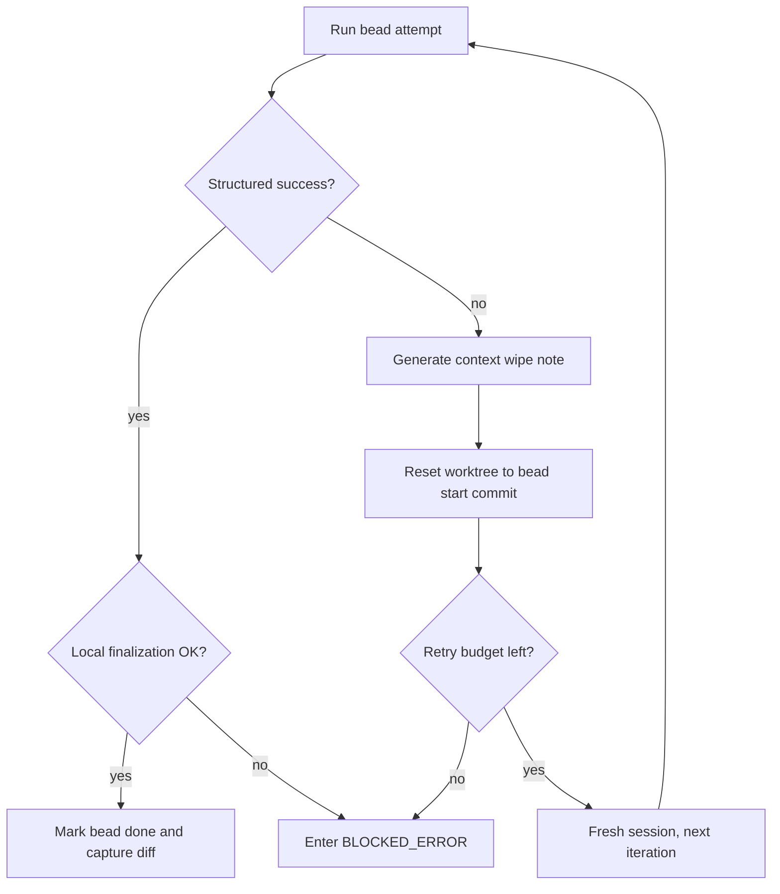

# Beads & Execution

> [!IMPORTANT]
> **TL;DR** — Instead of handing an entire feature to one giant coding session, LoopTroop decomposes the approved PRD into small, dependency-ordered beads. Each bead is executed one at a time in an isolated worktree with bounded retries. Failed attempts reset the worktree to the bead's start commit and retry in a fresh, clean session with a compact context-wipe failure note instead of a bloated conversation history.

Beads are LoopTroop's primary execution units. They serve as the structural bridge between the approved Product Requirements Document (PRD) and the live coding run, functioning as both the execution plan and the execution memory.

The core data model lives in `server/phases/beads/types.ts`. The execution orchestrator lives in `server/phases/execution/executor.ts`, and the workflow-side orchestration that manages coding loops and resumes interrupted sessions lives in `server/workflow/phases/executionPhase.ts` and `server/workflow/phases/beadsPhase.ts`.

---

## 1. What A Bead Is

A bead is designed to be small enough to execute in a highly focused, narrow context, but rich enough to encode:
- What must be changed (target files, descriptions)
- What depends on what (dependency graph edges)
- How to verify completion (test commands, acceptance criteria)
- What happened in prior attempts (iteration counts, notes)

LoopTroop plans features as a bead graph and executes this graph in a strict, scheduler-enforced dependency order.

### Current Bead Shape

| Field | Type | Meaning |
| --- | --- | --- |
| `id` | `string` | Stable bead identifier |
| `title` | `string` | Short execution title |
| `prdRefs` | `string[]` | PRD references that justify the bead |
| `description` | `string` | Full execution task description |
| `contextGuidance` | `{ patterns: string[]; anti_patterns: string[] }` | Local implementation guidance |
| `acceptanceCriteria` | `string[]` | Completion requirements |
| `tests` | `string[]` | What should be verified |
| `testCommands` | `string[]` | Concrete commands to run |
| `priority` | `number` | Execution order |
| `status` | `'pending' \| 'in_progress' \| 'done' \| 'error'` | Current execution state |
| `issueType` | `string` | Task, bug, chore, or similar |
| `externalRef` | `string` | Parent ticket reference |
| `labels` | `string[]` | PRD or planning labels |
| `dependencies` | `{ blocked_by: string[]; blocks: string[] }` | Execution graph edges |
| `targetFiles` | `string[]` | Expected file touch set |
| `notes` | `string` | Durable notes string carried across attempts |
| `iteration` | `number` | Current attempt count for the bead |
| `createdAt` | `string` | ISO timestamp — set when beads are approved |
| `updatedAt` | `string` | ISO timestamp |
| `completedAt` | `string` | Completion timestamp |
| `startedAt` | `string` | Start timestamp — set on first iteration, preserved across retries |
| `beadStartCommit` | `string \| null` | Git snapshot used for reset and retry |

### Example Bead

```json
{
  "id": "auth-refresh-token-rotation",
  "title": "Implement refresh-token rotation",
  "prdRefs": ["EPIC-AUTH", "STORY-SESSION-2"],
  "description": "Add refresh-token rotation and invalidation on reuse.",
  "contextGuidance": {
    "patterns": ["Reuse the existing session repository abstraction"],
    "anti_patterns": ["Do not introduce a second token storage format"]
  },
  "acceptanceCriteria": [
    "Refresh tokens rotate on successful refresh",
    "Reused refresh tokens invalidate the session family"
  ],
  "tests": [
    "Cover normal refresh flow",
    "Cover reused refresh token invalidation"
  ],
  "testCommands": [
    "npm run test:server"
  ],
  "priority": 3,
  "status": "pending",
  "issueType": "task",
  "externalRef": "AUTH-12",
  "labels": ["epic:auth", "story:sessions"],
  "dependencies": {
    "blocked_by": ["session-store-foundation"],
    "blocks": ["api-refresh-endpoint"]
  },
  "targetFiles": [
    "server/auth/sessionStore.ts",
    "server/routes/auth.ts"
  ],
  "notes": "",
  "iteration": 1,
  "createdAt": "",
  "updatedAt": "2026-04-23T09:00:00.000Z",
  "completedAt": "",
  "startedAt": "",
  "beadStartCommit": null
}
```

---

## 2. Storage Model

The editable bead plan for a ticket is stored under:

```text
.ticket/beads/<flow>/.beads/issues.jsonl
```

- **`flow`** defaults to the ticket base branch when not provided.
- The file is a line-oriented JSONL format.
- `GET /api/tickets/:id/beads` returns the canonical plan hash in the `X-Content-Sha256` header.
- `PUT /api/tickets/:id/beads` rewrites the full file atomically only while the ticket is in `WAITING_BEADS_APPROVAL`.
- The server also refreshes the approval snapshot, writes `user_edit_receipt:beads`, and clears execution-setup state after updates.

---

## 3. The Execution Loop

LoopTroop executes approved work through a bounded bead loop rather than one giant autonomous coding session.

### Execution Phases Around The Loop

| UI group | Phase | Purpose |
| --- | --- | --- |
| Pre-Implementation | `PRE_FLIGHT_CHECK` | Confirm the ticket is ready to leave planning |
| Pre-Implementation | `WAITING_EXECUTION_SETUP_APPROVAL` | Human review of the setup plan |
| Pre-Implementation | `PREPARING_EXECUTION_ENV` | Materialize the execution environment |
| Implementation | `CODING` | Run beads one at a time with bounded retries |
| Post-Implementation | `RUNNING_FINAL_TEST` | Validate the full result after all beads are done |
| Post-Implementation | `INTEGRATING_CHANGES` | Prepare the final change set |
| Post-Implementation | `CREATING_PULL_REQUEST` | Publish the delivery PR |
| Post-Implementation | `WAITING_PR_REVIEW` | Wait for merge or close-unmerged outcome |
| Post-Implementation | `CLEANING_ENV` | Remove temporary execution state |

*Note: `RUNNING_FINAL_TEST` and `CREATING_PULL_REQUEST` include model-output prompts governed by the AI Response Timeout. Test shell commands and coding work are governed by execution-band timeout controls.*

---

## 4. The Bead Execution Cycle

`executeBead()` is the heart of the execution phase. For each individual bead, the executor runs the following cycle:

1. **Load:** Load the active bead specification and the current execution profile.
2. **Recover or Reset:** Recover any interrupted `in_progress` bead from a matching checkpoint when possible, or hard-reset it to its recorded start commit snapshot before attempting a retry.
3. **Session Hook:** Start or reattach to the owned OpenCode session for that bead iteration.
4. **Prompt:** Prompt the model with the coding template and the narrow context slice, watching OpenCode retry status events for provider-side backoffs.
5. **Enforce Completion:** Require structured completion markers so the system can verify when the attempt actually finished.
6. **Persist:** Save the execution checkpoint, then finalize the local work.
7. **Complete:** Mark the bead `done` only after local finalization succeeds, or trigger a retry/blocking error path if execution or finalization fails.

---

## 5. Bead Lifecycle & Scheduler Rules

### Bead Lifecycle States

| Bead status | Meaning |
| --- | --- |
| `pending` | Planned but not yet started. |
| `in_progress` | Currently selected by the execution loop. |
| `done` | OpenCode succeeded and local finalization succeeded: committable project changes were committed regardless of language, or the bead was a true no-op. |
| `error` | Last attempt or finalization failed, needing retry or manual recovery. |

### Scheduler Rules

The scheduler logic is intentionally simple and deterministic, preventing the coding model from deciding its own work order:
- `getRunnable(beads)` returns pending beads whose dependencies are fully satisfied.
- `getNextBead(beads)` selects the next unblocked runnable bead based on priority.
- `isAllComplete(beads)` decides whether all beads are `done`, permitting the execution stage to advance.

---

## 6. Structured Completion & Corrective Reminders

LoopTroop does not trust plain prose statements like "I have completed the task." The executor enforces a strict protocol using two types of structured reminders:

- **Completion-marker reminder:** Sent when a response is missing or has a malformed `<BEAD_STATUS>` marker, prompting the model to re-emit machine-checkable state.
- **Continuation reminder:** Sent when the marker is valid but not all validation gates are passing, instructing the agent to keep working and re-emit the marker when done.

These reminders force the model to emit machine-readable progress state. If the marker is missing or malformed, LoopTroop retries with a corrective prompt instead of guessing what happened.

---

## 7. Bounded Ralph-Style Retry & Context Wipe Notes

### The Ralph Loop Philosophy

> [!NOTE]
> **The Ralph Loop Philosophy:** Instead of trying to talk an AI out of a degraded coding spiral, LoopTroop acts like a strict manager. It says: "stop, write down what failed, throw away your scratchpad, and start over with a clean head."

When a bead attempt fails (or the per-iteration deadline fires), LoopTroop abandons the degraded transcript, resets the workspace, and starts fresh.



### Context Wipe Notes

Before abandoning a failing session, `generateContextWipeNote()` sends a context-capture prompt to the still-open session to summarize the attempt. For iteration timeouts, this capture is best-effort: LoopTroop may query the session for notes, but the session is no longer allowed to preserve or finalize the bead.

The note is extremely compact and explicitly answers:
1. What the bead was trying to do.
2. What failed.
3. What was already tried.
4. What the next fresh attempt should keep in mind.

If the model fails to generate a good note, LoopTroop falls back to a simpler, synthesized system failure note.

---

## 8. Session Strategy

Execution combines fresh, isolated sessions with ownership-aware reconnect:

- **Fresh session per retry:** Prevents carrying corrupted reasoning or stale timed-out completions into the next iteration.
- **Ownership-aware reconnect:** Survives backend process restarts or temporary browser disconnections if the same owned session still exists.
- **Explicit lifecycle:** Keeps session state transparent and auditable in `opencode_sessions`.

---

## 9. OpenCode Retry Budget

OpenCode can emit `session.status` retry events while backing off from provider interruptions (rate limits, overloaded capacity, timeout/deadline errors, socket resets). LoopTroop treats matching retry states as shared prompt-level blockers across the workflow.

The execution profile controls two limits:
- **`OpenCode Retry Limit`:** The number of matching retry events allowed before blocking (default: 10).
- **`OpenCode Retry Grace Window`:** How long a prompt may remain in a matching retry state without progress before blocking (default: 60 seconds).

In any owned phase, retry-budget exhaustion can preserve the active OpenCode session and route the ticket to `BLOCKED_ERROR`. Resuming via **Continue** sends exactly `continue please` into that same session. During `CODING`, this prevents provider stalls from consuming the bead iteration timeout or bead retry budget.

---

## 10. Worktree Hygiene

Execution is fully isolated inside the ticket worktree. Important `gitOps.ts` behaviors include:
- **Diff capture:** Excludes `.ticket/**` and `.looptroop/**` folders from staging and review diffs.
- **Commit capture:** A local bead commit is required when Git-visible project changes exist in any language or file extension. Ephemeral setups and caches are excluded.
- **Hard reset:** Resets can hard-reset and clean the worktree back to `beadStartCommit` while preserving the LoopTroop-owned `.ticket/` directory containing planning artifacts, approvals, and logs.
- **Noise exclusion:** Common generated paths like `node_modules` or `dist` are skipped only if untracked, with `.gitignore` suggestions surfaced in warnings.

---

## 11. Success & Failure Paths

### Success Path
A successful bead execution:
1. Persists a `bead_execution:{beadId}` checkpoint.
2. Creates the local bead commit (or records a no-op completion if no changes exist).
3. Updates bead status to `done` only after local finalization succeeds.
4. Captures the bead diff artifact (`bead_diff:<beadId>`) exposed at `GET /api/tickets/:id/beads/:beadId/diff`.
5. Hands control back to the scheduler.

### Failure Path & Blocked-Error
LoopTroop distinguishes between recoverable iteration failure and terminal blockage. If local finalization fails after OpenCode reported success, LoopTroop broadcasts `BEAD_ERROR` with `BEAD_FINALIZATION_FAILED` and routes the ticket to `BLOCKED_ERROR`.

On startup or manual retry, `CODING` recovery checks if the interrupted `in_progress` bead has a current matching `bead_execution:<beadId>` checkpoint. If it matches, LoopTroop resumes finalization from the checkpoint instead of re-running the bead. Otherwise, recovery falls back to the reset/retry path.

---

## 12. Execution Configuration Controls

### Execution Setup Timeout
The maximum allowed runtime for the one-time `PREPARING_EXECUTION_ENV` step after the setup plan is approved. The setup agent must attempt safe user-space provisioning under `.ticket/runtime/execution-setup/tool-cache` if version/info probes fail, rather than blocking immediately. If setup provisions tooling, it writes `env.sh` and `run` wrappers. LoopTroop validates the declared wrapper before coding begins, and final testing automatically reuses this validated wrapper.

### Per-Iteration Timeout
The maximum allowed runtime for one bead attempt in `CODING` (before the system aborts, captures a context-wipe note, hard-resets, and retries in a fresh session).

### Max Bead Retries
Defines how many fresh-session re-attempts LoopTroop allows for a bead before it marks the bead with `BEAD_RETRY_BUDGET_EXHAUSTED` and enters `BLOCKED_ERROR`.

---

## 13. Why Beads & Execution Loops Matter Architecturally

Without beads and execution loops, AI coding orchestrators collapse back into a single long-running chat session with weak recovery, weaker context engineering, and no auditability. Beads limit context size, provide clear checkpoint boundaries, preserve execution history, and enforce scheduling constraints safely outside the language model itself.

---

## Related Docs

- [Ticket Flow](ticket-flow.md)
- [Context Engineering](context-engineering.md)
- [OpenCode Integration](opencode-integration.md)
- [System Architecture](system-architecture.md)
