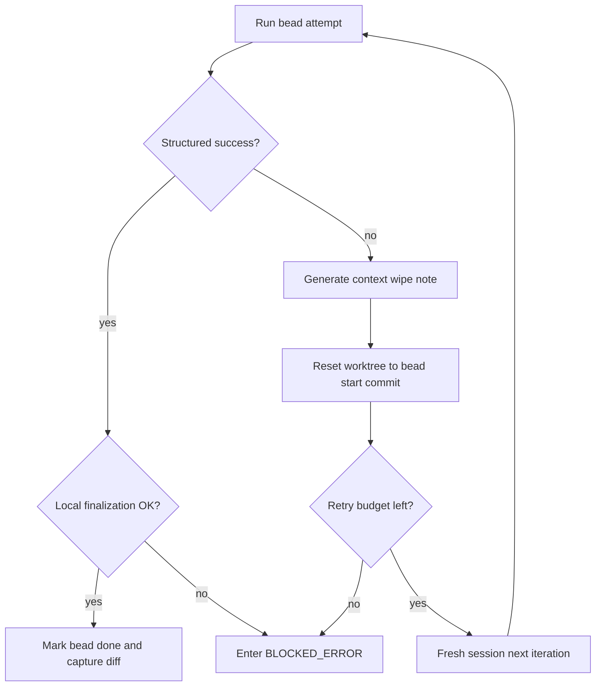

# Beads & Execution

> [!IMPORTANT]
> **TL;DR** - LoopTroop does not hand an entire feature to one long coding chat. It first turns the approved PRD into small, dependency-ordered beads, then runs those beads one at a time in an isolated worktree with strict retries, hard resets, structured completion markers, and explicit runtime-setup handoff.

Beads are LoopTroop's execution units. They are the bridge between the approved PRD and the live coding loop: small enough to keep context narrow, but structured enough to encode dependency order, file scope, verification intent, retry history, and durable recovery metadata.

The canonical bead model lives in `server/phases/beads/types.ts`. Runtime scheduling lives in `server/phases/execution/scheduler.ts`. The coding loop is split between `server/phases/execution/executor.ts` and `server/workflow/phases/executionPhase.ts`. The setup handoff immediately before coding lives in `server/workflow/phases/executionSetupPhase.ts`, `server/phases/executionSetupPlan/types.ts`, and `server/phases/executionSetup/types.ts`.

LoopTroop implements only part of the broader "beads" idea popularized by Steve Yegge. Its implementation is intentionally pragmatic: deterministic scheduling, small coding slices, strong retry/reset semantics, and durable workflow artifacts.

---

## 1. Where This Page Fits

This page starts at the point where beads are already expanded into execution-ready records and reviewed by a human. The earlier beads planning loop (`DRAFTING_BEADS` -> `COUNCIL_VOTING_BEADS` -> `REFINING_BEADS` -> `VERIFYING_BEADS_COVERAGE` -> `EXPANDING_BEADS`) is covered mainly in [Ticket Flow](ticket-flow.md) and [LLM Council](llm-council.md).

What this page focuses on:

- the final approved bead shape
- how beads are stored, edited, and approved
- how approved beads hand off into execution setup
- how the coding scheduler, retry loop, and recovery paths work
- which artifacts and APIs expose execution state

---

## 2. What An Approved Bead Contains

A bead is the smallest unit LoopTroop will schedule for coding. It carries enough structure to drive execution without forcing the coding model to infer its own work order.

### Current Bead Shape

| Field | Type | Meaning |
| --- | --- | --- |
| `id` | `string` | Stable bead identifier |
| `title` | `string` | Short execution title |
| `prdRefs` | `string[]` | PRD epic/story references that justify the bead |
| `description` | `string` | Full coding task description |
| `contextGuidance` | `{ patterns: string[]; anti_patterns: string[] }` | Local implementation guardrails |
| `acceptanceCriteria` | `string[]` | Completion requirements |
| `tests` | `string[]` | Verification intent in prose |
| `testCommands` | `string[]` | Concrete commands the bead expects to run |
| `priority` | `number` | Deterministic execution order among runnable beads |
| `status` | `'pending' \| 'in_progress' \| 'done' \| 'error'` | Runtime state |
| `issueType` | `string` | Task, bug, chore, or similar |
| `externalRef` | `string` | Parent ticket reference |
| `labels` | `string[]` | Planning labels |
| `dependencies` | `{ blocked_by: string[]; blocks: string[] }` | Dependency graph edges |
| `targetFiles` | `string[]` | Expected file touch set |
| `notes` | `string` | Append-only retry/context-wipe notes |
| `iteration` | `number` | Current execution attempt number |
| `createdAt` | `string` | ISO timestamp set when beads are approved |
| `updatedAt` | `string` | ISO timestamp |
| `completedAt` | `string` | Completion timestamp |
| `startedAt` | `string` | First-start timestamp, preserved across retries |
| `beadStartCommit` | `string \| null` | Git snapshot used for reset/retry |

### Why These Fields Matter At Runtime

- **Planning fields** (`prdRefs`, `description`, `acceptanceCriteria`, `testCommands`, `targetFiles`) keep each coding session narrow.
- **Graph fields** (`priority`, `dependencies`) let the scheduler choose work deterministically instead of letting the model decide its own sequence.
- **Recovery fields** (`status`, `iteration`, `notes`, `startedAt`, `beadStartCommit`) make retries durable across resets, backend restarts, and blocked-error recovery.

### Example Bead

```json
{
  "id": "auth-refresh-token-rotation",
  "title": "Implement refresh-token rotation",
  "prdRefs": ["EPIC-AUTH", "STORY-SESSION-2"],
  "description": "Add refresh-token rotation and invalidation on reuse.",
  "contextGuidance": {
    "patterns": ["Reuse the existing session repository abstraction"],
    "anti_patterns": ["Do not introduce a second token storage format"]
  },
  "acceptanceCriteria": [
    "Refresh tokens rotate on successful refresh",
    "Reused refresh tokens invalidate the session family"
  ],
  "tests": [
    "Cover normal refresh flow",
    "Cover reused refresh token invalidation"
  ],
  "testCommands": [
    "npm run test:server"
  ],
  "priority": 3,
  "status": "pending",
  "issueType": "task",
  "externalRef": "AUTH-12",
  "labels": ["epic:auth", "story:sessions"],
  "dependencies": {
    "blocked_by": ["session-store-foundation"],
    "blocks": ["api-refresh-endpoint"]
  },
  "targetFiles": [
    "server/auth/sessionStore.ts",
    "server/routes/auth.ts"
  ],
  "notes": "",
  "iteration": 1,
  "createdAt": "",
  "updatedAt": "2026-04-23T09:00:00.000Z",
  "completedAt": "",
  "startedAt": "",
  "beadStartCommit": null
}
```

---

## 3. Storage, Editing, And Approval Semantics

The editable bead plan for a ticket is stored as JSONL under:

```text
.ticket/beads/<flow>/.beads/issues.jsonl
```

- **`flow`** defaults to the ticket base branch when not provided.
- The format is line-oriented JSONL, but the runtime reads it as a bead array.
- `GET /api/tickets/:id/beads` returns the current plan and exposes the exact plan hash in `X-Content-Sha256`.
- `PUT /api/tickets/:id/beads` rewrites the entire file atomically, but only while the ticket is in `WAITING_BEADS_APPROVAL`.

### What Saving A Beads Edit Really Does

Saving the beads plan is not a cosmetic UI action. It is a workflow mutation with downstream consequences:

1. the canonical JSONL file is replaced atomically
2. the beads approval snapshot is refreshed
3. a `user_edit_receipt:beads` artifact is appended with before/after hashes
4. execution-setup state is cleared so stale setup assumptions cannot survive a changed bead plan

That invalidation is important. If the execution blueprint changes, any previously drafted setup-plan assumptions may no longer be valid, so LoopTroop forces setup to be regenerated/reapproved from the updated bead plan.

### Approval Gate Behavior

`WAITING_BEADS_APPROVAL` is the last human gate before execution-band work begins.

- Approval is hash-guarded against the exact reviewed content.
- If unresolved coverage gaps remain, `Fix gaps with AI` runs one fresh semantic-blueprint revision and coverage check; when the blueprint changes, expansion reruns so the approval plan and content hash are refreshed.
- The approved bead set becomes the authoritative execution plan consumed by pre-flight and coding.
- After approval, the coding agent does **not** receive the full plan every time. It receives the active bead plus narrow runtime context for that bead iteration.

---

## 4. The Handoff Between Beads And Coding

Approved beads do not go straight into `CODING`. They first pass through a deterministic execution-band handoff:

| Phase | Purpose |
| --- | --- |
| `WAITING_BEADS_APPROVAL` | Human approval of the expanded execution plan |
| `PRE_FLIGHT_CHECK` | Deterministic readiness checks against the worktree, dependency graph, Git/GitHub integration, and coding-agent capability |
| `WAITING_EXECUTION_SETUP_APPROVAL` | Human review of the runtime setup contract |
| `PREPARING_EXECUTION_ENV` | Temporary-only runtime preparation and reusable profile generation |
| `CODING` | Bead-by-bead coding with retries, resets, and checkpoint recovery |
| `RUNNING_FINAL_TEST` | Whole-change validation after all beads are done |
| `INTEGRATING_CHANGES` | Prepare the final integrated change set |
| `CREATING_PULL_REQUEST` | Draft and publish the delivery PR |
| `WAITING_PR_REVIEW` | Wait for merge or close-unmerged outcome |
| `CLEANING_ENV` | Remove temporary execution artifacts |

`BLOCKED_ERROR` can interrupt any of the execution-band phases above.

---

## 5. Execution Setup Is Part Of The Execution Story

The current runtime no longer treats setup as a loose list of `commands`, `environment_variables`, and `tool_cache` entries. The setup contract is now split into two distinct artifacts:

| Artifact | Produced in | Purpose |
| --- | --- | --- |
| `execution_setup_plan` | `WAITING_EXECUTION_SETUP_APPROVAL` | Human-reviewed contract describing whether setup is needed and, if so, which temporary steps are allowed |
| `execution_setup_profile` | `PREPARING_EXECUTION_ENV` | Machine-validated runtime profile describing the environment that coding and final test should reuse |

### 5.1 Approved Setup Plan Shape

The setup plan is an approval artifact, not the final runtime state. Its key fields are:

- **`readiness`**: `status`, `actionsRequired`, evidence, and remaining gaps
- **`tempRoots`**: approved temporary directories the setup phase may use
- **`steps`**: ordered setup steps with `commands`, `required`, rationale, and cautions
- **`projectCommands`**: discovered full-project command families (`prepare`, `testFull`, `lintFull`, `typecheckFull`)
- **`qualityGatePolicy`**: default policy later coding beads should follow
- **`cautions`**: user-facing warnings or assumptions

This matters because the setup gate is now explicitly allowed to conclude that the environment is already ready. In that case, the plan can be approved with zero setup steps and the next phase mostly becomes verification plus profile emission.

### 5.2 Runtime Setup Profile Shape

The setup profile is the durable runtime contract that later phases reuse. It records:

- **`bootstrapCommands`** actually used during setup
- **`toolingProbeCommands`** used to verify the prepared runtime
- optional **`toolRequirements`** evidence showing provisioning attempts or safe failure reasons
- **`reusableArtifacts`** such as `.ticket/runtime/execution-setup/run`
- **`projectCommands`** and **`qualityGatePolicy`** for later commands
- **`cautions`** copied forward for visibility

When setup provisions tooling, LoopTroop expects reusable runtime artifacts under `.ticket/runtime/execution-setup/**`, commonly including:

- `.ticket/runtime/execution-setup/env.sh`
- `.ticket/runtime/execution-setup/run`
- `.ticket/runtime/execution-setup-profile.json`

Final testing reuses this validated runtime wrapper instead of rediscovering the environment from scratch.

### 5.3 What Setup Is Allowed To Do

`PREPARING_EXECUTION_ENV` is deliberately narrow:

- it must respect the approved setup plan first
- it should verify readiness before running bootstrap commands
- it may prepare temporary-only tooling under LoopTroop-owned runtime paths
- it must not quietly leave committable project changes behind
- it may use setup-scoped online lookup (`websearch` / `webfetch`) when local metadata is insufficient to resolve a required launcher or version

This is why the setup phase belongs in the Beads & Execution story: it is the controlled runtime bridge between an approved plan and a safe coding loop.

---

## 6. Scheduler Rules And Bead Lifecycle

LoopTroop keeps scheduling intentionally simple and deterministic.

### Bead Status Meanings

| Status | Meaning |
| --- | --- |
| `pending` | Planned and eligible for future scheduling |
| `in_progress` | Selected by the coding loop |
| `done` | OpenCode succeeded **and** local finalization succeeded |
| `error` | The last attempt failed or finalization failed; manual recovery/retry is required |

### Scheduler Rules

`server/phases/execution/scheduler.ts` enforces three core rules:

- `getRunnable(beads)` returns only beads whose status is `pending` and whose `blocked_by` dependencies are already `done`
- `getNextBead(beads)` picks the runnable bead with the lowest `priority`
- `isAllComplete(beads)` advances the workflow only when every bead is `done`

Important consequences:

- beads in `error` are never auto-selected again
- interrupted `in_progress` beads are handled by recovery logic first, not by the scheduler
- the model never chooses its own work order

---

## 7. The Single-Bead Execution Cycle

`executeBead()` is the core loop for one bead attempt.

1. **Select** - mark the next runnable bead `in_progress`, persist `startedAt`, and record `beadStartCommit`.
2. **Assemble narrow context** - load the active bead plus focused runtime context for that bead.
3. **Create or reattach session** - own the OpenCode session for that bead iteration.
4. **Prompt** - send the coding prompt and watch OpenCode stream/status events.
5. **Enforce structured completion** - require a valid `<BEAD_STATUS>` marker instead of trusting free-form prose.
6. **Retry inside the session when safe** - use structured retry prompts or "keep working" reminders when the marker is malformed or the gates are not yet passing.
7. **Persist checkpoint** - write `bead_execution:{beadId}` with the execution result and checkpoint metadata.
8. **Finalize locally** - create the bead commit when Git-visible project changes exist, or record a true no-op completion.
9. **Capture diff and advance** - persist `bead_diff:{beadId}`, mark the bead `done`, and either choose the next runnable bead or advance to final test.

### What "done" Really Means

`done` is not "the model said it finished." It means:

- the completion marker passed validation
- required checks were reported as passing
- local finalization succeeded
- a bead commit exists when committable project changes were present, regardless of language or extension

If local finalization fails after model success, the bead does **not** become `done`; the ticket routes into `BLOCKED_ERROR` with `BEAD_FINALIZATION_FAILED`.

---

## 8. Structured Completion And Corrective Prompts

LoopTroop does not trust plain language like "done" or "tests pass now."

Each bead attempt must end with exactly one `<BEAD_STATUS>...</BEAD_STATUS>` block containing:

- `bead_id`
- `status`
- `checks.tests`
- `checks.lint`
- `checks.typecheck`
- `checks.qualitative`

If the output is malformed or missing the marker, LoopTroop does **not** guess. It sends a structured retry reminder that asks for the exact schema again.

If the marker shape is valid but the bead is still incomplete, LoopTroop sends a continuation reminder instructing the agent to keep editing, rerun the failing checks, and only return once the bead is actually complete.

This two-stage enforcement matters:

- **schema repair path** for malformed completion output
- **keep-working path** for valid-but-incomplete output

That prevents the executor from confusing formatting errors with genuine implementation failure.

---

## 9. Retry, Reset, And Context-Wipe Notes

When a bead attempt fails, LoopTroop does not keep piling more context into the same degraded session.

### Retry Philosophy

For ordinary implementation failure or a workflow-owned per-iteration timeout:

1. capture a compact retry note from the failing session when possible
2. append that note to the bead's durable `notes`
3. hard-reset the worktree to `beadStartCommit`
4. abandon the old session
5. retry in a fresh session with the accumulated notes as compact guidance



### What The Retry Note Tries To Preserve

The context-wipe note is intentionally short. It tries to preserve only:

1. what the bead was trying to do
2. what failed
3. what was already tried
4. what the next fresh attempt should remember

If the model cannot produce a good note, LoopTroop falls back to a deterministic system-generated note based on the recorded errors, recent failing tool excerpts, and truncated last output.

### Retry Budget Exhaustion

If the bead reaches the configured retry cap, LoopTroop marks it `error`, attaches `BEAD_RETRY_BUDGET_EXHAUSTED`, and routes the ticket to `BLOCKED_ERROR`.

---

## 10. Session Ownership, Preservation, And Continue

Execution uses owned OpenCode sessions, but not every failure is handled the same way.

### Fresh Session Versus Preserved Session

- **Ordinary bead failure or workflow-owned iteration timeout** -> no Continue; LoopTroop captures notes, resets, and retries in a fresh session
- **Continuable provider/session interruption** -> the active session may be preserved and the ticket may enter `BLOCKED_ERROR` with **Continue**

### When Continue Is Available

During `CODING`, LoopTroop can preserve the active session for provider-side interruptions such as:

- retry-budget exhaustion on matching OpenCode retry states
- selected provider/session timeouts
- transport or session failures that remain safely resumable

When Continue is available, returning from `BLOCKED_ERROR` sends exactly:

```text
continue please
```

into that preserved session.

This distinction is important:

- **workflow-owned timeouts** consume bead attempts and trigger reset/retry
- **provider/session interruptions** can preserve the session and avoid consuming the bead's retry budget in the same way

---

## 11. Recovery After Backend Restart

`CODING` is restart-aware.

If the backend restarts while a bead is `in_progress`, LoopTroop checks the latest `bead_execution:{beadId}` artifact before deciding what to do.

It will finalize from that checkpoint only when the checkpoint still matches the current:

- bead id
- iteration
- `startedAt`
- `updatedAt`
- `beadStartCommit`

If the checkpoint is missing, stale, malformed, or mismatched, LoopTroop does **not** trust it as proof of success. It resets the bead to its start snapshot, returns it to `pending`, and lets the scheduler choose the next valid attempt.

---

## 12. Worktree Hygiene And Finalization

Execution is isolated inside the ticket worktree, and the local Git rules are strict.

### Important Behaviors

- **Bead start snapshot**: every new bead records `beadStartCommit` before coding
- **Reset on retry**: retries hard-reset and clean back to that snapshot
- **Metadata preservation**: LoopTroop-owned planning/runtime paths are preserved appropriately during resets
- **Commit capture**: Git-visible project changes produce a local bead commit regardless of language or extension
- **No-op completion**: a true no-op bead can still finish successfully when no committable project changes were needed
- **Noise handling**: generated/untracked noise is surfaced as warnings rather than silently swept into bead commits

### Diff Capture

After successful local finalization, LoopTroop captures a code-oriented bead diff and exposes it as `bead_diff:{beadId}`. This lets the UI and API show what that bead actually changed without mixing in `.ticket/**` metadata.

---

## 13. Artifacts, APIs, And What You Can Inspect

Beads and execution are highly artifact-driven. The most important pieces are:

| Artifact / API | Meaning |
| --- | --- |
| `.ticket/beads/<flow>/.beads/issues.jsonl` | Canonical persisted bead plan |
| `GET /api/tickets/:id/beads` | Returns the plan and `X-Content-Sha256` |
| `PUT /api/tickets/:id/beads` | Rewrites the plan during `WAITING_BEADS_APPROVAL` |
| `POST /api/tickets/:id/coverage/fix-gaps` | Runs one approval-screen extra fix for unresolved beads coverage gaps when called with `{ "domain": "beads" }` |
| `GET /api/tickets/:id/beads/:beadId/diff` | Returns the captured diff for a completed bead when available |
| `approval_receipt` for beads | Hash-guarded proof that the reviewed bead plan was approved |
| `user_edit_receipt:beads` | Append-only audit trail for manual bead edits |
| `execution_setup_plan` | Approved runtime-setup contract between beads and coding |
| `execution_setup_report` / `execution_setup_retry_notes` | Setup execution diagnostics and retry history |
| `execution_setup_profile` | Reusable runtime profile for coding and final test |
| `bead_execution:{beadId}` | Latest raw execution/checkpoint artifact for that bead |
| `bead_diff:{beadId}` | Captured diff after successful finalization |

In the UI, `CODING` also exposes bead progress directly:

- the workspace title shows current bead and iteration progress while coding is active
- the left timeline keeps the last known bead count for later review
- per-bead raw input/output and iteration history are inspectable from the coding view

---

## 14. Configuration Controls That Shape The Loop

Three runtime controls matter most here:

### Execution Setup Timeout

The maximum runtime for `PREPARING_EXECUTION_ENV`. This bounds the setup agent while it verifies readiness, provisions temporary tooling, validates wrappers/probes, and emits the reusable runtime profile.

### Per-Iteration Timeout

The maximum runtime for one bead attempt in `CODING`. When this workflow-owned deadline fires, LoopTroop captures retry notes if possible, resets to `beadStartCommit`, and retries in a fresh session.

### Max Bead Retries

The maximum number of fresh-session attempts LoopTroop allows for a bead before routing to `BLOCKED_ERROR` with `BEAD_RETRY_BUDGET_EXHAUSTED`.

### OpenCode Retry Budget

Separate from bead retries, the execution profile also defines how long and how often matching OpenCode retry states may persist before the workflow blocks on a provider/session problem instead of burning bead time.

---

## 15. Why This Architecture Matters

Without beads, the coding phase collapses into a single long-running AI transcript with weak recovery and poor auditability.

LoopTroop's bead-and-execution model gives it:

- narrow context slices instead of giant conversations
- deterministic dependency order outside the model
- durable restart/recovery checkpoints
- hard resets instead of degraded-chat spirals
- explicit runtime setup contracts before coding starts
- bead-level audit artifacts instead of one opaque final diff

That combination is what makes the system durable at repository scale rather than just "a coding chat that ran for a long time."

### Manual QA fix beads

When an enabled Manual QA round is submitted with any explicit Fail, LoopTroop creates normal pending beads with `issueType: qa-fix` and the `manual-looptroop-qa` label. Related failures may share a user-selected merge group; every ungrouped failure gets its own deterministic bead. They are prioritized after existing beads, do not depend on already-completed work, carry affected target files where known, and include deterministic acceptance criteria/tests derived from the source checklist behavior and expected result.

Each QA bead has typed `qaOrigin` containing the Manual QA version, all source item IDs/lineages, observations, expected behavior, evidence references, deterministic origin/action identity, locked model ID/image-capability result, and Manual-QA creation timestamp. This is displayed as a **Manual QA Fix** badge in Coding, bead Details, selected-bead, artifact, and log views. It is intentionally separate from ordinary retry `notes`: a provider/test retry must not overwrite or masquerade as the user's QA observation.

Scheduling, execution, commits, metrics, retry/reset behavior, and final tests remain the standard bead pipeline. Before the first QA bead, Manual QA generation has already checkpointed accepted final-test effects and removed/quarantined residue from the Git-visible worktree, preventing a fix bead from sweeping unrelated runtime files into its commit. When all QA-fix beads finish, the ticket receives a fresh final-test attempt and, on success, a new checklist version.

Image evidence is handled through OpenCode SDK file parts. If the locked model advertises image input, all detected image files for the bead are attached with no additional prompt-size cap; non-images remain referenced. A false/unavailable capability records `references_only`. Provider/context overflow follows normal bead error recovery—LoopTroop does not silently omit selected images.

---

## Related Docs

- [Ticket Flow](ticket-flow.md)
- [Pre-Implementation](pre-implementation.md)
- [Post-Implementation](post-implementation.md)
- [Context Engineering](context-engineering.md)
- [OpenCode Integration](opencode-integration.md)
- [System Architecture](system-architecture.md)
