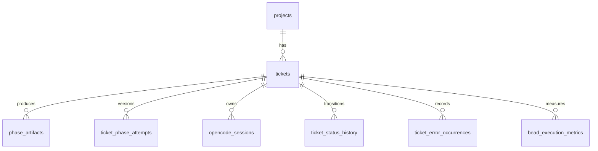

# Database Schema

> [!IMPORTANT]
> **TL;DR** — LoopTroop persists durable state in two SQLite databases plus ticket-owned files: one app DB for global settings and attached-project identity, one per-project DB for workflow records, and `.ticket/**` files for canonical planning docs, logs, and runtime metadata.

LoopTroop does **not** treat model transcripts as source of truth. Durable workflow state is split deliberately:

- the **app DB** stores global configuration and the attached-project registry
- each attached repository has a **project DB** for tickets, attempts, artifacts, session ownership, and error history
- the ticket worktree filesystem stores **canonical documents, logs, and per-ticket metadata** that do not belong in relational tables

## 1. Storage Layout At A Glance

| Layer | Default location | Owns | Notes |
| --- | --- | --- | --- |
| App DB | `~/.config/looptroop/app.sqlite` | Profile defaults, app metadata, attached projects | Override with `LOOPTROOP_CONFIG_DIR` or `LOOPTROOP_APP_DB_PATH` |
| Project DB | `<project>/.looptroop/db.sqlite` | Project row, tickets, artifacts, phase attempts, OpenCode session ownership, status/error history | Derived from the attached project root |
| Ticket filesystem | `<project>/.looptroop/worktrees/<externalId>/.ticket/**` | Canonical docs, runtime logs, bead files, ticket meta, rebuildable projections | Lives inside the ticket worktree, not in the root repo tree |

Both SQLite connections use WAL mode plus SQLite busy timeouts. The app DB connection and path resolution live in `server/db/index.ts`; the app schema is bootstrapped in `server/db/init.ts`. The project DB is created and evolved in `server/db/project.ts`, which also cleans foreign-key orphans before enabling `PRAGMA foreign_keys=ON` so old or manually edited project databases do not start with dangling references.

## 2. Identity And Ownership Boundaries

The main thing to understand is that LoopTroop has **public IDs**, **local row IDs**, and **filesystem paths**, and they are intentionally different:

| Identifier | Stored in | Meaning |
| --- | --- | --- |
| `attached_projects.id` | App DB | Public project id used by the API |
| `projects.id` | Project DB | Local numeric row id inside that project DB only |
| `tickets.id` | Project DB | Local numeric foreign-key target inside that project DB |
| `tickets.external_id` | Project DB + filesystem paths | Human-facing per-project ticket id such as `AUTH-12` |
| `projectId:externalId` | API/public refs | Composite ticket ref returned by the API, built from `attached_projects.id` + `tickets.external_id` |

Important consequences:

- there are **no cross-database foreign keys** between the app DB and project DB
- the bridge between them is the attached project root path (`attached_projects.folder_path` / `projects.folder_path`)
- `projects.id` and `tickets.id` are local implementation details; the API exposes composite refs instead

## 3. App Database

The app database is the global control-plane store.

### Tables

| Table | Purpose | Notes |
| --- | --- | --- |
| `profiles` | Baseline workflow/profile settings | Treated as a singleton row by the API |
| `app_meta` | Small app-level key/value metadata | Used for lightweight UI/runtime flags |
| `attached_projects` | Registry of attached project roots | Provides the public project id |

### `profiles`

This row is the default configuration source that projects and tickets inherit from until they override or lock values.

Important columns:

- model selection: `main_implementer`, `main_implementer_variant`, `council_members`, `council_member_variants`
- workflow budgets and limits: `min_council_quorum`, `interview_questions`, `max_iterations`, `structured_retry_count`
- timeout settings in milliseconds: `per_iteration_timeout`, `execution_setup_timeout`, `council_response_timeout`
- coverage controls: `coverage_follow_up_budget_percent`, `max_coverage_passes`, `max_prd_coverage_passes`, `max_beads_coverage_passes`
- Manual QA baseline: `manual_qa_enabled` (non-null boolean, default `false`)
- internal Git behavior: `git_hook_policy` (non-null text, default `validate_explicitly`)
- OpenCode retry controls: `opencode_retry_limit`, `opencode_retry_delay`, `opencode_steps`
- tool log truncation limits: `tool_input_max_chars`, `tool_output_max_chars`, `tool_error_max_chars`

Operational notes:

- the table shape allows multiple rows, but the API treats it as a **singleton**: `POST /api/profile` rejects a second profile and normal reads use the first row
- `council_members` is stored as a JSON array string; `council_member_variants` is a JSON object string keyed by model id
- defaults come from `server/db/defaults.ts`
- validation ranges are enforced by the API layer in `server/routes/profiles.ts`, not by SQLite column constraints alone

### `app_meta`

`app_meta` is intentionally small and generic: `key`, `value`, and `updated_at`.

Today it is used for startup/UI metadata such as `startup.restore_notice.dismissed_at` in `server/startupState.ts`, and it is the right place for tiny app-wide flags that do not justify a dedicated table.

### `attached_projects`

This table is the app-level registry of attached repositories:

- `folder_path` is unique
- `id` is the **public project id** used by the API
- deleting or detaching an attached project removes this registry row, not necessarily the project-local `.looptroop` state

## 4. Project Database

The project database is the operational store for one attached repository. LoopTroop expects one logical `projects` row per attached repo and many ticket-owned rows underneath it.

### Tables

| Table | Purpose |
| --- | --- |
| `projects` | Project metadata plus project-level configuration overrides |
| `tickets` | Ticket records, workflow status, progress counters, and serialized machine snapshot |
| `phase_artifacts` | Phase-scoped structured artifacts, reports, approvals, UI companions, and read models |
| `ticket_phase_attempts` | Archived/active phase-version history for non-implementation phases |
| `opencode_sessions` | Exact OpenCode session ownership records |
| `ticket_status_history` | Append-only status transition log |
| `ticket_error_occurrences` | Append-only blocked-error history plus resolution state |
| `bead_execution_metrics` | One row per completed bead; powers throughput/ETA forecasting |

### `projects`

Important columns:

- display/identity: `name`, `shortname`, `icon`, `color`, `folder_path`
- nullable overrides: `council_members`, `max_iterations`, `per_iteration_timeout`, `execution_setup_timeout`, `council_response_timeout`, `min_council_quorum`, `interview_questions`, `manual_qa_override`, `git_hook_policy`
- sequencing: `ticket_counter`
- metadata: `profile_id`

Operational notes:

- `ticket_counter` is the source for `tickets.external_id`; new tickets are generated as `<shortname>-<counter>`
- `council_members` is a JSON array string when present
- `profile_id` is **not** a cross-database foreign key; SQLite cannot enforce a foreign key into the separate app DB, so this column is metadata only
- project-level overrides are read directly from this row at runtime; they do not require joining back into the app DB
- project `git_hook_policy` overrides the profile baseline when a Draft ticket has no local choice; the final ticket → project → profile result is frozen at Start and never rewrites the target repository's Git configuration

### Reattaching Existing Project State

Selecting a repository with an existing `.looptroop/db.sqlite` exposes three storage operations:

- **Restore** preserves the project row and all ticket-owned rows/files. Current visible form edits are applied, and `projects.folder_path` plus the app-level `attached_projects.folder_path` are aligned to the repository root on the current machine.
- **Clear tickets** preserves the complete project row, including its short name, appearance, creation timestamp, profile association, and nullable overrides. It removes every ticket and all dependent records, artifacts, attempts, QA operations/metrics, status/error history, OpenCode session ownership, ticket files, and managed worktrees. It then sets `ticket_counter` to `0`, applies current visible form edits, updates `folder_path`, and advances `updated_at`.
- **Start fresh** removes managed worktrees, prunes Git worktree registrations, deletes the entire `.looptroop` directory, and creates a new project database from the current form.

Clear/start-fresh cleanup includes active tickets; it is not constrained by the normal project-deletion rule. Repository source files, commits, and branches remain outside these deletion boundaries. Resetting `ticket_counter` makes the next ticket `<SHORTNAME>-1`, so a surviving old branch can share the restarted ticket identifier.

### `tickets`

This is the operational center of a ticket.

Important columns:

- identity and status: `external_id`, `project_id`, `title`, `description`, `priority`, `status`
- persisted machine state: `xstate_snapshot`
- execution progress: `branch_name`, `current_bead`, `total_beads`, `percent_complete`
- failure surface: `error_message`
- Manual QA and reconciliation: nullable Draft-only `manual_qa_override`, frozen `locked_manual_qa_enabled`, frozen `locked_manual_qa_source`, and monotonic `workflow_revision`
- Git-hook behavior: nullable Draft-only `git_hook_policy`, frozen `locked_git_hook_policy`, and frozen `locked_git_hook_policy_source`
- frozen-on-start settings: `locked_main_implementer`, `locked_main_implementer_variant`, `locked_council_members`, `locked_council_member_variants`, `locked_interview_questions`, `locked_coverage_follow_up_budget_percent`, `locked_max_coverage_passes`, `locked_max_prd_coverage_passes`, `locked_max_beads_coverage_passes`, `locked_structured_retry_count`
- lifecycle times: `started_at`, `planned_date`, `created_at`, `updated_at`

Operational notes:

- `xstate_snapshot` is a serialized XState snapshot used to restore non-terminal tickets on startup
- `external_id` is the stable human-facing identifier; the API turns it into a public ticket ref by prefixing the public project id
- locked configuration columns freeze the profile/project settings that were in force when the ticket started
- `manual_qa_override` uses SQL `NULL` for Inherit and booleans for Enabled/Disabled; resolution order is ticket → project → profile, and missing locked values on older started tickets mean disabled
- `git_hook_policy` uses SQL `NULL` for Inherit; resolution order is ticket → project → profile, and Start freezes both the effective policy and its source for execution-setup planning
- `workflow_revision` increases on status transitions and lets polling/SSE consumers reject stale state even when the workflow moves backward from Manual QA to Coding
- `branch_name = '__looptroop_display_only_mock__'` is reserved for board-only mock/demo tickets; these rows are returned for display, projected through the API with `isDisplayOnlyMock: true`, excluded from startup hydration and runnable workflow actions, and expose only Cancel while non-terminal
- runtime details shown in the UI are enriched from **both** this row and ticket-owned files under `.ticket/**`

### `phase_artifacts`

This table stores structured workflow artifacts and related UI/read-model payloads.

Columns:

- `ticket_id`
- `phase`
- `phase_attempt`
- `artifact_type`
- `content`
- `created_at`
- `updated_at`

Operational notes:

- `content` is typically a JSON string, even when the user-facing canonical document also exists as YAML/JSONL on disk
- `phase_attempt` versions artifacts across retries, regenerations, and post-approval restarts for tracked phases
- the database does **not** have a `file_path` column; API artifact payloads may expose `filePath`, but DB-backed artifacts currently return `null`
- this table stores more than just final docs: examples include `interview`, `prd`, `beads`, `execution_setup_plan`, coverage artifacts, `approval_snapshot:*`, `ui_state:error_attention`, `cleanup_report`, `merge_report`, `final_test_report`, and `pull_request_report`
- Manual QA keeps compact append-only checklist, coverage, results, draft snapshot, and summary artifacts here; live editing exists only as `ui_state:manual_qa_draft:vN` with a server-owned compare-and-set revision
- council companion artifacts may embed draft/vote metadata and attempt diagnostics in `content`; malformed model text is intentionally kept out of structured fields

### `manual_qa_operations`

This table is the durable operation journal for a final Manual QA Submit or Skip batch.

Columns:

- `id` — auto-incrementing primary key
- `ticket_id` — source ticket foreign key with cascade deletion
- `action_id` — caller-stable idempotency identity
- `version` — checklist round reserved by the operation
- `checklist_hash` and `draft_revision` — immutable optimistic-concurrency guards
- `state` — durable journal stage (initially `staged`, then advanced as results, improvements, beads, receipts, and transition effects become durable)
- `payload` — serialized operation/journal data used to resume incomplete stages
- `created_at`, `updated_at`

`(ticket_id, action_id)` has a unique index. A retry with the same identity resumes the existing state; it cannot create a second operation for that ticket/action pair or silently change the guarded checklist/draft.

### `manual_qa_improvement_tickets`

This table maps one deterministic Manual QA Improvement origin to exactly one Draft child ticket.

Columns:

- `id` — auto-incrementing primary key
- `origin_id` — deterministic, globally unique improvement origin
- `destination_ticket_id` — created Draft ticket foreign key with cascade deletion
- `action_id` — parent submission identity
- `created_at`

`origin_id` is unique. The mapping is created in the same SQLite transaction as the Draft child ticket, so a restart after database creation but before filesystem provenance/evidence writes finds the same child and repairs the missing receipts instead of creating a duplicate.

### `ticket_phase_attempts`

This table tracks active and archived phase versions.

Columns:

- `ticket_id`
- `phase`
- `attempt_number`
- `state`
- `archived_reason`
- `created_at`
- `archived_at`

Operational notes:

- it is used for **non-implementation phases**
- `CODING` does **not** create new phase attempts; coding retries use bead/worktree reset history instead
- archived attempts are read-only and are what power prior-version artifact/log views

### `opencode_sessions`

This table is what makes restart-safe OpenCode ownership possible.

Columns:

- `session_id`
- `ticket_id`
- `phase`
- `phase_attempt`
- `member_id`
- `bead_id`
- `iteration`
- `step`
- `state`
- `last_event_id`
- `last_event_at`

Operational notes:

- the ownership slot is the full tuple of ticket + phase + phase attempt + optional member/bead/iteration/step
- reconnect/continue logic validates the **exact project-local** owned active session record, not just “some session for this ticket”; blocked-error restart recovery also requires the unresolved occurrence, previous phase, and diagnostic session id to match
- transient OpenCode verification failures preserve `active`, while only confirmed remote absence or stale ownership changes the row to `abandoned`
- `state` is currently `active`, `completed`, or `abandoned`
- `ticket_id` is nullable and becomes `NULL` if a referenced ticket is removed

### `ticket_status_history`

This is an append-only transition log with:

- `ticket_id`
- `previous_status`
- `new_status`
- `reason`
- `changed_at`

It records explicit status changes, not every internal machine detail. In normal patch flows, `reason` is typically populated from the error message that accompanied the transition.

### `ticket_error_occurrences`

This table records blocked errors as explicit occurrences instead of mutating one blob in place.

Columns:

- `ticket_id`
- `occurrence_number`
- `blocked_from_status`
- `error_message`
- `error_codes`
- `diagnostic_details`
- `occurred_at`
- `resolved_at`
- `resolution_status`
- `resumed_to_status`

Operational notes:

- each new blocked incident increments `occurrence_number`
- `error_codes` is stored as a JSON array string
- `diagnostic_details` stores normalized diagnostic payloads used for recovery decisions and UI detail
- resolution is modeled explicitly with `resolved_at`, `resolution_status`, and `resumed_to_status`

### `bead_execution_metrics`

One row is written per completed bead (best-effort; a failure here can never break an execution run). It is the deterministic throughput store behind the execution **percent-done + ETA forecast**.

Columns:

- `ticket_id`
- `bead_id`
- `size_bucket` — ticket size class by total bead count (`S` 1-5, `M` 6-12, `L` 13+)
- `effort_tier` — the ticket's locked main-implementer reasoning variant (e.g. `medium`)
- `iterations` — attempts including retries
- `active_duration_ms` — bead completion time, excluding windows where the ticket was outside `CODING`
- `wall_clock_ms` — `completed_at - started_at` (diagnostic only)
- `completed_at`
- `schema_version`
- `input_tokens`, `output_tokens`, `cost_usd` — **reserved** for the future Cost Management feature; nullable and intentionally left unset by the ETA feature

Operational notes:

- `active_duration_ms` is measured from bead start to bead completion, minus any window the ticket spent outside `CODING`; this keeps local finalization in the ETA because the forecast represents time until the bead is actually complete
- rows with no usable timing (`active_duration_ms <= 0`) are skipped so they cannot poison future medians
- ETA is computed **read-time** in `buildRuntime` from these rows (rich bucketed history with a `(size+effort) -> effort -> any` fallback, current-run samples while the ticket is building its own signal, sparse history before the hardcoded default); nothing about the forecast itself is persisted
- the reserved token/cost columns let Cost Management extend the same per-bead record later without changing existing readers

## 5. Relationship Overview

Within a project DB, the relational shape is:



Deletion behavior:

- deleting a ticket cascades through `phase_artifacts`, `ticket_phase_attempts`, `ticket_status_history`, `ticket_error_occurrences`, and `bead_execution_metrics`
- `opencode_sessions.ticket_id` uses `ON DELETE SET NULL`
- app DB rows and project DB rows are linked **logically** by project root path, not by SQL foreign key

## 6. What Lives Outside SQLite

SQLite is not the whole system. Some ticket state is intentionally filesystem-backed:

| Path | Role | Source-of-truth note |
| --- | --- | --- |
| `.ticket/relevant-files.yaml` | Canonical relevant-files document | Filesystem artifact |
| `.ticket/interview.yaml` | Final interview document | Filesystem artifact |
| `.ticket/prd.yaml` | Final PRD document | Filesystem artifact |
| `.ticket/beads/<baseBranch>/.beads/issues.jsonl` | Bead plan and bead runtime status/history | Filesystem artifact |
| `.ticket/meta/ticket.meta.json` | Ticket metadata such as base branch and locked model selection | Filesystem artifact |
| `.ticket/runtime/execution-log.jsonl` | Main execution log | Filesystem log |
| `.ticket/runtime/execution-log.debug.jsonl` | Folded forensic/debug log | Filesystem log |
| `.ticket/runtime/execution-log.ai.jsonl` | AI-detail log channel | Filesystem log |
| `.ticket/runtime/execution-setup-profile.json` | Reusable execution-setup profile | Filesystem runtime artifact |
| `.ticket/runtime/state.yaml` | UI-friendly runtime projection | **Rebuildable projection**, not the primary source of truth |
| `.ticket/manual-qa/vN/checklist.yaml` | Immutable generated checklist for one round | Canonical versioned artifact |
| `.ticket/manual-qa/vN/results.yaml` and `summary.yaml` | Submitted results and round outcome | Results exist for Submit; summary exists for every completed round |
| `.ticket/manual-qa/vN/coverage.yaml` | Code-computed PRD criterion coverage | Advisory canonical report |
| `.ticket/manual-qa/vN/fix-beads.yaml` | Complete validated AI-planned QA-fix bead candidates | Written before any child ticket/bead side effect |
| `.ticket/manual-qa/vN/model-capability.json` | Immutable locked-model image capability snapshot | Captured for evidence delivery auditing |
| `.ticket/manual-qa/vN/evidence/**` | Contained evidence binaries plus metadata index | Disk-only binaries; database/UI state stores refs only |
| `.ticket/manual-qa/generation-reservation-vN.json` | Restart-safe version reservation | Reused after generation retry/restart |
| `.ticket/manual-qa/workspace-baseline-vN.json` and drift receipts | Git baseline and audited include/discard decisions | Submission/skip safety records |
| `.ticket/manual-qa/events.jsonl` | Idempotent versioned generation, evidence, drift, submission, child-work, and completion events | Append-only Manual QA audit stream |

Manual QA also writes immutable draft snapshots, skip receipts, submission-operation journals, and origin/source receipts where needed. A skipped round intentionally has draft + skip receipt + summary rather than `results.yaml`, because Skip does not submit item results. Evidence is capped at 250 MiB **per file** with no count or round-total limit. Filenames are sanitized, traversal and symlinks at every contained ancestor are rejected, and bytes are streamed through contained temporary files, hashed, and atomically renamed. Synchronous index publication preserves concurrent uploads, while stable evidence/action IDs reconcile a restart between file rename or unlink, index persistence, and the final upload/remove receipt. These files remain under ticket-owned `.ticket` storage, so normal bead commits, candidate diffs, and PRs exclude them.

The important split is:

- the **database** stores indexed workflow records and ownership relationships
- the **filesystem** stores canonical ticket docs, append-only logs, and per-ticket metadata
- some filesystem files, especially `runtime/state.yaml`, are **derived read models** rebuilt from authoritative DB/file state

## 7. Indexes And Runtime Behavior

LoopTroop creates a small set of runtime-focused indexes rather than a large generic index set.

### App DB indexes

- `idx_attached_projects_folder_path` on `attached_projects(folder_path)`

### Project DB indexes

- ticket lookup: `tickets(project_id)`, `tickets(status)`, `tickets(external_id)`
- artifact lookup: `phase_artifacts(ticket_id)`, `phase_artifacts(ticket_id, phase, phase_attempt)`
- phase-attempt lookup: `ticket_phase_attempts(ticket_id, phase, state, attempt_number)` plus a uniqueness index on `(ticket_id, phase, attempt_number)`
- OpenCode session lookup: `opencode_sessions(session_id)`, `opencode_sessions(ticket_id, phase, state)`, `opencode_sessions(ticket_id, phase, phase_attempt, member_id, bead_id, iteration, step, state)`
- blocked-error lookup: unique `(ticket_id, occurrence_number)` plus `(ticket_id, resolved_at, occurrence_number)`
- throughput/ETA lookup: `bead_execution_metrics(size_bucket, effort_tier, completed_at)` and `bead_execution_metrics(ticket_id)`

These match the hot runtime paths: ticket board/status queries, phase-attempt version browsing, session reconnect, blocked-error recovery, and read-time ETA throughput sampling.

## 8. Changing The Schema Safely

LoopTroop uses Drizzle table definitions, but **runtime bootstrap code is the real startup contract**.

For app DB changes:

1. update `server/db/schema.ts`
2. update the app bootstrap/evolution logic in `server/db/init.ts`

For project DB changes:

1. update `server/db/schema.ts`
2. update the project bootstrap/evolution logic in `server/db/project.ts`

Do **not** treat `db:push` or `db:push:app` as the normal app-schema workflow. Likewise, do not assume a project schema change is complete just because Drizzle can generate or push it; the server still needs matching runtime bootstrap logic.

Useful explicit commands:

```bash
npm run db:generate:app
npm run db:generate:project
npm run db:push:project
```

`db:generate` / `db:generate:app` are primarily for migration artifact review or external tooling. `db:push:project` is the explicit project-target push command when you intentionally set `LOOPTROOP_PROJECT_DB_PATH`. Verify generated output against `server/db/schema.ts` before committing it.

## Related Docs

- [System Architecture](system-architecture.md)
- [Ticket Flow](ticket-flow.md)
- [API Reference](api-reference.md)
- [OpenCode Integration](opencode-integration.md)
- [Operations Guide](operations.md)
