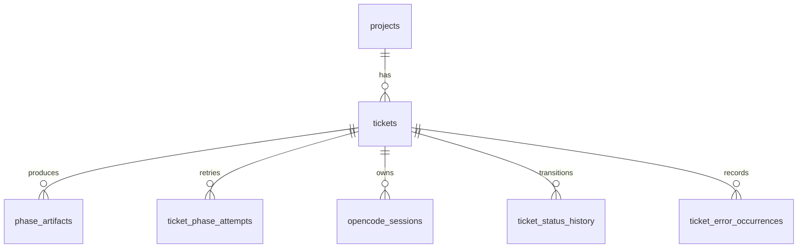

# Database Schema

LoopTroop currently uses two SQLite databases plus filesystem artifacts.

That split is intentional:

- the app database stores global application configuration
- each attached project has its own operational database
- ticket artifacts and runtime logs live in the project worktree filesystem

## Database Locations

| Database | Default location | Configuration |
| --- | --- | --- |
| App DB | `~/.config/looptroop/app.sqlite` | `LOOPTROOP_CONFIG_DIR` or `LOOPTROOP_APP_DB_PATH` |
| Project DB | `<project>/.looptroop/db.sqlite` | derived from the attached project root |

Both databases are opened with WAL mode and SQLite foreign-key enforcement enabled. `server/db/index.ts` owns the app DB path, connection lifecycle, and SQLite pragmas; `server/db/init.ts` bootstraps and evolves the app runtime schema. On project DB startup, LoopTroop removes orphan rows from dependent ticket tables before enabling enforcement so partially written or manually edited databases do not keep dangling references.

## App Database

The app database connection is configured in `server/db/index.ts`; its runtime schema is initialized and evolved by `server/db/init.ts`.

### Tables

| Table | Purpose |
| --- | --- |
| `profiles` | Singleton profile with model and workflow defaults |
| `app_meta` | Small app-level key/value metadata |
| `attached_projects` | Registry of attached project roots |

### `profiles`

Key columns:

- `main_implementer`
- `main_implementer_variant`
- `council_members`
- `council_member_variants`
- `min_council_quorum`
- `per_iteration_timeout`
- `execution_setup_timeout`
- `council_response_timeout`
- `interview_questions`
- `coverage_follow_up_budget_percent`
- `max_coverage_passes`
- `max_prd_coverage_passes`
- `max_beads_coverage_passes`
- `max_iterations`
- `tool_input_max_chars`
- `tool_output_max_chars`
- `tool_error_max_chars`

This table provides the baseline configuration that projects and tickets inherit from when they start.

## Project Database

The project database is initialized in `server/db/project.ts` and uses the schema definitions from `server/db/schema.ts`.

### Tables

| Table | Purpose |
| --- | --- |
| `projects` | Project metadata and project-level overrides |
| `tickets` | Ticket records and workflow snapshot fields |
| `phase_artifacts` | Structured phase artifacts with phase and attempt numbers |
| `ticket_phase_attempts` | Attempt history per phase |
| `opencode_sessions` | Owned OpenCode session records |
| `ticket_status_history` | Status transition history |
| `ticket_error_occurrences` | Persisted blocked-error occurrences and resolution history |

### `projects`

Important columns:

- `name`
- `shortname`
- `icon`
- `color`
- `folder_path`
- `profile_id`
- `council_members` — JSON array of model IDs, nullable project-level override
- `max_iterations`
- `per_iteration_timeout` — milliseconds, nullable project-level override
- `execution_setup_timeout` — milliseconds, nullable project-level override
- `council_response_timeout` — milliseconds, nullable project-level override
- `min_council_quorum`
- `interview_questions`
- `ticket_counter`

### `tickets`

Important columns:

- `external_id`
- `project_id`
- `title`
- `description`
- `priority`
- `status`
- `xstate_snapshot`
- `branch_name`
- `current_bead`
- `total_beads`
- `percent_complete`
- `error_message`
- locked model and planning settings, including interview coverage passes plus PRD/beads coverage pass caps frozen at ticket start
- `started_at`
- `planned_date`

This table is the operational center of a ticket, but it is not the only place ticket truth lives. Review artifacts and runtime logs still live in `.ticket/**`.

### `phase_artifacts`

Columns:

- `ticket_id`
- `phase`
- `phase_attempt`
- `artifact_type`
- `content`
- `created_at`
- `updated_at`

Important note:

- the current DB schema does not include a `file_path` column
- the frontend artifact normalizer accepts `filePath` in API payloads, but that field is not a physical column in `phase_artifacts`
- council companion artifacts may store draft/vote metadata and raw attempt diagnostics in `content`; invalid, failed, or timed-out companion payloads intentionally omit malformed model text from structured body fields

### `ticket_phase_attempts`

Tracks retry or restart history for individual phases.

Columns:

- `ticket_id`
- `phase`
- `attempt_number`
- `state`
- `archived_reason`
- `created_at`
- `archived_at`

### `opencode_sessions`

This table is what makes restart-safe session ownership possible.

Columns:

- `session_id`
- `ticket_id`
- `phase`
- `phase_attempt`
- `member_id`
- `bead_id`
- `iteration`
- `step`
- `state`
- `last_event_id`
- `last_event_at`

### `ticket_status_history`

A simple transition log:

- `ticket_id`
- `previous_status`
- `new_status`
- `reason`
- `changed_at`

### `ticket_error_occurrences`

Stores repeated blocked states as explicit occurrences rather than one mutable error blob.

Columns:

- `ticket_id`
- `occurrence_number`
- `blocked_from_status`
- `error_message`
- `error_codes`
- `diagnostic_details`
- `occurred_at`
- `resolved_at`
- `resolution_status`
- `resumed_to_status`

## Relationship Overview



Ticket-owned rows cascade when a ticket is deleted. `opencode_sessions.ticket_id` is nullable and is set to `NULL` if a referenced ticket is removed.

## What Is Not In SQLite

SQLite is not the whole system.

Important non-DB state includes:

- `.ticket/relevant-files.yaml`
- `.ticket/interview.yaml`
- `.ticket/prd.yaml`
- `.ticket/beads/<flow>/.beads/issues.jsonl`
- `.ticket/runtime/execution-log.jsonl`
- `.ticket/runtime/execution-log.debug.jsonl`
- `.ticket/runtime/execution-log.ai.jsonl`
- `.ticket/runtime/state.yaml`
- `.ticket/runtime/execution-setup-profile.json`

The database tracks and indexes workflow state. The filesystem stores the user-facing and execution-facing artifacts.

## Indexes And Runtime Behavior

The project DB also creates indexes for:

- ticket status
- ticket external id
- artifact lookup by ticket and phase attempt
- session lookup by ticket, phase, and ownership fields
- error occurrence lookup

Combined with WAL mode, this keeps the workflow responsive while the UI polls and the backend streams updates.

## Schema Changes

LoopTroop uses Drizzle schema definitions, but the app database is created and updated at server startup by `server/db/init.ts`. For normal app schema changes, update both `server/db/schema.ts` and the runtime bootstrap/evolution logic in `server/db/init.ts`; do not rely on `db:push` or `db:push:app` as the app schema-change workflow.

`db:generate` and `db:generate:app` are retained for external tooling or migration artifact review. Verify generated output against `server/db/schema.ts` before committing it.

For project-local database work, use the explicit scripts and set `LOOPTROOP_PROJECT_DB_PATH`:

```bash
npm run db:generate:project
npm run db:push:project
```

This split prevents accidental pushes to a repo-local project DB when the intended target is the app DB, or vice versa.

## Related Docs

- [System Architecture](system-architecture.md)
- [API Reference](api-reference.md)
- [OpenCode Integration](opencode-integration.md)
