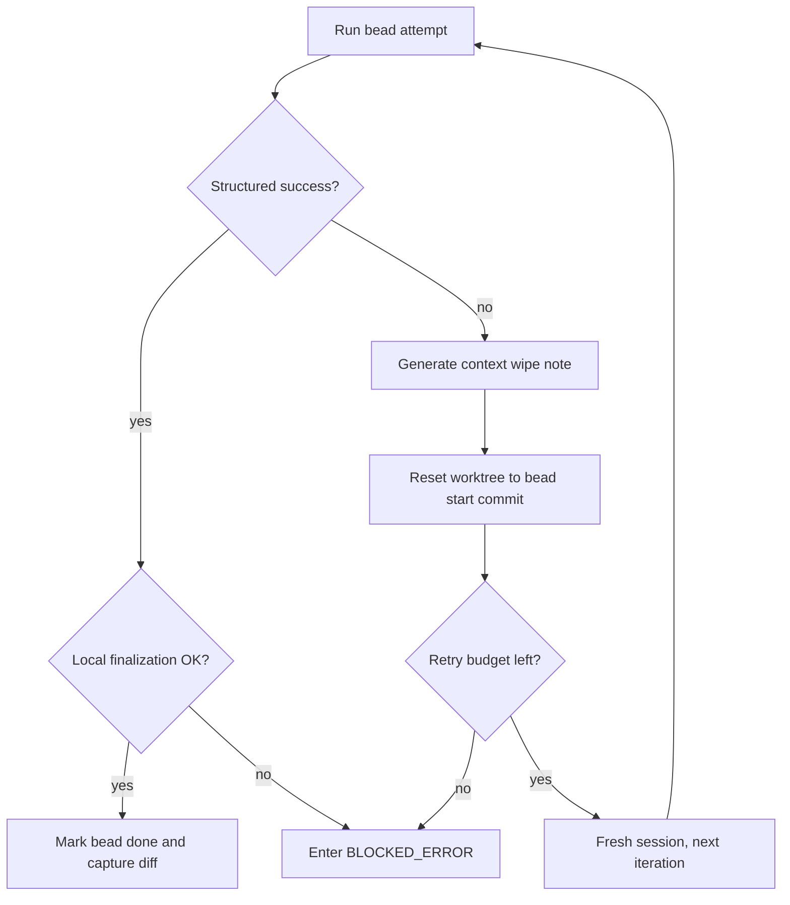

# Execution Loop

LoopTroop executes approved work through a bounded bead loop, not through one giant autonomous coding session.

The core implementation lives in `server/phases/execution/executor.ts`.

The workflow-side orchestration that resumes interrupted coding work lives in `server/workflow/phases/executionPhase.ts` and `server/workflow/phases/beadsPhase.ts`.

## Execution Phases Around The Loop

| UI group | Phase | Purpose |
| --- | --- | --- |
| Pre-Implementation | `PRE_FLIGHT_CHECK` | Confirm the ticket is ready to leave planning |
| Pre-Implementation | `WAITING_EXECUTION_SETUP_APPROVAL` | Human review of the setup plan |
| Pre-Implementation | `PREPARING_EXECUTION_ENV` | Materialize the execution environment |
| Implementation | `CODING` | Run beads one at a time with bounded retries |
| Post-Implementation | `RUNNING_FINAL_TEST` | Validate the full result after all beads are done |
| Post-Implementation | `INTEGRATING_CHANGES` | Prepare the final change set |
| Post-Implementation | `CREATING_PULL_REQUEST` | Publish the delivery artifact |
| Post-Implementation | `WAITING_PR_REVIEW` | Wait for merge or close-unmerged outcome |
| Post-Implementation | `CLEANING_ENV` | Remove temporary execution state |

## The Bead Execution Cycle

`executeBead()` is the heart of the loop.

For each bead:

1. Load the active bead specification and the current execution profile.
2. Recover any interrupted in-progress bead from a current `bead_execution` checkpoint when possible, or reset it from its recorded start snapshot before retry.
3. Start or reattach to the owned OpenCode session for that bead iteration; new session creation uses the shared 1s/3s/7s retry wrapper before the bead attempt is considered blocked.
4. Prompt the model with the coding template and the narrow execution context, while watching OpenCode retry status events for provider-side retry loops.
5. Require structured completion markers so the system can tell whether the attempt really finished.
6. Persist the execution checkpoint, then finalize the local work.
7. Mark the bead done only after local finalization succeeds, or generate a retry/blocking path if execution or finalization fails.

## Structured Completion Matters

Execution does not trust plain "I think I'm done" prose.

The executor uses two structured reminders:

- A **completion-marker reminder**: sent when a response is missing or has a malformed `<BEAD_STATUS>` marker, prompting the model to re-emit machine-checkable state
- A **continuation reminder**: sent when the marker is valid but not all gates are passing, instructing the agent to keep working and re-emit the marker when done

These reminders force the model to emit machine-checkable progress state. If the marker is missing or malformed, LoopTroop can retry with a specific corrective prompt instead of guessing what happened.

## Bounded Ralph-Style Retry

> [!NOTE]
> **The Ralph Loop Philosophy:** Instead of trying to talk an AI out of a broken coding spiral, LoopTroop acts like a strict manager. It says "stop, write down what failed, throw away your scratchpad, and start over with a clear head."

When a bead attempt fails, LoopTroop does not keep extending the same degraded transcript.

This is the execution discipline that most closely matches the Ralph-loop idea: preserve the useful post-mortem, discard the polluted conversational state.

## Context Wipe Notes

`generateContextWipeNote()` sends a context-capture prompt to the still-open failing session to summarize the attempt before abandonment.

The note is intentionally compact. It exists to answer:

- what the bead was trying to do
- what failed
- what was already tried
- what the next fresh attempt should keep in mind

If the model cannot generate a good note, LoopTroop can still fall back to a simpler synthesized failure note.

## Session Strategy

Execution combines fresh sessions with ownership-aware reconnect.

| Behavior | Why it exists |
| --- | --- |
| Fresh session per retry | Avoid carrying corrupted reasoning into the next iteration |
| Ownership-aware reconnect | Survive restart or resumable phase transitions when the same owned session still exists |
| Explicit completion or abandonment | Keep session state auditable in `opencode_sessions` |

See [OpenCode Integration](opencode-integration.md) for the full session model.

## OpenCode Retry Budget

OpenCode can emit `session.status` retry events while it is internally backing off from provider interruptions. LoopTroop treats matching retry states as shared prompt-level blockers across the workflow instead of waiting for a phase-specific timeout or retry loop to notice the stall.

The profile controls two limits:

- `OpenCode Retry Limit`: the number of matching retry events allowed before blocking; default 10
- `OpenCode Retry Grace Window`: how long a prompt may remain in a matching retry state without progress before blocking; default 60 seconds

Matching messages include rate limits, usage limits, resource exhaustion, overloaded/capacity responses, temporary unavailability, timeout/deadline errors, fetch failures, and network/socket resets. Persisted `HTTP 402 Payment Required` provider diagnostics are also eligible for Continue once the payment or workspace condition clears. Auth, invalid-request, permission, missing-key, request-size, model-not-found, and non-402 quota errors remain non-continuable.

In any owned phase, retry-budget exhaustion can preserve the active OpenCode session when possible and route the ticket to `BLOCKED_ERROR` with diagnostics. Continue sends exactly `continue please` into that same session. During `CODING`, this also prevents provider stalls from consuming the bead iteration timeout or bead retry budget; Retry still keeps the normal bead reset/retry behavior. Generic OpenCode provider errors are best-effort enriched from matching local OpenCode logs before they are shown in the ticket.

During `CODING`, matching OpenCode retry/session/output-limit diagnostics are also remembered while the bead continues. If the bead later blocks through completion-marker exhaustion or the normal bead retry budget, the blocked error keeps that latest underlying OpenCode cause in its diagnostics while the primary error still describes the bead failure.

## Worktree Hygiene

Execution happens inside the ticket worktree, not the attached project root.

Important `gitOps.ts` behavior:

- diffs are captured without `.ticket/**`
- local bead commits are required when code changes exist; true no-op completions may finish without a commit, and remote push failures are warnings after a successful local commit
- resets can hard-reset and clean the worktree back to the bead start snapshot
- resets preserve LoopTroop-owned `.ticket` state, including beads, PRD, relevant files, approvals, metadata, UI companions, and logs
- runtime directories like `.ticket/runtime`, `.ticket/locks`, `.ticket/streams`, `.ticket/sessions`, `.ticket/tmp`, `node_modules`, `.looptroop`, `dist`, and `build` are blocked from normal change capture

This is what makes retries safe: the next attempt starts from a known repository state.

On startup or manual retry, `CODING` recovery first checks whether the interrupted `in_progress` bead has a current matching `bead_execution:<beadId>` checkpoint for the `CODING` phase. The checkpoint must match the current bead id, iteration, `startedAt`, `updatedAt`, and `beadStartCommit`. When that persisted execution result matches, LoopTroop resumes finalization from the checkpoint instead of re-running the bead.

If there is no matching checkpoint, the checkpoint cannot be parsed, or the checkpoint no longer matches the current bead state, recovery falls back to the reset/retry path. The bead is reset to `beadStartCommit`, written back as `pending`, and handed back to the scheduler. If the bead has no recorded start commit, LoopTroop blocks instead of continuing in a worktree it cannot prove clean.

## Scheduler Interaction

Execution does not pick arbitrary work. It asks the scheduler for the next runnable bead.

The scheduler currently exposes:

- `getRunnable(beads)`
- `getNextBead(beads)`
- `isAllComplete(beads)`

That means dependencies are enforced outside the model. The model implements the active bead; the scheduler decides which bead is eligible.

## Success Path

A successful bead execution typically does all of the following:

- persists a `bead_execution:{beadId}` checkpoint
- creates the local bead commit when changes exist, or records a true no-op completion
- updates bead status to `done` only after local finalization succeeds
- persists logs
- captures a bead diff artifact
- advances runtime progress
- hands control back to the scheduler

If local commit/finalization fails after OpenCode reported success, LoopTroop does not broadcast `bead_complete` and does not mark the bead done. It sends `BEAD_ERROR` with `BEAD_FINALIZATION_FAILED`, keeps the bead retryable, and routes the ticket to `BLOCKED_ERROR`. A push failure after a successful local commit is visible as a warning but does not undo the completed bead.

Once all beads are complete, the workflow moves to final testing and then PR delivery.

## Failure Path

LoopTroop distinguishes between recoverable iteration failure and terminal blockage.

| Outcome | Meaning |
| --- | --- |
| Retry current bead | The system believes a fresh attempt may still succeed |
| `BLOCKED_ERROR` | The retry budget is exhausted or recovery is no longer trustworthy |
| Ticket cancel | User aborts the run and active sessions are abandoned |

Error occurrences are persisted so the UI can show both the live failure and past failures for the ticket.

Execution recovery is intentionally stricter after process or OpenCode interruptions:

- an interrupted bead is not treated as successful just because the model session might have continued somewhere else
- model sessions are owned by ticket, phase, phase attempt, bead, and iteration before they are reused
- without a valid `bead_execution` checkpoint, the worktree must reset to the bead-start commit before a failed or interrupted coding retry can run
- a current successful checkpoint can be re-finalized without resetting away uncommitted successful work
- missing reset metadata keeps the ticket blocked so the user can inspect the partial state manually

## Execution Configuration Controls

> [!TIP]
> For the full reference including defaults, ranges, and practical guidance, see the [Configuration Reference](/configuration).
> OpenCode provider retry settings are shared across all OpenCode prompts; see [Configuration Reference → OpenCode Provider Recovery](/configuration#opencode-provider-recovery).

### Execution Setup Timeout

Execution setup timeout is the maximum allowed runtime for the one-time `PREPARING_EXECUTION_ENV` step after the setup plan is approved. It bounds setup work such as installing user-space toolchains, warming caches, and preparing repository-local runtime artifacts.

Execution setup treats missing command launchers or toolchains for required checks as readiness blockers, not as successful setup cautions. Before blocking, the setup agent must first try safe user-space provisioning under approved temp roots, preferably `.ticket/runtime/execution-setup/tool-cache`. For Go projects, that means reading `go.mod` and any `toolchain` directive, installing the matching official OS/architecture toolchain into the ticket-owned cache, prepending its `bin` directory, and verifying `go version` before running required checks.

When setup provisions tooling, it writes `.ticket/runtime/execution-setup/env.sh` and `.ticket/runtime/execution-setup/run`. Later coding and final-test prompts prefer commands through the wrapper, such as `./.ticket/runtime/execution-setup/run go test ./...`, so the prepared PATH and cache variables are reused. Execution setup retries clear stale profile and wrapper files but preserve `tool-cache`; if the same tooling blocker repeats after provisioning fails, LoopTroop stops with one blocked error instead of spending the rest of the retry budget on identical failures.

### Per-Iteration Timeout

Per-iteration timeout is the maximum allowed runtime for one bead attempt in `CODING`. If an attempt exceeds this budget, LoopTroop treats it as a failed iteration and routes it through the normal retry path.

### Max Bead Retries

Max bead retries defines how many fresh-session re-attempts LoopTroop allows for a bead before it enters `BLOCKED_ERROR`. The same limit also bounds final-test retries so execution remains deterministic.

### Tool Log Truncation

The system restricts the maximum character length for tool inputs, outputs, and errors within logs to prevent infinite runaway logs. `Tool Input Max Chars`, `Tool Output Max Chars` and `Tool Error Max Chars` configure these hard caps.

## Why This Loop Exists

The execution loop exists because coding models are good at focused work but unreliable at long self-healing conversations. LoopTroop narrows the task, constrains the runtime state, and bounds retries so the system can recover without pretending the model has infinite patience or perfect memory.

## Related Docs

- [Beads](beads.md)
- [Context Isolation](context-isolation.md)
- [OpenCode Integration](opencode-integration.md)
- [System Architecture](system-architecture.md)
