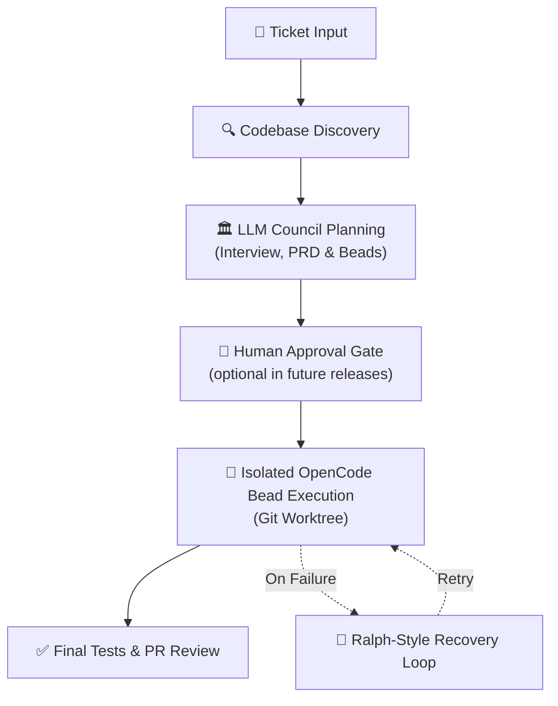

# LoopTroop Docs

> **A smart local engine that automates big coding tasks from start to finish.**
> LLM councils plan it. Ralph loops perfect it. OpenCode worktrees ship it.

LoopTroop helps you turn a coding ticket into a planned, reviewable, agent-executed pull request.

Instead of trusting a single, endless AI chat session - where the conversation history gets bloated, the AI gets confused, and code quality falls off a cliff - LoopTroop breaks the job into clean, separate stages. **Planning** turns an interview into a PRD, which is then split into the smallest manageable milestones, called "beads." **Execution** runs each bead through multiple targeted auto-fix loops. A **final review** ties it all together.

| Architectural Layer | Core | Technical Lifecycle |
| :--- | :--- | :--- |
| **1. Planning** | *LLM Councils Plan It* | Human Input ➔ AI Interview ➔ PRD ➔ Atomic Beads |
| **2. Execution** | *Ralph Loops Perfect It* | Isolated Bead Work ➔ Multi-Loop Automated Testing & Fixing |
| **3. Shipping** | *OpenCode Worktrees Ship It* | Code Isolation ➔ Final Verification Pass ➔ Main Branch Handoff |

Free and fully open-source.

::: warning Run LoopTroop in a Sandboxed Environment (VM)
LoopTroop executes agent code changes with full local user privileges to allow unattended runs. For maximum security, it is highly recommended to run LoopTroop inside a disposable VM, cloud environment, or sandboxed workspace. See [Getting Started](getting-started.md#why-a-vm) for details.
:::
## Start Here

```bash
git clone https://github.com/looptroop-ai/LoopTroop.git
cd LoopTroop
npm run dev
```

If you are new to LoopTroop, use this order:

1. [Getting Started](getting-started.md) for local setup and the first run.
2. [Core Philosophy](core-philosophy.md) for the system-level design goals.
3. [Context Engineering](context-engineering.md) for LoopTroop's minimum-context model discipline.
4. [Ticket Flow](ticket-flow.md) for the full lifecycle from draft to completion.

## What LoopTroop Is

LoopTroop is a **local GUI orchestrator for long-running, high-correctness AI software delivery** - taking you from a raw idea to merged code.

Unlike high-speed coding tools that optimize for immediate chat responses, LoopTroop is built for **complex, multi-file feature work** where alignment and correctness are paramount. It optimizes for a "slow and perfect" paradigm, intentionally sacrificing raw speed to deliver a final result that matches exactly how you envisioned it.

**Great Context Engineering = Zero AI Slop:** LoopTroop employs precise context curation at every stage, feeding the agent only the absolute **minimum** context it needs. See [Context Engineering](context-engineering.md) for details.

## How It Works



## Screenshots

::: details Projects dialog

*Manage attached repositories, review ticket counts, and add new projects from the dashboard.*
:::

::: details Configuration dialog

*Choose the main implementer model, council members, and effort levels for local orchestration.*
:::

::: details Interview workspace

*Answer focused planning questions before specs and implementation plans are approved.*
:::

::: details Ticket workflow detail

*Track council progress, generated artifacts, and live execution logs inside a ticket.*
:::

::: details Implementation review

*Review bead completion, commits, changes, and final implementation details before closing the workflow.*
:::

::: details Bead execution detail

*Inspect bead-level progress, task status, and live execution logs while an implementation bead runs.*
:::

::: details Bead error view

*Review the focused workspace view shown when an implementation bead is blocked by an error.*
:::

::: details Alternate bead error view

*Compare a different bead's error state, diagnostics, and recovery context before deciding whether to continue or retry.*
:::

## Documentation Map

### Start Here

- [Getting Started](getting-started.md): installation, startup, ports, and first project attach.
- [Core Philosophy](core-philosophy.md): context engineering, councils, retries, approvals, durable state.
- [Context Engineering](context-engineering.md): why prompts are built from minimal per-status context and what each status receives.

### Workflow

- [Ticket Flow & State Machine](ticket-flow.md): end-to-end ticket lifecycle, state machine transitions, artifacts, user actions, retries, and outcomes.
- [Interview](interview.md): adaptive clarification batches, skipped questions, coverage follow-ups, artifact structure, and approval.
- [PRD](prd.md): Full Answers, skipped-answer resolution, council drafting/voting/refining, PRD structure, coverage, and approval.
- [LLM Council](llm-council.md): draft, vote, refine, and coverage orchestration.
- [Beads & Execution](beads.md): execution-unit model, dependency graph, execution loop, bounded Ralph-style retry, storage, and diff review.
- [Pre-Flight & Setup](pre-flight-setup.md): environment validation doctor, pre-flight check-list, setup plan configuration, and local tooling tool-cache setup.
- [Verification & Delivery](verification-delivery.md): final testing, file effects audit, integration squashing, pull request publishing, and worktree cleanup.

### Architecture

- [System Architecture](system-architecture.md): current runtime architecture, storage ownership, module map, lifecycle.
- [OpenCode Integration](opencode-integration.md): adapter, sessions, reconnect, stream handling.
- [Frontend](frontend.md): workspace composition, navigation, hooks, live updates.
- [Database Schema](database-schema.md): app DB, project DB, ownership boundaries.

### Reference

- [Configuration](configuration.md): all profile settings with defaults, ranges, and trade-offs.
- [Prompt Inventory](prompts.md): built-in prompts, collapsed full prompt content, runtime prompt builders, workflow usage, tool policies, and context inputs.
- [API Reference](api-reference.md): routes, SSE events, payload shapes.
- [Output Normalization](output-normalization.md): how malformed or partial model output is repaired or isolated before use.

### Operations

- [Operations Guide](operations.md): startup maintenance, environment variables, runtime storage, diagnostics, and project cleanup.
- [Runtime Diagnostics](diagnostics.md): local stall and resource-pressure report command.

### Direction

- [Changelog](changelog.md): project release notes and historical changes.
- [Roadmap](roadmap.md): living planning notes for priorities and future directions.

## Terminology Notes

LoopTroop uses a mix of established and newer terms:

- **[Bead](beads.md)** - the smallest, independently implementable unit of work. Borrowed from Steve Yegge's *Beads Project* methodology. Each bead contains a clear purpose, acceptance criteria, target files, and validation steps.
- **[git worktree](system-architecture.md)** - a standard Git capability for working on multiple linked trees from one repository. LoopTroop uses it as the main execution-isolation primitive.
- **[Ralph-style retry](beads.md)** - community shorthand for abandoning a degraded coding session, keeping a compact failure note, and retrying in fresh context instead of continuing the same transcript.
- **[LLM council](llm-council.md)** - LoopTroop's name for its multi-model draft, vote, and refine pattern. The idea overlaps with newer multi-model consensus research, but the exact workflow here is LoopTroop-specific.
- **[PRD](prd.md)** - Product Requirements Document. The structured spec (epics + user stories) that the LLM Council produces from your ticket and interview answers before any coding starts.
- **AI orchestrator** - descriptive, not magical. In this repo it means a system that owns workflow state, artifact boundaries, retries, approvals, and delivery mechanics around model calls.
