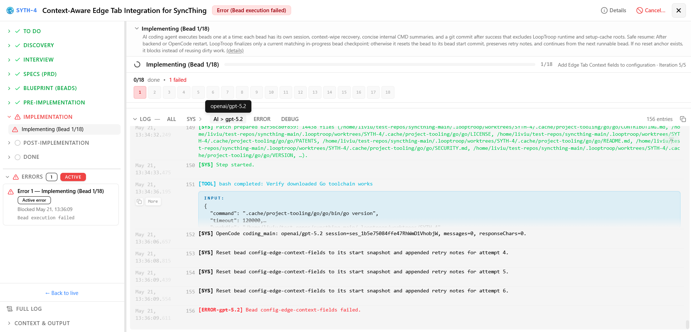
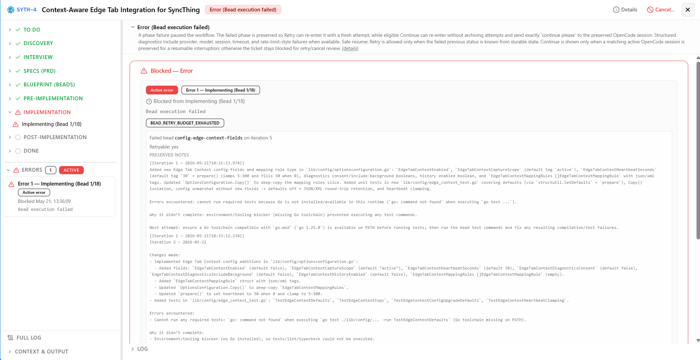

# LoopTroop Docs

LoopTroop is local AI coding orchestration for repo-scale work. It separates planning from execution, keeps critical workflow state outside the model, executes code inside isolated git worktrees, and forces explicit human review at the expensive boundaries.

This docs site is the navigation hub for the current system. The README stays GitHub-first; this site is where the grouped, cross-linked runtime documentation lives.

## Start Here

If you are new to LoopTroop, use this order:

1. [Getting Started](getting-started.md) for local setup and the first run.
2. [Core Philosophy](core-philosophy.md) for the system-level design goals.
3. [Context Engineering](context-engineering.md) for LoopTroop's minimum-context model discipline.
4. [Ticket Flow](ticket-flow.md) for the full lifecycle from draft to completion.
5. [FAQ](faq.md) for terminology, safety, and common workflow questions.

## What LoopTroop Is

- A **local GUI orchestrator for long-running, high-correctness AI software delivery** — taking you from a raw idea to merged code.
- Built for **complex, multi-file feature work** where alignment and correctness are paramount, optimizing for a "slow and perfect" paradigm over raw speed.
- **Great Context Engineering = Zero AI Slop:** precise context curation at every stage feeds the agent only the absolute minimum context it needs — eliminating context rot, LLM drift, and degraded output.
- A planning pipeline that uses interview, PRD, and beads stages with multi-model councils (draft → vote → refine → verify) before any code execution.
- An OpenCode worktrees execution system that keeps the attached project checkout out of the blast radius.
- A durable runtime built around SQLite, `.ticket/**` artifacts, execution logs, and resumable ownership-aware sessions.
- A human-in-the-loop system with approval gates before specs, blueprint, workspace setup, and final PR completion.
- A safe-resume workflow that returns users to durable ticket state after browser, frontend, backend, OpenCode, or model interruptions, or blocks explicitly when a safe resume point cannot be proven.

## Screenshots

::: details Projects dialog

*Manage attached repositories, review ticket counts, and add new projects from the dashboard.*
:::

::: details Configuration dialog

*Choose the main implementer model, council members, and effort levels for local orchestration.*
:::

::: details Interview workspace

*Answer focused planning questions before specs and implementation plans are approved.*
:::

::: details Ticket workflow detail

*Track council progress, generated artifacts, and live execution logs inside a ticket.*
:::

::: details Implementation review

*Review bead completion, commits, changes, and final implementation details before closing the workflow.*
:::

::: details Bead execution detail

*Inspect bead-level progress, task status, and live execution logs while an implementation bead runs.*
:::

::: details Bead error view

*Review the focused workspace view shown when an implementation bead is blocked by an error.*
:::

::: details Alternate bead error view

*Compare a different bead's error state, diagnostics, and recovery context before deciding whether to continue or retry.*
:::

## Documentation Map

### Start Here

- [Getting Started](getting-started.md): installation, startup, ports, and first project attach.
- [Core Philosophy](core-philosophy.md): context engineering, councils, retries, approvals, durable state.
- [Context Engineering](context-engineering.md): why prompts are built from minimal per-status context and what each status receives.
- [FAQ](faq.md): terminology and practical operational questions.

### Workflow

- [Ticket Flow](ticket-flow.md): end-to-end ticket lifecycle, artifacts, user actions, retries, outcomes.
- [Interview](interview.md): adaptive clarification batches, skipped questions, coverage follow-ups, artifact structure, and approval.
- [PRD](prd.md): Full Answers, skipped-answer resolution, council drafting/voting/refining, PRD structure, coverage, and approval.
- [State Machine](state-machine.md): canonical phase inventory and transition model.
- [LLM Council](llm-council.md): draft, vote, refine, and coverage orchestration.
- [Beads](beads.md): execution-unit model, dependency graph, storage, diff review.
- [Execution Loop](execution-loop.md): per-bead execution, structured completion, fresh-session retry.

### Architecture

- [System Architecture](system-architecture.md): current runtime architecture, storage ownership, module map, lifecycle.
- [OpenCode Integration](opencode-integration.md): adapter, sessions, reconnect, stream handling.
- [Frontend](frontend.md): workspace composition, navigation, hooks, live updates.
- [Database Schema](database-schema.md): app DB, project DB, ownership boundaries.

### Reference

- [API Reference](api-reference.md): routes, SSE events, payload shapes.
- [Output Normalization](output-normalization.md): how malformed or partial model output is repaired or isolated before use.

### Operations

- [Operations Guide](operations.md): startup maintenance, environment variables, runtime storage, diagnostics, and project cleanup.
- [Runtime Diagnostics](diagnostics.md): local stall and resource-pressure report command.

### Direction

- [Roadmap](roadmap.md): living planning notes for priorities and future directions.

## Terminology Notes

LoopTroop uses a mix of established and newer terms:

- `git worktree` is a standard Git capability for working on multiple linked trees from one repository. LoopTroop uses it as the main execution-isolation primitive.
- `Ralph-style retry` is community shorthand for abandoning a degraded coding session, keeping a compact failure note, and retrying in fresh context instead of continuing the same transcript.
- `LLM council` is LoopTroop's name for its multi-model draft, vote, and refine pattern. The idea overlaps with newer multi-model consensus research, but the exact workflow here is LoopTroop-specific.
- `AI orchestrator` is descriptive, not magical. In this repo it means a system that owns workflow state, artifact boundaries, retries, approvals, and delivery mechanics around model calls.

## Canonical Runtime Sources

When documentation and behavior disagree, the current implementation wins. The main sources of truth are:

- `shared/workflowMeta.ts` for phase labels, groups, descriptions, UI mapping, and review metadata.
- `server/machines/ticketMachine.ts` for state transitions and retry behavior.
- `server/routes/ticketHandlers/` for user-triggered action modules like start, approve, merge, close-unmerged, and retry.

For the broad runtime picture, start with [System Architecture](system-architecture.md). For the exact lifecycle, go to [Ticket Flow](ticket-flow.md).
