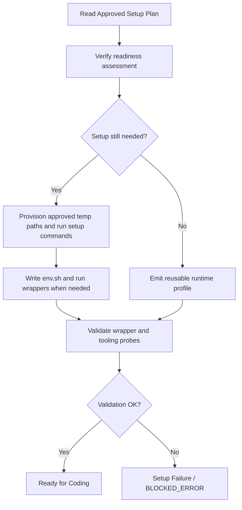

# Pre-Implementation

Before LoopTroop enters the coding execution stage, it runs a series of strict environment validation gates and sets up a localized execution container. This ensures that when the implementer starts coding, it has a clean workspace, access to the correct tools, and a reliable execution environment.

Pre-implementation is split into three phases: **Checking Readiness** (`PRE_FLIGHT_CHECK`), **Approving Setup** (`WAITING_EXECUTION_SETUP_APPROVAL`), and **Preparing Runtime** (`PREPARING_EXECUTION_ENV`).

---

## 1. Checking Readiness (`PRE_FLIGHT_CHECK`)

LoopTroop does not start writing code on an unverified workspace. When a ticket transitions out of the beads planning stage, it invokes the **Pre-Flight Doctor** (`server/phases/preflight/doctor.ts`) to run 19 automated integrity checks.

These checks are grouped into six main categories:

### 1.1 OpenCode & Model Connectivity
- **OpenCode Connectivity**: Verifies that the local OpenCode server is reachable and responsive to basic HTTP probes.
- **Main Implementer Availability**: Queries the provider catalog to check if the locked main implementer model is online and properly configured in OpenCode.
- **OpenCode Execution Capability**: Creates a temporary execution-mode session and runs a read-only probe prompt (`PROM_EXECUTION_CAPABILITY_PROBE`). It expects the model to reply exactly `OK` to ensure tool-calling, API connectivity, and model adherence to instructions are fully functional before attempting to execute beads.

### 1.2 Ticket & Planning Artifacts
- **Ticket Directory**: Confirms the workspace ticket directory `.ticket/` exists on disk.
- **Relevant Files**: Checks for the presence of the `relevant-files.yaml` index generated during the early discovery phase.
- **Beads Available**: Verifies that at least one bead has been planned and expanded for execution.
- **Beads Approval**: Confirms that the beads plan has a valid, untampered user approval receipt from the planning stage.

### 1.3 Dependency Graph Integrity
- **Dangling Dependencies**: Scans the bead list to make sure no bead blocks on a non-existent bead ID.
- **Self-Dependencies**: Verifies no bead is blocked by or blocks itself.
- **Duplicate Bead IDs**: Checks for duplicate identifiers in the planned beads list to prevent namespace collisions.
- **Circular Dependencies**: Traverses the dependency graph to ensure there are no circular blockers (e.g., Bead A blocks Bead B which blocks Bead A).
- **Runnable Bead Check**: Confirms the graph contains at least one bead with zero unsatisfied dependencies that can start immediately, ensuring the execution engine doesn't deadlock at the very beginning.

### 1.4 Git Safety & Cleanliness
- **Git Worktree Presence**: Checks that the ticket's isolated Git worktree exists on disk.
- **HEAD State**: Verifies the worktree is active on a valid branch and not in a detached HEAD state.
- **Worktree Cleanliness**: Runs a workspace audit. If there are pre-existing, committable project changes outside LoopTroop's tracking paths, the check fails to prevent capturing unrelated edits in bead commits. Untracked noise is reported as warnings and suggested for `.gitignore`.

### 1.5 GitHub Integration
- **GitHub Origin Remote**: Checks that the repository remote resolves to `github.com`.
- **GitHub CLI Installation**: Verifies the `gh` binary is installed on the host system, which is required for PR generation.
- **GitHub Auth Status**: Checks that the `gh` CLI is properly authenticated.
- **GitHub Repository Access**: Confirms that the authenticated CLI has read-write access to the remote target repository.

### 1.6 Concurrency & Budgets
- **Project Execution Lock**: Verifies no other ticket for the same project is currently in the execution band, avoiding Git conflicts across concurrent processes.
- **Runtime Budget**: Validates that `maxIterations` is defined and non-negative, preventing unbounded Ralph loops.

> [!WARNING]
> Any check failing with a **Critical Failure** routes the ticket to `BLOCKED_ERROR`. Warnings (such as generated untracked noise files) are displayed but allow the pipeline to proceed.

---

## 2. Approving Setup (`WAITING_EXECUTION_SETUP_APPROVAL`)

Once pre-flight checks pass, LoopTroop drafts an environment setup blueprint. This step uses the main implementer model to decide what compilers, runtimes, package managers, and test suites are required for the project.

### 2.1 The Setup Plan Draft
LoopTroop prompts the model with `PROM_EXECUTION_SETUP_PLAN`, feeding it the ticket details, relevant files, approved beads, PRD, and any prior reusable setup profile. The model returns a structured `execution_setup_plan` centered on readiness and temporary-only preparation, including:

- **`readiness`**: Whether the current environment is already `ready`, only `partial`, or still `missing` key requirements, plus evidence and remaining gaps.
- **`temp_roots`**: Approved runtime paths LoopTroop may use for temporary setup work.
- **`steps`**: Ordered setup steps with concrete commands, required/optional flags, rationale, and cautions.
- **`project_commands`**: Discovered full-project command families such as prepare, full test, lint, and typecheck.
- **`quality_gate_policy`**: The default gate policy the later coding loop should follow.
- **`cautions`**: User-facing warnings or assumptions that remain relevant even after approval.

This phase is critical because LoopTroop does not allow arbitrary system-level installations (for example `sudo apt-get install`) during bead execution. Missing tooling must either be provisioned safely under approved temporary roots or surfaced explicitly before coding starts.

### 2.2 Human Gate & Regeneration
The setup plan is presented to the user on the dashboard. The user has three choices:
1. **Direct Edit**: Modify readiness details, setup steps, command families, cautions, or the raw plan directly in the UI editor.
2. **Regenerate**: Provide natural-language comments (e.g., "Use Node 20 instead of Node 18", "Skip the database seeding script") and trigger `PROM_EXECUTION_SETUP_PLAN_REGENERATE` to rewrite the plan.
3. **Approve**: Locks in the setup plan. Approval is content-hash protected to avoid stale-tab overrides.

---

## 3. Preparing Runtime (`PREPARING_EXECUTION_ENV`)

After user approval, the environment setup runner executes the plan steps sequentially.

### 3.1 Provisioning Temporary Runtime Paths
If the approved plan says setup is still needed, LoopTroop prepares only temporary runtime state under approved paths such as `.ticket/runtime/execution-setup/**`. If a required launcher or toolchain is missing, the setup agent must first try distinct safe user-space provisioning strategies before reporting a tooling failure, or record why no safe provisioning path exists.

### 3.2 Running Setup Commands
Approved setup commands are executed inside the isolated worktree directory. Standard output and errors are captured in the execution log. If setup claims the environment is ready, LoopTroop still validates declared wrappers and tooling probes before accepting the runtime profile. If any required setup command, wrapper validation, or tooling probe fails, the phase routes to `BLOCKED_ERROR` for user intervention.

### 3.3 Generating The Runtime Profile
When setup succeeds, LoopTroop emits a reusable `execution_setup_profile` describing what was actually prepared: bootstrap commands, tooling probe commands, optional tool-requirement evidence, reusable artifacts such as `.ticket/runtime/execution-setup/run`, discovered project command families, and the quality-gate policy for later coding and final-test phases. If tooling was provisioned, wrapper artifacts such as `env.sh` and `run` ensure later commands execute in the same validated environment instead of rediscovering runtime state ad hoc.

---

## Related Docs

- [Ticket Flow & State Machine](ticket-flow.md)
- [Beads & Execution](beads.md)
