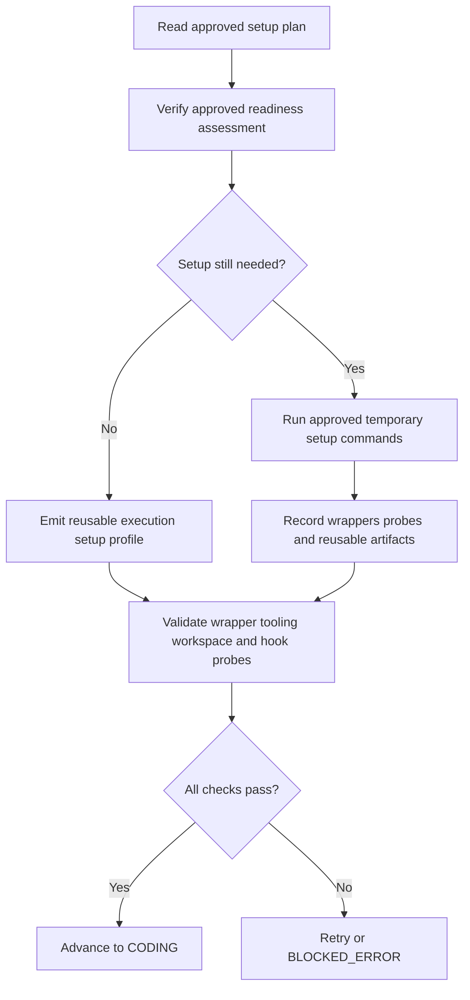

# Pre-Implementation

Pre-implementation is the execution-band handoff between approved planning and real code changes. It verifies that the ticket can safely leave planning, turns the setup contract into a reviewable artifact, and prepares temporary runtime state that later coding and final-test phases can reuse.

LoopTroop splits this into three workflow statuses:

| Status | Purpose | Main outputs |
| --- | --- | --- |
| `PRE_FLIGHT_CHECK` | Deterministic readiness gate before any setup or coding work starts. | `preflight_report` artifact + per-check SYS log entries |
| `WAITING_EXECUTION_SETUP_APPROVAL` | Drafts and pauses on the reviewable setup contract. | `execution_setup_plan`, generation report, notes, approval receipt, edit receipts |
| `PREPARING_EXECUTION_ENV` | Executes only the approved temporary setup and emits the reusable runtime profile. | `execution_setup_profile`, `execution_setup_report`, runtime files under `.ticket/runtime/execution-setup/**` |

---

## 1. `PRE_FLIGHT_CHECK`: deterministic readiness gate

When the beads plan is approved, LoopTroop runs the **Pre-Flight Doctor** (`server/phases/preflight/doctor.ts`). This phase does not prepare tooling yet; it only proves that the ticket is safe to enter execution setup.

### 1.1 What it validates

The doctor checks six areas:

| Area | What LoopTroop verifies |
| --- | --- |
| **OpenCode and model reachability** | OpenCode health, locked main-implementer availability, and a real execution-mode probe session using `PROM_EXECUTION_CAPABILITY_PROBE`, which must return exactly `OK`. |
| **Ticket and planning artifacts** | The ticket workspace exists, `relevant-files.yaml` is checked and warned on when missing, at least one bead exists, and the beads approval receipt is available. |
| **Dependency graph integrity** | No dangling references, self-dependencies, duplicate bead ids, or cycles, and at least one bead is runnable immediately. |
| **Git safety** | The ticket worktree exists, is on a real branch, and has no pre-existing committable project changes. Generated or local untracked noise is downgraded to warnings with suggested `.gitignore` entries. |
| **GitHub delivery prerequisites** | `origin` resolves to GitHub, `gh` is installed, authentication works, and the authenticated account can access the target repo. |
| **Concurrency and budget guards** | No other real workflow ticket in the same project is already inside the execution band; display-only mock/demo tickets are ignored because they cannot run workflow work. `maxIterations` must also be valid (`0` means unlimited). |

### 1.2 Why the execution probe matters

The execution-capability probe is stricter than a plain health check. LoopTroop creates a temporary execution-mode OpenCode session with the same locked model and variant planned for real work, dispatches a tiny read-only prompt, requires the exact response `OK`, and then tears the session down. That catches session-creation, tool-policy, or model-behavior failures before runtime setup or coding starts.

### 1.3 Outcomes and failure behavior

- LoopTroop persists a `preflight_report` artifact containing every pass, warning, and failure.
- Each check is also emitted into the **SYS** log so the UI shows the same detail without opening raw artifacts.
- Any `fail` result routes the ticket to `BLOCKED_ERROR`.
- `warning` results are preserved but do **not** block execution.

> [!WARNING]
> This phase is intentionally non-mutating. If the worktree already contains committable project changes, LoopTroop blocks here instead of letting setup or coding absorb unrelated edits into later bead commits.

---

## 2. `WAITING_EXECUTION_SETUP_APPROVAL`: reviewable setup contract

After pre-flight passes, LoopTroop asks the locked main implementer to audit the approved ticket context and draft an `execution_setup_plan`. This is still a planning-style approval gate: no setup commands run until the user approves the contract.

### 2.1 How the draft is generated

`server/workflow/phases/executionSetupPlanPhase.ts` assembles the execution-setup planning context from durable artifacts, including ticket details, relevant files, approved beads, and any prior reusable execution-setup profile. On first entry, the draft is generated automatically if no current setup-plan artifact exists.

The setup-plan artifact is structured around a small, explicit contract:

| Section | Meaning |
| --- | --- |
| `readiness` | Whether the environment is already `ready`, only `partial`, or still `missing` key requirements, plus supporting evidence and gaps. |
| `temp_roots` | Repository-local or runtime-owned paths the next phase may use for temporary setup work. |
| `workspace_inputs` | Ignored or untracked files and directories that exist in the original checkout, are missing from the ticket worktree, and are needed for setup. Each entry records a repository-relative `path`, `kind`, `source_status`, and concrete `reason`. |
| `workspace_probes` | Ordered repository-level commands that prove the prepared checkout can actually perform project work; each entry has an `id`, `command`, and `purpose`. |
| `git_hooks` | The resolved policy, read-only detected-hook evidence, and an ordered editable list of explicit validation commands. |
| `steps` | Ordered setup actions with `id`, `title`, `purpose`, `commands`, `required`, `rationale`, and step-level `cautions`. |
| `project_commands` | Discovered project-wide command families such as prepare, full test, lint, and typecheck. |
| `quality_gate_policy` | The default policy later coding and final-test phases should follow for tests, lint, typecheck, and full-project fallback behavior. |
| `cautions` | User-facing warnings or assumptions that should remain visible after approval. |

The planning prompt receives the original checkout and ticket worktree as read-only locations. It checks whether a missing ignored or untracked file or directory explains a concrete readiness problem. It does not list unrelated caches, dependencies, build output, or the complete ignored-file inventory. The user can edit every proposed input before approval.

If the workspace is already ready, LoopTroop treats that as a first-class result: `steps` can be empty, and the artifact stays reviewable instead of inventing filler setup commands. A non-empty `workspace_inputs` list still counts as required setup work because LoopTroop must materialize those inputs before validation.

### 2.2 Edit, regenerate, and version semantics

This approval gate is more than a single draft:

1. **Manual edit** updates the structured plan or raw content directly. LoopTroop saves the canonical normalized artifact and records append-only `user_edit_receipt:execution_setup_plan` history with before/after hashes.
2. **Regenerate** appends the commentary into `execution_setup_plan_notes`, archives the active attempt, and starts a fresh background generation using the current plan plus the user's note as context.
3. **Archived attempts stay read-only.** Older setup-plan versions remain available through phase-attempt history, but explicit writes to archived attempts are rejected.

The generation report also preserves:

- the raw model output
- validation errors
- structured-output retry diagnostics
- rejected/accepted raw attempts when formatting or schema repair was needed
- regenerate commentary history

### 2.3 Approval handoff and rewind behavior

Approving the plan stores an approval receipt with the reviewed `content_sha256`, step count, command count, approved workspace inputs, selected Git-hook policy, detected-hook evidence, workspace probes, and the exact hook-validation command list. Stale approvals fail with `409` instead of silently approving newer content. Detected hooks are read-only, while validation commands and workspace inputs can be added, edited, reordered, or removed.

While the ticket is still in `PREPARING_EXECUTION_ENV`, editing or regenerating the setup plan triggers a **runtime rewind** rather than an in-place overwrite:

- the active setup session is stopped
- the current setup-plan attempt and runtime attempt are archived
- stale runtime outputs are cleared
- `.ticket/runtime/execution-setup/tool-cache` is preserved
- the ticket returns to `WAITING_EXECUTION_SETUP_APPROVAL`
- approval is required again before setup restarts

That keeps the approved contract explicit and prevents a running setup session from drifting away from what the user last reviewed.

---

## 3. `PREPARING_EXECUTION_ENV`: temporary runtime setup

Once the plan is approved, LoopTroop moves to `server/workflow/phases/executionSetupPhase.ts`. This phase is AI-driven and retryable, but it is still **not** a bead: it never creates commits, never pushes, and never counts as implementation progress.

### 3.1 Approved-plan-first execution

The setup agent reads the **approved** plan first. User edits override the model's original draft. If the approved plan says the environment is already ready and that still holds, the phase should stay nearly no-op: verify the claim, emit the reusable profile, and move on without inventing bootstrap work.

When setup is still needed, the agent may:

- use the approved ignored or untracked workspace inputs that LoopTroop materialized before the setup session
- run only the approved temporary setup steps
- inspect the repository and invoke repo-native bootstrap commands
- prepare runtime-owned wrappers or caches
- create reusable artifacts under `.ticket/runtime/execution-setup/**`

If required launchers or toolchains are missing, the agent must try real user-space provisioning strategies under approved temp roots before reporting failure. Simple PATH edits, wrapper creation, cache inspection, or version probes do **not** count as provisioning strategies.

### 3.2 Validation rules before a profile is accepted

LoopTroop does not trust a superficially valid setup response. A setup result is accepted only when all of the following are true:

- the structured result parses and all setup checks pass
- declared wrappers can launch a no-op command successfully
- declared `tooling_probe_commands` exist and succeed
- approved `workspace_probes` run in order through the setup wrapper and succeed; when repository command families or bead test commands exist, at least one probe must exercise the repository rather than only print a tool version
- approved Git-hook validation commands run with the same wrapper, timeout, output capture, and tracked-file audit rules when the policy is `validate_explicitly`
- profiles that declare wrappers or project command families include non-mutating probes
- failed tooling results include durable `tool_requirements` evidence:
  - either at least two distinct `provisioning_attempts` strategies with real commands
  - or a `not_provisionable` result with a concrete `failure_reason`

Before setup commands run, LoopTroop validates every approved workspace input against the original checkout and Git status. It rejects missing sources, incorrect ignored or untracked classifications, paths outside the checkout, and Git or LoopTroop internal paths. Approved files are copied to the same relative path. Approved directories are copied recursively without a size limit, but tracked ticket source always wins and is never replaced. Materialized inputs are setup-only state: worktree audits and ticket commits exclude them, and setup retries rematerialize them after tracked-file resets.

LoopTroop also audits the worktree after each ready-looking attempt. Committable project changes left behind by setup fail the attempt. Generated noise is kept as a warning and copied into the profile cautions with suggested `.gitignore` entries. The setup agent may not copy any additional ignored or untracked path that the user did not approve.

Hook discovery is evidence, not an ecosystem assumption. LoopTroop inspects Git's resolved hook path, standard hook files, committed hook directories, and recognizable manager configuration. Known managers may supply a hint, but unknown hooks remain visible without an invented command. The ticket starts with the inherited ticket → project → profile choice, freezes that choice at Start, and records it in the approved setup plan. The three UI choices control LoopTroop-owned Git operations:

- **Validate** (`validate_explicitly`, recommended) bypasses hooks for internal commits and pushes, runs the approved commands during setup, and reruns them before integration
- **Ignore** (`ignore_internal_only`) bypasses hooks and records that explicit validation was skipped
- **Run** (`use_on_internal_commits`) leaves normal Git hook execution enabled

Validate and Run are deliberately different: Validate makes the checks explicit and auditable outside the internal Git command, while Run allows a repository hook to execute inside and potentially block that command.

### 3.3 Setup-scoped web tools, retries, and reset behavior

This is the one execution-band phase where LoopTroop can enable setup-scoped `websearch` and `webfetch` so the agent can look up official release or launcher metadata when repository files do not identify a required tool artifact locally.

If an attempt fails:

1. LoopTroop appends an execution-setup retry note.
2. It resets tracked files back to the setup phase start commit.
3. It preserves LoopTroop-owned runtime artifacts under `.ticket`, especially `tool-cache`.
4. It clears stale profile and wrapper outputs.
5. It retries until the normal setup budget is exhausted or a repeated tooling blocker becomes terminal.

The final report keeps the retry notes and per-attempt history so the user can see how setup evolved and why it eventually succeeded or blocked.

When the automatic retry budget ends in `BLOCKED_ERROR`, the live error view offers two setup-specific recovery actions. **Retry with extra note...** opens a dialog and sends only the entered text to the preserved `PREPARING_EXECUTION_ENV` OpenCode session. It keeps the current runtime phase attempt, does not add the note to future setup context, and allows exactly one manual setup attempt beyond the configured automatic budget. **Edit setup plan...** opens a confirmation dialog. After confirmation, it archives the failed runtime attempt, returns the ticket to `WAITING_EXECUTION_SETUP_APPROVAL`, and opens the current plan for editing or regeneration. Regeneration receives the cleaned setup failure so it can propose a missing workspace input when the evidence supports one. Historical error occurrences remain read-only.

### 3.4 What gets persisted

Successful or failed setup attempts produce durable artifacts:

| Artifact or path | Purpose |
| --- | --- |
| `execution_setup_profile` | Canonical reusable profile containing temp roots, bootstrap commands, tooling and workspace probes, resolved Git-hook policy/evidence/validation commands, optional tool-requirement evidence, reusable artifacts, discovered project commands, and quality-gate policy. |
| `execution_setup_report` | Final status, attempt history, retry notes, probe and hook outcomes, structured-output diagnostics, worktree warnings, raw attempts, and the diff between approved-plan commands and any audited execution-time additions. |
| `.ticket/runtime/execution-setup-profile.json` | Mirror of the accepted profile for later phases that prefer reading a file path instead of loading the artifact body inline. |
| `.ticket/runtime/execution-setup/**` | Runtime-owned temp state such as `env.sh`, `run`, caches, and tool downloads. |

### 3.5 Impact on later phases

Pre-implementation directly shapes later execution:

- **Coding** receives the reusable setup profile path instead of rediscovering environment state from scratch.
- **Final testing** reuses the validated wrapper from the setup profile when generating commands.
- **Bead commits** ignore setup-owned runtime roots so prepared toolchains and caches do not become implementation diffs, and apply the approved hook policy consistently.
- **Integration** reruns approved explicit hook validations before incorporating the candidate and exposes executed or skipped outcomes in final review.
- **Cleanup** removes the temporary runtime roots at ticket end while leaving the audit artifacts and execution log intact.

---

## Related Docs

- [Ticket Flow & State Machine](ticket-flow.md)
- [Beads & Execution](beads.md)
- [Post-Implementation](post-implementation.md)
