# State Machine

The canonical workflow metadata lives in `shared/workflowMeta.ts`, and the executable transition rules live in `server/machines/ticketMachine.ts`.

Use this page for the phase inventory and transition model. Use [Ticket Flow](ticket-flow.md) for the end-to-end lifecycle narrative and artifact story.

## Workflow Groups

| Group id | Label |
| --- | --- |
| `todo` | To Do |
| `discovery` | Discovery |
| `interview` | Interview |
| `prd` | Specs (PRD) |
| `beads` | Blueprint (Beads) |
| `pre_implementation` | Pre-Implementation |
| `implementation` | Implementation |
| `post_implementation` | Post-Implementation |
| `done` | Done |
| `errors` | Errors |

## Phase Inventory

| Phase | Label | Group | `uiView` | `kanbanPhase` | Review artifact | Editable | Multi-model logs | Progress kind |
| --- | --- | --- | --- | --- | --- | --- | --- | --- |
| `DRAFT` | Backlog | `todo` | `draft` | `todo` | — | yes | no | — |
| `SCANNING_RELEVANT_FILES` | Scanning Relevant Files | `discovery` | `council` | `in_progress` | — | yes | no | — |
| `COUNCIL_DELIBERATING` | Council Drafting Questions | `interview` | `council` | `in_progress` | — | yes | yes | — |
| `COUNCIL_VOTING_INTERVIEW` | Voting on Questions | `interview` | `council` | `in_progress` | — | yes | yes | — |
| `COMPILING_INTERVIEW` | Refining Interview | `interview` | `council` | `in_progress` | — | yes | no | — |
| `WAITING_INTERVIEW_ANSWERS` | Interviewing | `interview` | `interview_qa` | `needs_input` | — | yes | no | `questions` |
| `VERIFYING_INTERVIEW_COVERAGE` | Coverage Check (Interview) | `interview` | `council` | `in_progress` | — | yes | no | — |
| `WAITING_INTERVIEW_APPROVAL` | Approving Interview | `interview` | `approval` | `needs_input` | `interview` | yes | no | — |
| `DRAFTING_PRD` | Council Drafting Specs | `prd` | `council` | `in_progress` | — | yes | yes | — |
| `COUNCIL_VOTING_PRD` | Voting on Specs | `prd` | `council` | `in_progress` | — | yes | yes | — |
| `REFINING_PRD` | Refining Specs | `prd` | `council` | `in_progress` | — | yes | no | — |
| `VERIFYING_PRD_COVERAGE` | Coverage Check (PRD) | `prd` | `council` | `in_progress` | — | yes | no | — |
| `WAITING_PRD_APPROVAL` | Approving Specs | `prd` | `approval` | `needs_input` | `prd` | yes | no | — |
| `DRAFTING_BEADS` | Council Drafting Blueprint | `beads` | `council` | `in_progress` | — | yes | yes | — |
| `COUNCIL_VOTING_BEADS` | Voting on Blueprint | `beads` | `council` | `in_progress` | — | yes | yes | — |
| `REFINING_BEADS` | Refining Blueprint | `beads` | `council` | `in_progress` | — | yes | no | — |
| `VERIFYING_BEADS_COVERAGE` | Coverage Check (Beads) | `beads` | `council` | `in_progress` | — | yes | no | — |
| `EXPANDING_BEADS` | Expanding Blueprint | `beads` | `council` | `in_progress` | — | yes | no | — |
| `WAITING_BEADS_APPROVAL` | Approving Blueprint | `beads` | `approval` | `needs_input` | `beads` | yes | no | — |
| `PRE_FLIGHT_CHECK` | Checking Readiness | `pre_implementation` | `coding` | `in_progress` | — | yes | no | — |
| `WAITING_EXECUTION_SETUP_APPROVAL` | Approving Workspace Setup | `pre_implementation` | `approval` | `needs_input` | `execution_setup_plan` | yes | no | — |
| `PREPARING_EXECUTION_ENV` | Preparing Workspace Runtime | `pre_implementation` | `coding` | `in_progress` | — | no | no | — |
| `CODING` | Implementing (Bead ?/?) | `implementation` | `coding` | `in_progress` | — | no | no | `beads` |
| `RUNNING_FINAL_TEST` | Testing Implementation | `post_implementation` | `coding` | `in_progress` | — | no | no | — |
| `INTEGRATING_CHANGES` | Preparing Final Commit | `post_implementation` | `coding` | `in_progress` | — | no | no | — |
| `CREATING_PULL_REQUEST` | Creating Pull Request | `post_implementation` | `coding` | `in_progress` | — | no | no | — |
| `WAITING_PR_REVIEW` | Reviewing Pull Request | `post_implementation` | `coding` | `needs_input` | — | no | no | — |
| `CLEANING_ENV` | Cleaning Up | `post_implementation` | `coding` | `in_progress` | — | no | no | — |
| `COMPLETED` | Done | `done` | `done` | `done` | — | no | no | — |
| `CANCELED` | Canceled | `done` | `canceled` | `done` | — | no | no | — |
| `BLOCKED_ERROR` | Error (reason) | `errors` | `error` | `needs_input` | — | no | no | — |

## Phase Descriptions

The short descriptions below match the `description` field in `shared/workflowMeta.ts` (base value before the runtime-appended Safe resume suffix). They appear as subtitle text in the workspace phase header and as tooltips in the phase timeline.

| Phase | Description |
| --- | --- |
| `DRAFT` | Ticket created but inactive; backlog item waiting for Start. |
| `SCANNING_RELEVANT_FILES` | The locked main implementer scans the codebase and extracts relevant file paths, excerpts, and rationales. Configured structured scan retries are preserved in Raw attempts, while retry warnings remain on the Files tab and the shared context artifact contains only accepted normalized files. |
| `COUNCIL_DELIBERATING` | Each council member independently drafts interview questions in parallel; accepted drafts become artifacts, while invalid outputs keep only diagnostics and raw-attempt history. |
| `COUNCIL_VOTING_INTERVIEW` | Council members score all anonymized interview drafts against a structured rubric to select the strongest candidate; previous draft Raw views show only validated draft content. |
| `COMPILING_INTERVIEW` | The winning interview draft is normalized into an interactive session; previous draft Raw views stay aligned to the validated content consumed by refinement. |
| `WAITING_INTERVIEW_ANSWERS` | Answer the interview questions that will shape the PRD. Non-final submissions can keep you here with another batch; completed interviews move to coverage, and coverage follow-ups can return here later. |
| `VERIFYING_INTERVIEW_COVERAGE` | Coverage check for interview completeness; may add targeted follow-up questions before approval. |
| `WAITING_INTERVIEW_APPROVAL` | Review and approve the final interview Q&A before PRD drafting starts. Edits are allowed; saving a post-approval edit archives the current version and restarts downstream PRD planning. |
| `DRAFTING_PRD` | Models produce per-model Full Answers artifacts and competing PRD drafts. Safe parser repairs preserve approved interview metadata; invalid Full Answers skip that member's PRD draft after configured structured retries and malformed bodies stay in Raw diagnostics only. |
| `COUNCIL_VOTING_PRD` | Council members score all anonymized PRD drafts against a weighted rubric to select the strongest specification baseline; previous draft Raw views show only validated draft content. |
| `REFINING_PRD` | Winning draft is consolidated into PRD Candidate v1 using useful ideas from losing drafts; previous draft Raw views are validated-only, while refinement retries remain inspectable. |
| `VERIFYING_PRD_COVERAGE` | LoopTroop checks the current PRD candidate against the winning model's Full Answers artifact and revises it in-phase until clean or the configured cap is reached. |
| `WAITING_PRD_APPROVAL` | Review and approve the PRD candidate before architecture planning starts. The winning Full Answers artifact is available as reference context. Edits are allowed; saving a post-approval edit archives the current version and restarts beads planning. |
| `DRAFTING_BEADS` | Each council member independently decomposes the approved PRD into a semantic beads blueprint; accepted blueprints advance, while invalid bodies are shown only as diagnostics/raw attempts. |
| `COUNCIL_VOTING_BEADS` | Council members score all anonymized beads blueprints against an architecture rubric to select the best implementation plan; previous blueprint Raw views show only validated content. |
| `REFINING_BEADS` | Winning draft is consolidated into the final semantic beads blueprint using the strongest ideas from losing drafts; previous blueprint Raw views are validated-only. |
| `VERIFYING_BEADS_COVERAGE` | LoopTroop checks the current semantic beads blueprint against the approved PRD. If something is missing, it updates the blueprint and checks again. Once clean or the cap is reached, the workflow advances automatically to the Expanding Blueprint phase. |
| `EXPANDING_BEADS` | LoopTroop transforms the coverage-validated semantic blueprint into execution-ready bead records with commands, file targets, dependency graphs, and runtime metadata. |
| `WAITING_BEADS_APPROVAL` | Review and approve the full execution-ready beads plan — task descriptions, acceptance criteria, dependency chain, and test commands. This is the last human gate before the coding agent begins. |
| `PRE_FLIGHT_CHECK` | Validates the execution environment before coding begins: workspace health, coding-agent connectivity, an execution-mode session probe, bead artifact availability, and dependency-graph integrity. No ticket planning context is assembled — the only AI interaction is a minimal connectivity probe. |
| `WAITING_EXECUTION_SETUP_APPROVAL` | Review the readiness audit and approve any temporary workspace preparation, including missing toolchains or command launchers; failed setup-plan output stays in Raw attempt diagnostics, not the structured plan body. |
| `PREPARING_EXECUTION_ENV` | Verifying readiness and provisioning missing required runtime tooling under ticket-owned temp roots before coding begins. Missing tooling still blocks this phase after provisioning fails, setup-generation retries are captured in Raw attempts, and internal setup commands are audited as concise completion summaries. |
| `CODING` | AI coding agent executes beads one at a time; each bead has its own session, context-wipe recovery, concise internal CMD summaries, and a git commit after success that excludes LoopTroop runtime and setup-cache roots. |
| `RUNNING_FINAL_TEST` | The main implementer generates a comprehensive test plan from ticket details, PRD, beads, and retry notes, preserves final-test generation retries in Raw attempts, then runs the accepted commands against the ticket branch. |
| `INTEGRATING_CHANGES` | Squashes all individual bead commits into one clean candidate commit on the ticket branch, with progress-free internal git audit rows. Per-bead history is preserved in the audit trail. |
| `CREATING_PULL_REQUEST` | Drafting and validating PR title/body before any remote side effects, then pushing the final candidate branch and creating or updating the draft PR without retrying git/GitHub operations. |
| `WAITING_PR_REVIEW` | Review the draft pull request on GitHub, then choose Merge PR & Finish or Finish Without Merge; merge/sync commands are audited as concise CMD summaries before cleanup. |
| `CLEANING_ENV` | Removes transient runtime resources (lock files, session folders, temp files) while preserving permanent artifacts (interview, PRD, beads, logs, test and integration reports) for long-term review and audit. |
| `COMPLETED` | The workflow reached its successful terminal state. All planning, execution, PR, and cleanup artifacts remain accessible. The ticket records whether it closed as a merged PR or finished without merge. |
| `CANCELED` | Ticket canceled by user action. Artifacts are preserved by default; optional cleanup is available at cancellation time. |
| `BLOCKED_ERROR` | A phase failure paused the workflow. Retry versions every failed non-implementation phase before re-entering it, while CODING keeps bead-scoped retry recovery and eligible Continue re-enters without archiving attempts by sending exactly `continue please` to the preserved OpenCode session. Structured diagnostics include provider, model, session, timeout, and rate-limit-style failures when available. |

## Transition Model

```mermaid
stateDiagram-v2
    direction LR

    [*] --> DRAFT

    DRAFT --> SCANNING_RELEVANT_FILES: START
    DRAFT --> CANCELED: CANCEL

    SCANNING_RELEVANT_FILES --> COUNCIL_DELIBERATING: RELEVANT_FILES_READY

    COUNCIL_DELIBERATING --> COUNCIL_VOTING_INTERVIEW: QUESTIONS_READY
    COUNCIL_VOTING_INTERVIEW --> COMPILING_INTERVIEW: WINNER_SELECTED
    COMPILING_INTERVIEW --> WAITING_INTERVIEW_ANSWERS: READY
    WAITING_INTERVIEW_ANSWERS --> WAITING_INTERVIEW_ANSWERS: BATCH_ANSWERED
    WAITING_INTERVIEW_ANSWERS --> VERIFYING_INTERVIEW_COVERAGE: INTERVIEW_COMPLETE
    WAITING_INTERVIEW_ANSWERS --> WAITING_INTERVIEW_APPROVAL: SKIP_ALL_TO_APPROVAL
    VERIFYING_INTERVIEW_COVERAGE --> WAITING_INTERVIEW_ANSWERS: GAPS_FOUND
    VERIFYING_INTERVIEW_COVERAGE --> WAITING_INTERVIEW_APPROVAL: COVERAGE_CLEAN
    VERIFYING_INTERVIEW_COVERAGE --> WAITING_INTERVIEW_APPROVAL: COVERAGE_LIMIT_REACHED
    WAITING_INTERVIEW_APPROVAL --> DRAFTING_PRD: APPROVE

    DRAFTING_PRD --> COUNCIL_VOTING_PRD: DRAFTS_READY
    COUNCIL_VOTING_PRD --> REFINING_PRD: WINNER_SELECTED
    REFINING_PRD --> VERIFYING_PRD_COVERAGE: REFINED
    VERIFYING_PRD_COVERAGE --> REFINING_PRD: GAPS_FOUND
    VERIFYING_PRD_COVERAGE --> WAITING_PRD_APPROVAL: COVERAGE_CLEAN
    VERIFYING_PRD_COVERAGE --> WAITING_PRD_APPROVAL: COVERAGE_LIMIT_REACHED
    WAITING_PRD_APPROVAL --> DRAFTING_BEADS: APPROVE

    DRAFTING_BEADS --> COUNCIL_VOTING_BEADS: DRAFTS_READY
    COUNCIL_VOTING_BEADS --> REFINING_BEADS: WINNER_SELECTED
    REFINING_BEADS --> VERIFYING_BEADS_COVERAGE: REFINED
    VERIFYING_BEADS_COVERAGE --> REFINING_BEADS: GAPS_FOUND
    VERIFYING_BEADS_COVERAGE --> EXPANDING_BEADS: COVERAGE_CLEAN
    VERIFYING_BEADS_COVERAGE --> EXPANDING_BEADS: COVERAGE_LIMIT_REACHED
    EXPANDING_BEADS --> WAITING_BEADS_APPROVAL: EXPANDED
    WAITING_BEADS_APPROVAL --> PRE_FLIGHT_CHECK: APPROVE

    PRE_FLIGHT_CHECK --> WAITING_EXECUTION_SETUP_APPROVAL: CHECKS_PASSED
    WAITING_EXECUTION_SETUP_APPROVAL --> PREPARING_EXECUTION_ENV: APPROVE_EXECUTION_SETUP_PLAN
    PREPARING_EXECUTION_ENV --> CODING: EXECUTION_SETUP_READY
    CODING --> CODING: BEAD_COMPLETE / next bead
    CODING --> RUNNING_FINAL_TEST: ALL_BEADS_DONE
    RUNNING_FINAL_TEST --> INTEGRATING_CHANGES: TESTS_PASSED
    INTEGRATING_CHANGES --> CREATING_PULL_REQUEST: INTEGRATION_DONE
    CREATING_PULL_REQUEST --> WAITING_PR_REVIEW: PULL_REQUEST_READY
    WAITING_PR_REVIEW --> CLEANING_ENV: MERGE_COMPLETE
    WAITING_PR_REVIEW --> CLEANING_ENV: CLOSE_UNMERGED_COMPLETE
    CLEANING_ENV --> COMPLETED: CLEANUP_DONE

    state "previousStatus" as PREVIOUS_PHASE
    BLOCKED_ERROR --> PREVIOUS_PHASE: RETRY
    BLOCKED_ERROR --> PREVIOUS_PHASE: CONTINUE
    BLOCKED_ERROR --> CANCELED: CANCEL

    SCANNING_RELEVANT_FILES --> BLOCKED_ERROR: ERROR / INIT_FAILED
    COUNCIL_DELIBERATING --> BLOCKED_ERROR: ERROR
    COUNCIL_VOTING_INTERVIEW --> BLOCKED_ERROR: ERROR
    COMPILING_INTERVIEW --> BLOCKED_ERROR: ERROR
    WAITING_INTERVIEW_ANSWERS --> BLOCKED_ERROR: ERROR
    VERIFYING_INTERVIEW_COVERAGE --> BLOCKED_ERROR: ERROR
    WAITING_INTERVIEW_APPROVAL --> BLOCKED_ERROR: ERROR
    DRAFTING_PRD --> BLOCKED_ERROR: ERROR
    COUNCIL_VOTING_PRD --> BLOCKED_ERROR: ERROR
    REFINING_PRD --> BLOCKED_ERROR: ERROR
    VERIFYING_PRD_COVERAGE --> BLOCKED_ERROR: ERROR
    WAITING_PRD_APPROVAL --> BLOCKED_ERROR: ERROR
    DRAFTING_BEADS --> BLOCKED_ERROR: ERROR
    COUNCIL_VOTING_BEADS --> BLOCKED_ERROR: ERROR
    REFINING_BEADS --> BLOCKED_ERROR: ERROR
    VERIFYING_BEADS_COVERAGE --> BLOCKED_ERROR: ERROR
    EXPANDING_BEADS --> BLOCKED_ERROR: ERROR
    WAITING_BEADS_APPROVAL --> BLOCKED_ERROR: ERROR
    PRE_FLIGHT_CHECK --> BLOCKED_ERROR: ERROR / CHECKS_FAILED
    WAITING_EXECUTION_SETUP_APPROVAL --> BLOCKED_ERROR: ERROR / PLAN_FAILED
    PREPARING_EXECUTION_ENV --> BLOCKED_ERROR: ERROR / SETUP_FAILED
    CODING --> BLOCKED_ERROR: ERROR / BEAD_ERROR
    RUNNING_FINAL_TEST --> BLOCKED_ERROR: ERROR / TESTS_FAILED
    INTEGRATING_CHANGES --> BLOCKED_ERROR: ERROR
    CREATING_PULL_REQUEST --> BLOCKED_ERROR: ERROR
    WAITING_PR_REVIEW --> BLOCKED_ERROR: ERROR
    CLEANING_ENV --> BLOCKED_ERROR: ERROR

    WAITING_INTERVIEW_APPROVAL --> CANCELED: CANCEL
    WAITING_PRD_APPROVAL --> CANCELED: CANCEL
    WAITING_BEADS_APPROVAL --> CANCELED: CANCEL
    WAITING_EXECUTION_SETUP_APPROVAL --> CANCELED: CANCEL
    WAITING_PR_REVIEW --> CANCELED: CANCEL
```

## What The Diagram Emphasizes

- Approval gates are explicit workflow states, not transient UI overlays.
- The interview input state can self-loop while the interview session prepares additional batches, and the later coverage loop can also return to user input when it finds gaps.
- PRD and beads coverage stay inside their own phase groups and revise automatically until clean or capped.
- `CODING` is intentionally self-looping because bead completion may just advance to the next runnable bead.
- Delivery is part of the machine: final test, integration, PR creation, PR review, and cleanup are all first-class states.

## Safe Resume Model

Each non-terminal ticket stores both the durable ticket status and the serialized XState snapshot. On backend startup, LoopTroop validates the stored snapshot before starting an actor:

- valid snapshots are rehydrated and immediately processed, so active phases continue without waiting for a new state-change event
- missing snapshots for active tickets are reconstructed from the durable ticket status and persisted back to storage
- corrupt or impossible snapshots for active tickets move the ticket to `BLOCKED_ERROR`
- terminal tickets remain terminal and do not restart work

This keeps browser reloads, frontend reconnects, backend restarts, and OpenCode reconnect gaps from changing the workflow phase behind the user's back. The user should return to the same ticket status, or to an explicit blocked state with a retry/cancel decision.

## Retry Semantics

`BLOCKED_ERROR` is special:

- it stores the failed state as `previousStatus`
- `RETRY` returns to that exact state, not to a generic restart point
- `RETRY` archives and creates a fresh phase attempt for every non-implementation state
- the retry target can be a planning phase, an approval phase, or any execution-band phase
- `RETRY` is rejected when `previousStatus` is missing, because there is no safe phase to re-enter
- `CODING` retry is the implementation exception: it must first restore the failed bead and reset the worktree to its bead-start commit before execution can safely re-enter, and it does not create phase attempts

This is why `BLOCKED_ERROR` has a dedicated `errors` group even though it can be reached from planning, implementation, or delivery. It is the system-wide manual recovery gate.

## UI Consequences

The workflow metadata directly drives frontend behavior:

- `uiView` decides which workspace component renders
- `reviewArtifactType` decides which approval editor loads
- `progressKind` controls question or bead progress displays
- `editable` controls whether a phase can still be modified
- `multiModelLogs` determines whether the UI expects multi-member council logs

That is why docs that drift away from `workflowMeta.ts` quickly become misleading.

## Related Docs

- [Ticket Flow](ticket-flow.md)
- [Frontend](frontend.md)
- [Context Isolation](context-isolation.md)
- [System Architecture](system-architecture.md)
