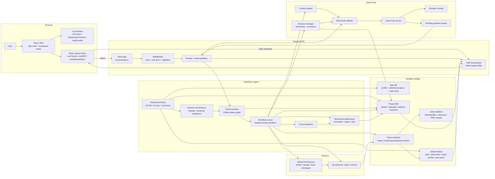

# System Architecture

> [!IMPORTANT]
> **TL;DR** — LoopTroop is a local control plane: a React browser client talks to a Hono backend, durable state lives in SQLite plus `.ticket/**` artifacts, each ticket executes in its own git worktree, and all model work goes through OpenCode behind a session-ownership layer. On restart, the backend rebuilds runtime projections, hydrates ticket actors, and reconnects only the sessions it still owns.

This document is the canonical architecture reference for the current LoopTroop application.

LoopTroop is not a thin chat wrapper around a coding model. It is a long-running workflow system with explicit planning phases, durable storage, isolated execution worktrees, resumable ticket actors, and restart-aware OpenCode session ownership. The core architectural rule is simple: **important state must survive the model and survive the browser**.

## 1. Mental Model

LoopTroop operates as a layered local system:

1. The browser runs a React SPA plus local providers for UI state, log caching, and AI question handling.
2. A Hono API owns the REST and SSE boundary and applies auth, rate limiting, and JSON validation before requests reach workflow code.
3. XState ticket actors hold the live workflow state machine, while the workflow runner dispatches the phase-specific handlers.
4. Council orchestration and structured-output normalization turn raw model text into bounded, typed artifacts before anything becomes canonical.
5. Durable truth lives in SQLite, `.ticket/**` artifacts, runtime projections, and JSONL logs rather than in model transcripts.
6. OpenCode sessions do the model work inside isolated ticket worktrees, and Git/GitHub delivery turns the resulting change set into a PR outcome.

## 2. Runtime Actors

| Actor | Responsibility | Primary modules |
| --- | --- | --- |
| Browser shell | App bootstrap, modal/URL coordination, dashboard vs ticket workspace switching, startup notices | `src/main.tsx`, `src/App.tsx`, `src/components/layout/*` |
| Browser state providers | Persistent UI state, AI question queue, per-ticket log cache and recovery | `src/context/UIContext.tsx`, `src/context/AIQuestionContext.tsx`, `src/context/LogContext.tsx` |
| React Query + SSE hooks | Fetching, cache invalidation, replay recovery, startup-status fetches | `src/hooks/*`, especially `useTickets.ts`, `useTicketArtifacts.ts`, `useSSE.ts`, `useStartupStatus.ts` |
| Hono API | REST routes and SSE endpoint under `/api` | `server/index.ts`, `server/routes/*` |
| API guard rails | CORS, token auth, per-bucket rate limiting, JSON validation | `server/middleware/*` |
| Ticket state machine | Canonical ticket statuses, legal transitions, blocked-error resume rules | `server/machines/ticketMachine.ts`, `server/machines/types.ts` |
| Actor persistence and hydration | Snapshot reconciliation, safe restore, startup hydration of non-terminal tickets | `server/machines/persistence.ts`, `server/startup.ts` |
| Phase orchestrators | Planning, approval, execution, retry, cleanup, and delivery logic | `server/workflow/*`, `server/phases/*` |
| Council + structured output layer | Draft/vote/refine orchestration, tagged-output parsing, schema normalization, retry diagnostics | `server/council/*`, `server/structuredOutput/*`, `server/phases/parserTaggedStructuredOutput.ts`, `server/lib/structuredOutput*.ts` |
| OpenCode integration | Session creation, prompting, event/question translation, ownership validation, blocked-error diagnostics | `server/opencode/*` |
| SSE broadcaster + execution logging | Ticket-scoped fan-out, replay buffer, durable log ingestion, session-status log translation | `server/sse/broadcaster.ts`, `server/log/*`, `server/workflow/sessionStatusLogging.ts` |
| App database | Singleton profile, attached projects, startup UI meta | `server/db/index.ts`, `server/db/init.ts` |
| Project database + ticket storage | Tickets, artifacts, phase attempts, OpenCode sessions, error history, runtime projections | `server/db/project.ts`, `server/storage/*` |
| Git and GitHub layer | Worktrees, diffs, commits, PR creation, merge/close flows | `server/phases/execution/gitOps.ts`, `server/git/*` |
| Startup bootstrap | Database init, crash recovery, WSL/runtime diagnostics, actor hydration, session reconnect | `server/startup.ts`, `server/startupState.ts`, `server/runtime.ts` |

## 3. Authoritative Data Ownership

LoopTroop deliberately splits state across several storage layers. Each layer owns a different class of truth.

| Storage location | Canonical contents | Notes |
| --- | --- | --- |
| `~/.config/looptroop/app.sqlite` by default | Singleton profile, attached projects, app meta such as startup restore-notice dismissal | Configurable via `LOOPTROOP_CONFIG_DIR` or `LOOPTROOP_APP_DB_PATH` |
| `<project>/.looptroop/db.sqlite` | Tickets, runtime metadata, OpenCode session ownership, `phase_artifacts`, `ticket_phase_attempts`, status history, error occurrences | This is the project-local operational database |
| `<project>/.looptroop/worktrees/<ticket>/` | The isolated ticket worktree used for planning artifacts, runtime files, and code changes | Startup blocks if `.looptroop` is tracked by Git so stale runtime data cannot be checked out into new worktrees; `.ticket/**` stays local LoopTroop state and is excluded from bead commits and PR diffs |
| `.ticket/relevant-files.yaml` | Relevant-file scan output used by later planning phases | Replaces older `codebase-map.yaml` terminology |
| `.ticket/interview.yaml` and `.ticket/prd.yaml` | Editable review artifacts for the approved planning stages | These are user-facing canonical documents |
| `.ticket/beads/<flow>/.beads/issues.jsonl` | The current bead plan for a given flow or base branch | Stored as JSONL, rewritten atomically on updates |
| `.ticket/runtime/execution-log.jsonl`, `.debug.jsonl`, `.ai.jsonl` | Durable workflow, debug, and AI-detail log channels | The UI consumes these both live through SSE and on reload through `/api/files/:ticketId/logs` |
| `.ticket/runtime/state.yaml` | Derived runtime projection for the active non-terminal ticket | Rebuilt from ticket state on startup; convenient to inspect, but not the only source of truth |
| `.ticket/runtime/execution-setup-profile.json` | Concrete execution environment profile produced after approved setup runs | Separate from the reviewable execution setup plan artifact |
| `.ticket/runtime/execution-setup/**`, especially `tool-cache/` | Ticket-owned temp roots, wrapper outputs, execution-only toolchains, and reusable caches | Preserved across setup-plan rewinds when safe so retries do not throw away valid tool caches |
| `.ticket/manual-qa/**` | Versioned checklists/results/coverage, evidence binaries, generation/operation receipts, clean baselines, and workspace-drift decisions | Preserved during cleanup and excluded from bead commits, candidate diffs, and PRs |
| `phase_artifacts` table | Structured snapshots used by the API and UI | Holds artifact content, phase, attempt number, timestamps, approval receipts, edit receipts, cleanup/integration reports, and content hashes |

> Note
> SQLite and the filesystem are complementary, not redundant. The database is optimized for querying, ownership, and workflow bookkeeping; `.ticket/**` keeps artifacts inspectable, editable, and recoverable without polluting the target repository branch.

### Durable State Beats Conversational Memory

The reason state is split across these layers is a deliberate design commitment: durable storage beats conversational memory. LoopTroop stores meaningful workflow state in places that can be inspected, queried, and rebuilt — SQLite, `.ticket/**` YAML and JSONL artifacts, durable execution logs, and worktree state tied to git snapshots. If the process restarts, the system recovers from storage, not from a model trying to remember what happened (see [Restart And Session Ownership](#_8-restart-and-session-ownership)).

For the per-table breakdown of which database owns what, see the [Database Schema](database-schema.md).

## 4. End-to-End Ticket Lifecycle

1. A ticket starts in `DRAFT` with editable title, description, and priority.
2. `SCANNING_RELEVANT_FILES` creates `relevant-files.yaml` from the ticket description and repo context.
3. The interview council drafts, votes, refines the interview artifact, and iterates until interview coverage is good enough.
4. The user approves the interview artifact.
5. The PRD council drafts, votes, refines, and coverage-checks the spec.
6. The user approves the PRD artifact.
7. The beads council drafts, votes, refines, expands, and coverage-checks the execution plan.
8. The user approves the beads artifact and then reviews the pre-implementation execution setup plan.
9. Implementation runs bead by bead in an isolated ticket worktree, with bounded retry per bead.
10. Post-implementation final testing routes either directly to integration or through the start-locked optional `GENERATING_QA_CHECKLIST → WAITING_MANUAL_QA` loop. QA failures become fix beads and return to coding/fresh tests; pass, waiver, or skip continues.
11. Integration, PR creation, review follow-up, and cleanup drive the ticket to `COMPLETED`, `CANCELED`, or `BLOCKED_ERROR`.

The full phase map lives in [Ticket Flow & State Machine](ticket-flow.md).

## 5. Planning Flow

Planning is intentionally artifact-driven.

| Stage | Primary input | Primary output | Why it exists |
| --- | --- | --- | --- |
| Discovery scan | Ticket details | `relevant-files.yaml` | Grounds planning in the actual codebase |
| Interview council | Ticket details, relevant files | Interview document and answer session | Forces ambiguity out before specs |
| PRD council | Ticket details, interview, relevant files, member-specific Full Answers | PRD document | Produces the feature contract |
| Beads council | Ticket details, PRD, relevant files | Execution bead plan | Converts the spec into execution units |
| Execution setup planning | Ticket details, PRD, beads, execution profile | Reviewable setup plan | Makes the coding environment explicit before code changes begin |

The planning phases are not one long conversation. Each stage assembles a new context window from durable artifacts and runs in its own session scope.

Councils are a reusable subsystem, not bespoke logic embedded in each phase. `server/council/pipeline.ts` handles the common draft -> quorum -> vote -> refine shape, while each phase provides its own context and normalization rules.

Structured output is a hard boundary. `server/structuredOutput/*` and `server/phases/parserTaggedStructuredOutput.ts` normalize, validate, and optionally repair model output before anything becomes canonical artifact content. Rejected or uncorrectable responses are preserved as diagnostics and raw attempts so downstream phases never consume malformed text as if it were approved state.

Human approval gates are content-addressed. The API exposes the current artifact hash for interview, PRD, beads, and execution setup plan views; approval requests must send `expectedContentSha256`; stale approvals return `409` instead of approving bytes the user did not review. Approval snapshots and receipts keep the reviewed raw content plus `content_sha256`, and interview/PRD receipts also record the post-stamp stored hash when approval metadata changes the YAML.

## 6. Execution Flow

Execution is built around beads, not around one monolithic coding prompt.

1. `PRE_FLIGHT_CHECK` verifies the ticket can enter pre-implementation setup, including worktree cleanliness before setup starts.
2. `WAITING_EXECUTION_SETUP_APPROVAL` pauses for setup-plan review before setup commands run.
3. `PREPARING_EXECUTION_ENV` creates the temporary execution environment described by the approved setup plan, provisioning missing required tooling under ticket-owned runtime roots, exposing setup-scoped OpenCode `websearch`/`webfetch` for unresolved official launcher artifact lookup, validating declared wrappers and `tooling_probe_commands`, requiring `tool_requirements.provisioning_attempts` evidence for failed launcher provisioning, and rejecting ready results that leave committable project changes behind.
4. `CODING` selects the next runnable bead from the scheduler.
5. `executeBead()` starts or reattaches to the owned OpenCode session for that bead attempt.
6. The model must emit the expected structured bead status markers. Missing or malformed markers trigger a structured retry path instead of silently progressing.
7. If the attempt stalls or fails, LoopTroop generates a context wipe note, resets the worktree to the bead start commit, and retries in fresh context.
8. When the bead succeeds, LoopTroop finalizes it locally before marking it done: changed work must be committed, true no-op work may complete without a commit, push failures are warnings, and fatal finalization failures route to `BLOCKED_ERROR`.
9. `RUNNING_FINAL_TEST`, optional Manual QA, `INTEGRATING_CHANGES`, and `CREATING_PULL_REQUEST` package the result for post-implementation delivery, with final-test commands automatically reusing a validated setup wrapper and PR creation auditing the final candidate files before anything is pushed.
10. During all non-terminal execution states, runtime projections and execution logs are updated so a restarted backend or reloaded browser can restore the ticket from durable state rather than from memory.

See [Beads & Execution](beads.md).

## 7. Recovery Flow

Recovery is a first-class architectural concern.

| Failure type | Recovery strategy |
| --- | --- |
| Browser reload, close, or reconnect gap | REST state remains canonical; the browser keeps the last SSE event id, restores best-effort log cache detail, replays buffered live events, and then refetches tickets, artifacts, bead state, interview state, and matching server logs |
| Frontend crash or tab close | Interview drafts, approval drafts, and browser-cached logs are persisted locally and flushed on unload with best-effort keepalive behavior |
| Concurrent/stale autosave | Server serializes each ticket/scope and compare-and-set rejects revision conflicts with the latest state; Manual QA keeps its five-second debounce/unload keepalive and derives its last-save age/exact timestamp from acknowledged saves |
| Crash during atomic write or append | Startup promotes orphan `.tmp` files, repairs trailing corrupt JSONL lines when safe, and rebuilds runtime projections |
| Invalid model output | Retry with repair or explicit re-prompt, depending on phase |
| Bead execution stall | Generate context wipe note, reset worktree, retry in fresh session |
| OpenCode reconnect gap | Validate the exact owned session against remote sessions and recreate only when ownership can no longer be proven |
| Backend process restart | Reconcile persisted XState snapshots, hydrate ticket actors from durable ticket state, and immediately process restored active snapshots |
| User edits approved interview or PRD | Archive the active approved generation and downstream attempts, cancel downstream sessions intentionally, clear stale downstream artifacts/UI state, persist a `user_edit_receipt:*`, and restart from the next drafting phase |
| User edits or regenerates setup plan during runtime setup | Stop active runtime setup, archive both setup-plan and runtime attempts, preserve the tool cache when safe, clear stale setup outputs, and return to `WAITING_EXECUTION_SETUP_APPROVAL` for fresh approval |
| Stale approval | Return `409` with the expected and current SHA-256 hashes, keeping the ticket at the approval gate |
| Manual QA generation/submission restart | Reuse the reserved checklist version or submission operation journal; deterministic action/origin/bead IDs prevent duplicate child work |
| Application-created drift during QA | Stay in `WAITING_MANUAL_QA` and require include/discard for exactly audited paths before submit/skip |
| Bead finalization failure | Keep the bead retryable, avoid `bead_complete`, send `BEAD_ERROR` with `BEAD_FINALIZATION_FAILED`, and route to `BLOCKED_ERROR` |
| Cleanup warning | Persist a `cleanup_report` with `status: warning`, expose the cleanup summary on the ticket, and still complete the ticket |
| Terminal blockage | Enter `BLOCKED_ERROR` with persisted error occurrence history |

LoopTroop tries hard to preserve the work product while discarding the bad conversational state that produced the failure.

If a resume point cannot be proven, recovery stops at `BLOCKED_ERROR` instead of continuing execution against unknown state. `BLOCKED_ERROR` retry requires a preserved `previousStatus`; `CODING` retry also requires a successful reset to the failed bead's `beadStartCommit`.

## 8. Restart And Session Ownership

LoopTroop pairs persisted ticket snapshots with OpenCode session ownership records so it can decide whether a remote session still belongs to the exact workflow slot that wants to use it.

Ownership keys can include:

- `ticketId`
- `phase`
- `phaseAttempt`
- `memberId`
- `beadId`
- `iteration`
- `step`

This lets LoopTroop safely reconnect in cases like:

- server restart while a ticket is still in the same phase
- phase retry that should resume the currently owned session
- multi-model council phases where each member has its own session identity
- bead execution where iteration and bead identity both matter

Reconnect deliberately does **not** mean "resume any random old transcript." Validation succeeds only if the ticket is still in the same workflow state, the project database still records that ownership slot as active, and the exact remote session still exists.

Snapshot restore is equally defensive. `server/machines/persistence.ts` reconciles persisted XState snapshots with the ticket row; if the snapshot is missing required structure, cannot be reconciled, or would resume from an unprovable state, the ticket is rebuilt conservatively or moved to `BLOCKED_ERROR` instead of guessing.

Prompt acquisition is bounded by timeout and abort signals. OpenCode `create`, `list`, `getSession`, and message-read calls are guarded so an OpenCode restart cannot indefinitely block the workflow runner.

## 9. Module Map

### Frontend

| Area | Modules |
| --- | --- |
| App bootstrap and query client | `src/main.tsx`, `src/lib/queryClient.ts` |
| App shell, modal routing, startup overlays | `src/App.tsx`, `src/components/layout/*`, `src/components/shared/StartupRestorePopup.tsx`, `src/components/shared/WelcomeDisclaimer.tsx` |
| Ticket workspace and shared UI | `src/components/ticket/*`, `src/components/workspace/*`, `src/components/shared/*` |
| Manual QA preparation, workspace, and data | `src/components/workspace/CodingView.tsx`, `src/components/workspace/PhaseArtifactsPanel.tsx`, `src/components/manual-qa/*`, `src/components/workspace/ManualQAView.tsx`, `src/hooks/useManualQA.ts`, `src/hooks/useSSE.ts` |
| Browser state providers | `src/context/UIContext.tsx`, `src/context/AIQuestionContext.tsx`, `src/context/LogContext.tsx` |
| Data hooks and live updates | `src/hooks/useTickets.ts`, `useTicketArtifacts.ts`, `useTicketPhaseAttempts.ts`, `useWorkflowMeta.ts`, `useSSE.ts`, `useStartupStatus.ts`, `useRecoveryAutoReload.ts` |

### API Surface

| Area | Modules |
| --- | --- |
| App entry and route mounting | `server/index.ts` |
| Middleware and request guards | `server/middleware/apiAuth.ts`, `rateLimit.ts`, `validation.ts` |
| Ticket routes and modular ticket handlers | `server/routes/tickets.ts`, `server/routes/ticketHandlers/*` |
| Files, beads, streaming | `server/routes/files.ts`, `beads.ts`, `stream.ts` |
| Profile, projects, health, models, workflow meta | `server/routes/profiles.ts`, `projects.ts`, `health.ts`, `models.ts`, `workflow.ts` |

### Ticket Orchestration

| Area | Modules |
| --- | --- |
| Ticket status machine | `server/machines/ticketMachine.ts`, `server/machines/types.ts` |
| Actor persistence and restore | `server/machines/persistence.ts` |
| Workflow runner and phase dispatch | `server/workflow/runner.ts`, `server/workflow/phases/*` |
| Planning phases | `server/phases/interview/*`, `server/phases/prd/*`, `server/phases/beads/*`, `server/phases/executionSetupPlan/*` |
| Execution and delivery phases | `server/phases/preflight/*`, `server/phases/executionSetup/*`, `server/phases/execution/*`, `server/phases/finalTest/*`, `server/phases/manualQa/*`, `server/phases/integration/*`, `server/phases/cleanup/*` |
| Ticket initialization and relevant-file preparation | `server/ticket/create.ts`, `server/ticket/initialize.ts`, `server/ticket/relevantFiles.ts`, `server/ticket/metadata.ts` |

### Council And Structured Output

| Area | Modules |
| --- | --- |
| Reusable council pipeline | `server/council/pipeline.ts`, `drafter.ts`, `voter.ts`, `refiner.ts`, `quorum.ts` |
| Prompt template layer | `server/prompts/index.ts` (per-phase prompt templates), `server/prompts/globalRules.ts` (`GLOBAL_RULES`, `SAME_SESSION_RULES`, `CONVERSATIONAL_RULES`) |
| Structured-output schemas and normalizers | `server/structuredOutput/*` |
| Tagged marker extraction and repair-aware parsing | `server/phases/parserTaggedStructuredOutput.ts` |
| Retry policy, raw-attempt capture, prompt echo detection | `server/lib/structuredOutputRetry.ts`, `structuredRawAttempts.ts`, `structuredRetryDiagnostics.ts`, `promptEcho.ts` |

### Persistence

| Area | Modules |
| --- | --- |
| App DB connection and schema bootstrap | `server/db/index.ts`, `server/db/init.ts` |
| Project DB bootstrap and schema | `server/db/project.ts`, `server/db/schema.ts` |
| Project attach, repo-path normalization, local exclude setup | `server/storage/projects.ts`, `server/storage/paths.ts`, `server/git/repository.ts` |
| Ticket artifact and attempt storage | `server/storage/ticketArtifacts.ts`, `ticketPhaseAttempts.ts`, `ticketMutations.ts`, `ticketQueries.ts` |
| Ticket runtime projection | `server/storage/ticketRuntimeProjection.ts` |

### Observability And Recovery

| Area | Modules |
| --- | --- |
| SSE replay and fan-out | `server/sse/broadcaster.ts`, `server/routes/stream.ts` |
| Execution log ingestion and dedupe | `server/log/executionLog.ts`, `readDedupe.ts`, `commandLogger.ts` |
| Startup bootstrap and restore state | `server/startup.ts`, `server/startupState.ts`, `server/runtime.ts` |
| Crash-safe IO and recovery | `server/io/atomicWrite.ts`, `atomicAppend.ts`, `jsonl.ts`, `recovery.ts` |

### OpenCode Integration

| Area | Modules |
| --- | --- |
| Adapter and factory | `server/opencode/adapter.ts`, `server/opencode/factory.ts` |
| Context assembly | `server/opencode/contextBuilder.ts` |
| Session ownership and reconnect | `server/opencode/sessionManager.ts` |
| Prompt runner and phase bridge | `server/workflow/runOpenCodePrompt.ts` |
| Question handling and blocked-error mapping | `server/routes/ticketHandlers/openCodeQuestionHandlers.ts`, `server/opencode/blockedErrorDiagnostics.ts` |

## 10. ASCII Overview

```text
User
  |
  v
React SPA + browser providers
  |  REST (/api/*)                         SSE (/api/stream)
  |-------------------------------------> Hono API <--------------------+
  |                                         |                           |
  |                                         v                           |
  |                                 auth / rate limit / validation      |
  |                                         |                           |
  |                                         v                           |
  |                                  routes + ticket handlers           |
  |                                         |                           |
  |                                         v                           |
  |                             ticket machine + workflow runner        |
  |                               |            |            |           |
  |                               |            |            |           |
  |                               v            v            v           |
  |                         council pipeline  phase logic  OpenCode     |
  |                               |                         adapter      |
  |                               v                            |         |
  |                     structured output layer                v         |
  |                                                            OpenCode |
  |                                                              server |
  |                                                                 |   |
  |                                                                 v   |
  |                                                          provider models
  |
  +<--------------------------- SSE broadcaster <-------------------+
                                ^            ^
                                |            |
                        project DB      runtime logs/state
                                ^            ^
                                |            |
                        app DB / project DB / ticket worktree /.ticket/**

Startup bootstrap runs before normal traffic:
  initialize DB -> recover temp/log files -> rebuild runtime projections ->
  hydrate ticket actors -> reconnect owned OpenCode sessions
```

## 11. Detailed Mermaid Diagram



## 12. Startup State System

On startup, LoopTroop restores durable state through `server/startup.ts` and `server/startupState.ts`. The workflow runner hydrates ticket actors from the project database, and the OpenCode layer attempts to reconnect only sessions that still match a valid ownership record.

### Bootstrap Sequence

`startupSequence()` performs the runtime bootstrap in this order:

1. Initialize the app/project databases and create runtime indexes.
2. Classify the startup storage state and capture runtime diagnostics such as WSL mounted-drive warnings.
3. Recover ticket runtime artifacts by promoting orphan `.tmp` files, repairing trailing JSONL corruption where safe, and rebuilding `.ticket/runtime/state.yaml` projections.
4. Start the WAL checkpoint timer and probe OpenCode health.
5. Hydrate XState actors for non-terminal tickets from attached project databases.
6. Validate and reconnect active OpenCode sessions; records that no longer map to a live owned session are marked abandoned.

### Startup Classification

`classifyStartupStorageKind()` determines the current storage condition:

| Kind | Meaning |
| --- | --- |
| `fresh` | First-ever startup — no prior app database exists. |
| `empty_existing` | App database exists but has no attached projects. |
| `restored` | Database found with existing projects — full state restoration. |

### Restore Flow

1. `initializeStartupState()` reads the app database path, profile count, and attached project count, then persists the startup classification.
2. `getStartupStatus()` exposes the cached startup snapshot through `GET /api/health/startup`.
3. The frontend uses `useStartupStatus()` and `StartupRestorePopup` to show restore context after a real restore.
4. `dismissStartupRestoreNotice()` persists the user's dismissal in app metadata so the restore notice does not keep reappearing.

Session recovery is best-effort. If OpenCode is unavailable during startup, ticket actors are still hydrated from durable workflow state and later phase work either reconnects, creates fresh owned sessions, or blocks with a persisted error.

The startup health endpoint exposes the storage path, kind, source, runtime warning state, restored project list, dismissed state, and human-readable summary for diagnostics and UI messaging.

## 13. IO Utilities

The IO layer provides crash-safe file operations and recovery used by the workflow engine. All modules live in `server/io/`.

| Module | Purpose | Key Export |
| --- | --- | --- |
| `atomicWrite.ts` | Crash-safe file writes | `safeAtomicWrite(filePath, content)` — writes to a `.tmp` file, calls `fsync`, renames to the target path, then best-effort fsyncs the parent directory. Prevents partial overwrites on system failure. |
| `atomicAppend.ts` | Crash-safe line appends | `safeAtomicAppend(filePath, line)` — opens with the `a+` flag, checks trailing newline, adds a `\n` prefix when needed, then calls `fsync`. Used for durable JSONL log appends. |
| `jsonl.ts` | JSON Lines I/O | `readJsonl<T>()`, `writeJsonl<T>()`, `appendJsonl<T>()` — type-safe JSONL read/write/append with graceful malformed-line skipping and newline integrity. |
| `recovery.ts` | Crash recovery | `recoverOrphanTmpFiles(folder)` — recursively promotes `.tmp` files to their target paths after a crash; `fixTrailingLineCorruption(filePath)` — validates and truncates trailing corrupt JSONL lines (scans backward in 8KB chunks, stays under 4MB scan limit). |

These utilities form the durability backbone: atomic writes protect mutable state files (YAML and JSON artifacts), atomic appends protect append-only logs, and recovery handles the edge case where a process stops mid-write.

## 14. Session Status Logging

OpenCode session status events are translated into normalized log entries by `server/workflow/sessionStatusLogging.ts`. Each entry captures a retry event or phase change as a structured execution-log record so live SSE views and reload-time log reads converge on the same timeline.

`buildSessionStatusLogEntries()` converts OpenCode `SessionStatusStreamEvent` objects into `SessionStatusLogEntry[]` — ordered, typed log entries with:

| Field | Meaning |
| --- | --- |
| `id` | Stable entry identifier |
| `type` | `info` or `error` |
| `kind` | `session` or `error` |
| `op` | `append`, `upsert`, or `finalize` — determines how the log viewer merges this entry |
| `content` | Human-readable description of the status event |

The log builder handles retry status events (rate limits, usage limits, timeouts, transport errors) and session phase transitions. These entries feed the normal execution log alongside phase log entries, while the separate AI-detail log keeps prompt/tool-call depth when that channel is needed.

## 15. Optional Manual QA Architecture And Cross-Application Impact

Manual QA is a ticket-locked branch of the execution band, not a browser-only form. Configuration resolves ticket → project → profile on Start and stores both the effective boolean and source. The public ticket read model adds `visitedStatuses`, monotonic `workflowRevision`, and a compact Manual QA projection so polling, SSE, the navigator, status summaries, completed review, and needs-input attention agree even when a failed round moves backward to Coding.

The backend domain under `server/phases/manualQa/*` owns strict schemas, PRD ref/coverage validation, version reservation, checkpoint/baseline and drift audits, contained streaming evidence, checklist generation, submission journaling, child-ticket provenance, and deterministic QA beads. Canonical files live under `.ticket/manual-qa/vN/`; compact phase artifacts support indexed UI/history queries, while binary evidence remains filesystem-only. The generic UI-state channel is server-revisioned CAS storage, and `manual_qa_draft:vN` is the only live draft. Items initialize as Pending; Pass and Waive need no evidence, Pass notes and waiver reasons are optional, and successful CAS writes power the workspace's automatic-save/last-save indicator with no separate Save command or endpoint. Completion waits for active file mutations, and Submit rebuilds evidence metadata/references from the durable index so valid files survive while dangling optional links cannot block the outcome.

The clean checkpoint is the boundary between final tests and user verification. Accepted candidate effects are committed locally, final-test/prior residue is quarantined or removed under ticket storage, and the worktree must be Git-clean. Before submit/skip the same baseline detects app-created drift. This design affects final-test audit/recovery, Git integration/squashing, normal cleanup preservation, candidate exclusions, and the first subsequent QA-fix commit.

Submission stages immutable results, fix beads, improvement tickets, origin/evidence copies, content hashes, receipts, and database idempotency mappings before any transition. Merge-group state may reference any checklist items while the draft is open, but Submit verifies that every selected member is Fail and reports unresolved members by number/title. An operation-typed journal resumes the exact Submit/Skip action and repairs its final state from a durable summary after interruption. Skip bypasses ordinary result, observation, and group-completeness validation, preserves every entered value as immutable draft + receipt + summary, and creates no improvement ticket or QA-fix bead. Improvements use inline editable title/description/context plus a shared deterministic composer as their future implementation contract, while structured Manual QA origin stays audit-only. Advisory PRD coverage, improvement context, final-description preview, and evidence/provenance preview are collapsed by default. Final-test file-effect overrides are fingerprinted to their originating audit so a prior QA round cannot resolve a fresh round's unclassified files. Integration and PR delivery summaries use the newest completed outcome/skip/waiver state and accumulate fix-bead and improvement-ticket IDs across every round without embedding evidence binaries.

OpenCode prompt transport now supports SDK text/system/file parts. A QA-fix bead attaches every detected image evidence file when its locked model advertises image input; other evidence remains referenced. Missing capability records `references_only`, and provider/context overflow routes through ordinary bead error recovery without silently altering the selected evidence set.

Security boundaries are local-content containment rather than file-type trust: each upload is streamed, capped at 250 MiB per file, hash/size verified, name-sanitized, symlink/traversal checked, and atomically renamed. There is no count/round-total cap. The client publishes acknowledged uploads into the current item immediately, renders link Details only after Add link is chosen, and limits the initial evidence disclosure to five entries. Only safe raster types may be inline; everything else is `nosniff` attachment content. LoopTroop never launches, previews, stops, or controls the application under test.

## Related Docs

- [Core Philosophy](core-philosophy.md)
- [Context Engineering](context-engineering.md)
- [Ticket Flow & State Machine](ticket-flow.md)
- [Beads & Execution](beads.md)
- [OpenCode Integration](opencode-integration.md)
- [Frontend](frontend.md)
- [Output Normalization](output-normalization.md)
- [Database Schema](database-schema.md)
- [API Reference](api-reference.md)
- [Operations Guide](operations.md)
