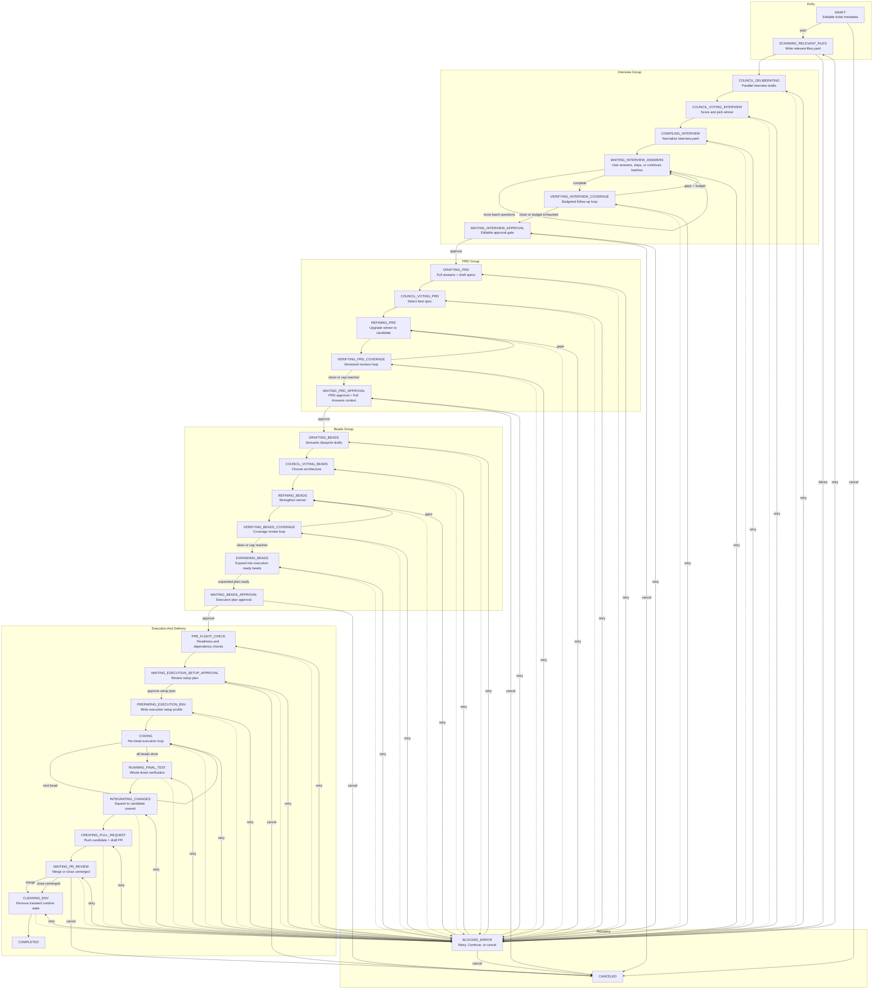

# Ticket Flow

> [!IMPORTANT]
> **TL;DR** — A ticket flows through scanning → interview → PRD → beads planning → execution setup → bead-by-bead coding → final test → integration → PR → cleanup. Every single status, allowed transition, workflow group, board location, and recovery behavior is defined in a single deterministic state machine. If the system cannot prove a safe next step, it blocks rather than guesses.

LoopTroop does not move a ticket through a tiny backlog -> coding -> done list. It runs a staged lifecycle with planning loops, approval gates, execution setup, bead-scoped coding, PR delivery, and explicit error recovery. 

The canonical workflow metadata lives in `shared/workflowMeta.ts`, the executable transition rules live in `server/machines/ticketMachine.ts`, and the route handling lives under `server/routes/ticketHandlers/`.

---

## 1. At A Glance

```text
DRAFT
  -> SCANNING_RELEVANT_FILES
  -> Interview loop
  -> PRD loop
  -> Beads loop
  -> PRE_FLIGHT_CHECK
  -> WAITING_EXECUTION_SETUP_APPROVAL
  -> PREPARING_EXECUTION_ENV
  -> CODING bead loop
  -> RUNNING_FINAL_TEST
  -> INTEGRATING_CHANGES
  -> CREATING_PULL_REQUEST
  -> WAITING_PR_REVIEW
  -> CLEANING_ENV
  -> COMPLETED

Any active phase can fail into BLOCKED_ERROR.
BLOCKED_ERROR -> RETRY -> previousStatus
BLOCKED_ERROR -> CONTINUE -> previousStatus (eligible preserved OpenCode sessions only)
Any cancellable phase -> CANCELED
WAITING_PR_REVIEW -> merge or close-unmerged -> CLEANING_ENV
```

---

## 2. Detailed Flow Diagram

The flowchart below visualizes how tickets progress through planning, execution, and delivery, and how recovery pathways branch back to active phases:



---

## 3. State Machine Transition Model

The underlying state machine enforces valid state transitions and recovery hooks deterministically.

```mermaid
stateDiagram-v2
    direction LR

    [*] --> DRAFT

    DRAFT --> SCANNING_RELEVANT_FILES: START
    DRAFT --> CANCELED: CANCEL

    SCANNING_RELEVANT_FILES --> COUNCIL_DELIBERATING: RELEVANT_FILES_READY

    COUNCIL_DELIBERATING --> COUNCIL_VOTING_INTERVIEW: QUESTIONS_READY
    COUNCIL_VOTING_INTERVIEW --> COMPILING_INTERVIEW: WINNER_SELECTED
    COMPILING_INTERVIEW --> WAITING_INTERVIEW_ANSWERS: READY
    WAITING_INTERVIEW_ANSWERS --> WAITING_INTERVIEW_ANSWERS: BATCH_ANSWERED
    WAITING_INTERVIEW_ANSWERS --> VERIFYING_INTERVIEW_COVERAGE: INTERVIEW_COMPLETE
    WAITING_INTERVIEW_ANSWERS --> WAITING_INTERVIEW_APPROVAL: SKIP_ALL_TO_APPROVAL
    VERIFYING_INTERVIEW_COVERAGE --> WAITING_INTERVIEW_ANSWERS: GAPS_FOUND
    VERIFYING_INTERVIEW_COVERAGE --> WAITING_INTERVIEW_APPROVAL: COVERAGE_CLEAN
    VERIFYING_INTERVIEW_COVERAGE --> WAITING_INTERVIEW_APPROVAL: COVERAGE_LIMIT_REACHED
    WAITING_INTERVIEW_APPROVAL --> DRAFTING_PRD: APPROVE

    DRAFTING_PRD --> COUNCIL_VOTING_PRD: DRAFTS_READY
    COUNCIL_VOTING_PRD --> REFINING_PRD: WINNER_SELECTED
    REFINING_PRD --> VERIFYING_PRD_COVERAGE: REFINED
    VERIFYING_PRD_COVERAGE --> REFINING_PRD: GAPS_FOUND
    VERIFYING_PRD_COVERAGE --> WAITING_PRD_APPROVAL: COVERAGE_CLEAN
    VERIFYING_PRD_COVERAGE --> WAITING_PRD_APPROVAL: COVERAGE_LIMIT_REACHED
    WAITING_PRD_APPROVAL --> DRAFTING_BEADS: APPROVE

    DRAFTING_BEADS --> COUNCIL_VOTING_BEADS: DRAFTS_READY
    COUNCIL_VOTING_BEADS --> REFINING_BEADS: WINNER_SELECTED
    REFINING_BEADS --> VERIFYING_BEADS_COVERAGE: REFINED
    VERIFYING_BEADS_COVERAGE --> REFINING_BEADS: GAPS_FOUND
    VERIFYING_BEADS_COVERAGE --> EXPANDING_BEADS: COVERAGE_CLEAN
    VERIFYING_BEADS_COVERAGE --> EXPANDING_BEADS: COVERAGE_LIMIT_REACHED
    EXPANDING_BEADS --> WAITING_BEADS_APPROVAL: EXPANDED
    WAITING_BEADS_APPROVAL --> PRE_FLIGHT_CHECK: APPROVE

    PRE_FLIGHT_CHECK --> WAITING_EXECUTION_SETUP_APPROVAL: CHECKS_PASSED
    WAITING_EXECUTION_SETUP_APPROVAL --> PREPARING_EXECUTION_ENV: APPROVE_EXECUTION_SETUP_PLAN
    PREPARING_EXECUTION_ENV --> CODING: EXECUTION_SETUP_READY
    CODING --> CODING: BEAD_COMPLETE / next bead
    CODING --> RUNNING_FINAL_TEST: ALL_BEADS_DONE
    RUNNING_FINAL_TEST --> INTEGRATING_CHANGES: TESTS_PASSED
    INTEGRATING_CHANGES --> CREATING_PULL_REQUEST: INTEGRATION_DONE
    CREATING_PULL_REQUEST --> WAITING_PR_REVIEW: PULL_REQUEST_READY
    WAITING_PR_REVIEW --> CLEANING_ENV: MERGE_COMPLETE
    WAITING_PR_REVIEW --> CLEANING_ENV: CLOSE_UNMERGED_COMPLETE
    CLEANING_ENV --> COMPLETED: CLEANUP_DONE

    state "previousStatus" as PREVIOUS_PHASE
    BLOCKED_ERROR --> PREVIOUS_PHASE: RETRY
    BLOCKED_ERROR --> PREVIOUS_PHASE: CONTINUE
    BLOCKED_ERROR --> CANCELED: CANCEL

    SCANNING_RELEVANT_FILES --> BLOCKED_ERROR: ERROR / INIT_FAILED
    COUNCIL_DELIBERATING --> BLOCKED_ERROR: ERROR
    COUNCIL_VOTING_INTERVIEW --> BLOCKED_ERROR: ERROR
    COMPILING_INTERVIEW --> BLOCKED_ERROR: ERROR
    WAITING_INTERVIEW_ANSWERS --> BLOCKED_ERROR: ERROR
    VERIFYING_INTERVIEW_COVERAGE --> BLOCKED_ERROR: ERROR
    WAITING_INTERVIEW_APPROVAL --> BLOCKED_ERROR: ERROR
    DRAFTING_PRD --> BLOCKED_ERROR: ERROR
    COUNCIL_VOTING_PRD --> BLOCKED_ERROR: ERROR
    REFINING_PRD --> BLOCKED_ERROR: ERROR
    VERIFYING_PRD_COVERAGE --> BLOCKED_ERROR: ERROR
    WAITING_PRD_APPROVAL --> BLOCKED_ERROR: ERROR
    DRAFTING_BEADS --> BLOCKED_ERROR: ERROR
    COUNCIL_VOTING_BEADS --> BLOCKED_ERROR: ERROR
    REFINING_BEADS --> BLOCKED_ERROR: ERROR
    VERIFYING_BEADS_COVERAGE --> BLOCKED_ERROR: ERROR
    EXPANDING_BEADS --> BLOCKED_ERROR: ERROR
    WAITING_BEADS_APPROVAL --> BLOCKED_ERROR: ERROR
    PRE_FLIGHT_CHECK --> BLOCKED_ERROR: ERROR / CHECKS_FAILED
    WAITING_EXECUTION_SETUP_APPROVAL --> BLOCKED_ERROR: ERROR / PLAN_FAILED
    PREPARING_EXECUTION_ENV --> BLOCKED_ERROR: ERROR / SETUP_FAILED
    CODING --> BLOCKED_ERROR: ERROR / BEAD_ERROR
    RUNNING_FINAL_TEST --> BLOCKED_ERROR: ERROR / TESTS_FAILED
    INTEGRATING_CHANGES --> BLOCKED_ERROR: ERROR
    CREATING_PULL_REQUEST --> BLOCKED_ERROR: ERROR
    WAITING_PR_REVIEW --> BLOCKED_ERROR: ERROR
    CLEANING_ENV --> BLOCKED_ERROR: ERROR

    WAITING_INTERVIEW_APPROVAL --> CANCELED: CANCEL
    WAITING_PRD_APPROVAL --> CANCELED: CANCEL
    WAITING_BEADS_APPROVAL --> CANCELED: CANCEL
    WAITING_EXECUTION_SETUP_APPROVAL --> CANCELED: CANCEL
    WAITING_PR_REVIEW --> CANCELED: CANCEL
```



Key observations highlighted by this transition model:
- **Approval Gates** are explicit workflow states, not transient UI flags.
- **The Interview Loop** can self-loop dynamically during active batching or coverage verification.
- **Spec & Blueprint Coverage Loops** remain bounded inside their groups, revising automatically until clean or capped.
- **`BLOCKED_ERROR`** stores `previousStatus` in its context to allow precise, phase-scoped recovery.

---

## 4. Workflow Groups & Board Locations

### Status Groups
The UI and API categorize all ticket states into distinct lifecycle groups:

| Group | Meaning |
| --- | --- |
| `todo` | Backlog item before AI planning activity begins. |
| `discovery` | Codebase indexing and file scanning before requirements. |
| `interview` | Questionnaire compilation, Q&A batching, coverage, and interview approval. |
| `prd` | Requirements spec drafting, voting, refinement, coverage, and PRD approval. |
| `beads` | Execution blueprint drafting, voting, refinement, coverage, expansion, and approval. |
| `pre_implementation` | Pre-flight readiness verification, runtime setup plan drafting, and tool environment setup. |
| `implementation` | Bead-by-bead isolated coding loop. |
| `post_implementation` | Holistic testing, branch squashing, PR publishing, review gates, and worktree cleanup. |
| `done` | Successful completion or cancellation. |
| `errors` | The dedicated recovery gateway for blocked errors. |

### Kanban Board Locations
Every ticket belongs to exactly one Kanban board location determined by its `kanbanPhase`. These locations simplify board layout by indicating who or what owns the next move:

| Board Location | `kanbanPhase` | Meaning | Included Statuses |
| --- | --- | --- | --- |
| **To Do** | `todo` | Inactive backlog item. | `DRAFT` |
| **Needs Input** | `needs_input` | Paused; waiting for user action, approval, or error recovery. | Interview Q&A, all approvals, PR review, and `BLOCKED_ERROR`. |
| **In Progress** | `in_progress` | Active; LoopTroop is running background calculations, councils, or coding sessions. | Scanning, deliberating, voting, refining, preparing, coding, testing, squashing. |
| **Done** | `done` | Terminal status. | `COMPLETED`, `CANCELED` |

*Note: `BLOCKED_ERROR` maps to `needs_input` rather than a unique board column, because recovery requires manual retry, session continuation, or cancellation.*

---

## 5. Phase Inventory

The canonical properties for every workflow phase are detailed in the inventory below:

| Phase | Label | Group | `uiView` | `kanbanPhase` | Review Artifact | Editable | Multi-Model Logs | Progress Indicator |
| --- | --- | --- | --- | --- | --- | --- | --- | --- |
| `DRAFT` | Backlog | `todo` | `draft` | `todo` | — | yes | no | — |
| `SCANNING_RELEVANT_FILES` | Scanning Files | `discovery` | `council` | `in_progress` | — | yes | no | — |
| `COUNCIL_DELIBERATING` | Drafting Questions | `interview` | `council` | `in_progress` | — | yes | yes | — |
| `COUNCIL_VOTING_INTERVIEW` | Voting on Questions | `interview` | `council` | `in_progress` | — | yes | yes | — |
| `COMPILING_INTERVIEW` | Refining Interview | `interview` | `council` | `in_progress` | — | yes | no | — |
| `WAITING_INTERVIEW_ANSWERS` | Interviewing | `interview` | `interview_qa` | `needs_input` | — | yes | no | `questions` |
| `VERIFYING_INTERVIEW_COVERAGE` | Interview Coverage | `interview` | `council` | `in_progress` | — | yes | no | — |
| `WAITING_INTERVIEW_APPROVAL` | Approving Interview | `interview` | `approval` | `needs_input` | `interview` | yes | no | — |
| `DRAFTING_PRD` | Drafting Specs | `prd` | `council` | `in_progress` | — | yes | yes | — |
| `COUNCIL_VOTING_PRD` | Voting on Specs | `prd` | `council` | `in_progress` | — | yes | yes | — |
| `REFINING_PRD` | Refining Specs | `prd` | `council` | `in_progress` | — | yes | no | — |
| `VERIFYING_PRD_COVERAGE` | PRD Coverage | `prd` | `council` | `in_progress` | — | yes | no | — |
| `WAITING_PRD_APPROVAL` | Approving Specs | `prd` | `approval` | `needs_input` | `prd` | yes | no | — |
| `DRAFTING_BEADS` | Drafting Blueprint | `beads` | `council` | `in_progress` | — | yes | yes | — |
| `COUNCIL_VOTING_BEADS` | Voting on Blueprint | `beads` | `council` | `in_progress` | — | yes | yes | — |
| `REFINING_BEADS` | Refining Blueprint | `beads` | `council` | `in_progress` | — | yes | no | — |
| `VERIFYING_BEADS_COVERAGE` | Beads Coverage | `beads` | `council` | `in_progress` | — | yes | no | — |
| `EXPANDING_BEADS` | Expanding Blueprint | `beads` | `council` | `in_progress` | — | yes | no | — |
| `WAITING_BEADS_APPROVAL` | Approving Blueprint | `beads` | `approval` | `needs_input` | `beads` | yes | no | — |
| `PRE_FLIGHT_CHECK` | Checking Readiness | `pre_implementation` | `coding` | `in_progress` | — | yes | no | — |
| `WAITING_EXECUTION_SETUP_APPROVAL` | Approving Setup | `pre_implementation` | `approval` | `needs_input` | `execution_setup_plan` | yes | no | — |
| `PREPARING_EXECUTION_ENV` | Preparing Runtime | `pre_implementation` | `coding` | `in_progress` | — | no | no | — |
| `CODING` | Implementing | `implementation` | `coding` | `in_progress` | — | no | no | `beads` |
| `RUNNING_FINAL_TEST` | Testing | `post_implementation` | `coding` | `in_progress` | — | no | no | — |
| `INTEGRATING_CHANGES` | Squashing Commits | `post_implementation` | `coding` | `in_progress` | — | no | no | — |
| `CREATING_PULL_REQUEST` | Creating PR | `post_implementation` | `coding` | `in_progress` | — | no | no | — |
| `WAITING_PR_REVIEW` | Reviewing PR | `post_implementation` | `coding` | `needs_input` | — | no | no | — |
| `CLEANING_ENV` | Cleaning Up | `post_implementation` | `coding` | `in_progress` | — | no | no | — |
| `COMPLETED` | Done | `done` | `done` | `done` | — | no | no | — |
| `CANCELED` | Canceled | `done` | `canceled` | `done` | — | no | no | — |
| `BLOCKED_ERROR` | Error | `errors` | `error` | `needs_input` | — | no | no | — |

---

## 6. UI & Frontend Consequences

The state machine metadata directly drives the React user interface. Developers modifying the workflow must ensure backend descriptors align, as:
- **`uiView`** decides which top-level layout panel is mounted (e.g., `council`, `approval`, `interview_qa`).
- **`reviewArtifactType`** controls which approval schema editor and custom comparison components are loaded.
- **`progressKind`** controls specialized progress tracking visuals (e.g., question batch tallies vs. bead graph lists).
- **`editable`** toggles raw markdown edit boxes for planning and setup specs.
- **`multiModelLogs`** decides whether the UI should search for multi-agent council tabs and scoring matrices or render single-model log output.

---

## 7. Status-By-Status Detail

### Entry & Discovery
- **`DRAFT`:** Backlog item. Ticket metadata (title, description, assignee) can be edited freely. No worktree isolation or AI routines have run. Exiting via `start` triggers indexing.
- **`SCANNING_RELEVANT_FILES`:** The Main Implementer scans the project folder under AI Response Timeout and registers target files, writing results to `.ticket/relevant-files.yaml`.

### Interview Loop
- **`COUNCIL_DELIBERATING`:** All configured council members draft interview strategies in parallel, producing candidate question lists.
- **`COUNCIL_VOTING_INTERVIEW`:** Council models rate the anonymized questionnaires using a structural rubric to select the best intake framework.
- **`COMPILING_INTERVIEW`:** LoopTroop normalizes the selected plan into the canonical `interview.yaml` session file.
- **`WAITING_INTERVIEW_ANSWERS`:** The dashboard pauses for user answers. Questions are presented in adaptive, dynamic batches of 1 to 3 to optimize cognitive load. Skip and "skip all" choices are supported.
- **`VERIFYING_INTERVIEW_COVERAGE`:** The winner checks the answers for ambiguities or gaps, spawning targeted follow-up rounds if budget permits.
- **`WAITING_INTERVIEW_APPROVAL`:** Gatekeeper review. The user approves the structured YAML specs with content-hash protection (`expectedContentSha256` matching check).

### Specs Loop (PRD)
- **`DRAFTING_PRD`:** Models resolve skipped questions into a Full Answers artifact (`answered_by: ai_skip`), then draft comprehensive feature requirements.
- **`COUNCIL_VOTING_PRD`:** Anonymized votes are cast on rival PRD drafts based on completeness, risk, and feasibility metrics.
- **`REFINING_PRD`:** The winner incorporates the strongest elements from competing drafts into PRD Candidate v1.
- **`VERIFYING_PRD_COVERAGE`:** The candidate PRD is audited against the approved Full Answers context, revising in-phase until clean or capped.
- **`WAITING_PRD_APPROVAL`:** Gatekeeper review of the PRD requirements spec with content-hash matching, supported by the winning Full Answers reference context.

### Blueprint Loop (Beads)
- **`DRAFTING_BEADS`:** Council members draft blueprints decomposing the approved spec into semantic dependency graphs of beads.
- **`COUNCIL_VOTING_BEADS`:** Blueprints are rated on graph logic, file target isolation, and testing strategy.
- **`REFINING_BEADS`:** Winning blueprint merges strong verification steps from alternative drafts.
- **`VERIFYING_BEADS_COVERAGE`:** Blueprint is verified against the PRD, revising in-phase when missing criteria are found.
- **`EXPANDING_BEADS`:** LoopTroop expands the blueprint into live execution bead lists, specifying exact file scopes and test suites.
- **`WAITING_BEADS_APPROVAL`:** Gatekeeper review of the dependency graph and executable plan before coding starts.

### Pre-Implementation
- **`PRE_FLIGHT_CHECK`:** Verifies workspace sanitation, Git worktree hygiene, OpenCode reachability, and execution locks. Committable changes outside LoopTroop fail the checks.
- **`WAITING_EXECUTION_SETUP_APPROVAL`:** Audi-prep checks are presented; the user approves the temporary runtime environment profile.
- **`PREPARING_EXECUTION_ENV`:** Fetches toolchains, runs probes, sets paths, and creates sandboxed execution wrappers.

### Implementation (Coding)
- **`CODING`:** The executor processes one bead at a time in dependency order. The agent gets narrow contexts and structured completion reminders. Uncommitted project changes are captured in local bead commits.

### Post-Implementation & Delivery
- **`RUNNING_FINAL_TEST`:** The implementer constructs a whole-ticket test plan and executes tests using runtime wrappers, generating a file-effects checklist.
- **`INTEGRATING_CHANGES`:** Squashes bead-level changes and tested files into a clean candidate commit on the main ticket branch.
- **`CREATING_PULL_REQUEST`:** Performs a final candidate audit (reconciling inclusions/exclusions) before pushing the branch and drafting the PR title/description.
- **`WAITING_PR_REVIEW`:** Review window. Exits successfully via `merge` (which locks, checks, and finishes) or `close_unmerged`.
- **`CLEANING_ENV`:** Deletes transient lockfiles, wrapper hooks, and session directories, preserving planning files and audit trails.

---

## 8. User Actions & Guard Systems

`getAvailableWorkflowActions()` governs what explicit actions the user can issue depending on active phases:

- **`DRAFT`:** `start` (locks configurations), `cancel`.
- **Gatekeepers (Approvals):** `approve` (must provide `expectedContentSha256` to prevent race conditions; mismatch returns `409`), `cancel`.
- **`BLOCKED_ERROR`:** `retry` (versions and restarts the failed phase), `continue` (resumes eligible preserved OpenCode sessions), file-effects overrides, `cancel`.

### Planning Edit Restarts
Approved interview and PRD documents can still be edited manually while in planning (before `PRE_FLIGHT_CHECK`). Saving manual changes triggers session cancellation downstream to keep artifacts consistent:
- Editing **Interview** from PRD/Beads archives the approved interview, aborts downstream sessions, clears downstream drafts, saves/approves the edit, and jumps to `DRAFTING_PRD`.
- Editing **PRD** from Beads archives the approved PRD, aborts downstream sessions, clears downstream blueprint drafts, saves/approves the edit, and jumps to `DRAFTING_BEADS`.

---

## 9. Retry, Continue, And Blocked-Error Semantics

When a phase encounters a fatal block, it routes to `BLOCKED_ERROR` while storing the failed status in `previousStatus`. Recovery pathways are phase-scoped:

### The Retry Path (`RETRY`)
- Archives the active phase attempt and initializes a fresh run.
- **Planning Phases:** Manual retries create a new version of the draft spec or blueprint in the UI.
- **`CODING` Exception:** `CODING` does not create new phase attempts. It runs a bead-scoped recovery loop: resets the active bead's worktree back to its recorded `beadStartCommit` snapshot and schedules it again.

### The Continue Path (`CONTINUE`)
- Resumes an in-progress session without resetting or creating new attempts.
- Used for continuable, transient errors (HTTP 402, rate/usage limits, overload capacity, provider timeouts) where the remote OpenCode session is still active and addressable.
- LoopTroop locks onto the preserved session and sends exactly:
  ```text
  continue please
  ```

---

## 10. Safe Resume & Interruption Recovery

LoopTroop is designed to survive crashes, restarts, and disconnects. The table below outlines how specific interruption events are safely handled:

| Interruption | Expected Resume Behavior |
| --- | --- |
| **Browser Closes / SSE Disconnects** | The next UI mount requests the Hono server REST state. SSE reconnects pass `Last-Event-ID` to replay stream indicators without reloading active panels. |
| **Frontend Crashes** | Active draft forms and interview inputs are written to local ticket UI-state files on page unload. |
| **Backend Process Restarts** | LoopTroop validates the serialized XState snapshot on startup: valid snapshots are rehydrated and immediately processed, resuming the active task; corrupt states trigger `BLOCKED_ERROR`. |
| **OpenCode Server Restarts** | LoopTroop queries local `opencode_sessions` active keys; missing sessions are cleanly abandoned, and fresh contexts are created. |
| **Model Fails / Returns Garbage** | Planning phases run automatic structured retries; rejected attempts are saved as Raw attempts for inspection. |

---

## 11. Artifact Checkpoints

Durable checkpoints are saved to the project directory at critical milestones:

| Point in Flow | Durable Artifact Location / State |
| --- | --- |
| **Discovery** | `.ticket/relevant-files.yaml` index + companion scanner results. |
| **Interview** | `.ticket/interview.yaml` + Q&A snapshots + progress markers. |
| **PRD Specs** | `.ticket/prd.yaml` + per-model Full Answers + candidate coverage histories. |
| **Blueprints** | `.ticket/beads/<flow>/.beads/issues.jsonl` + coverage reports. |
| **Pre-Implementation** | `execution_setup_plan` YAML schema + approved SHA hashes. |
| **Execution** | `.ticket/runtime/execution-log.jsonl` + setup profile + bead notes and diffs. |
| **Edits** | Append-only `user_edit_receipt:*` documents recording change differentials and approval resets. |
| **Delivery** | Holistic test plans, file-effects audits, and Git PR creation reports. |

---

## Related Docs

- [Beads & Execution](beads.md)
- [Context Engineering](context-engineering.md)
- [System Architecture](system-architecture.md)
